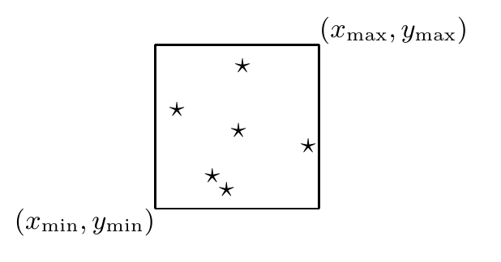
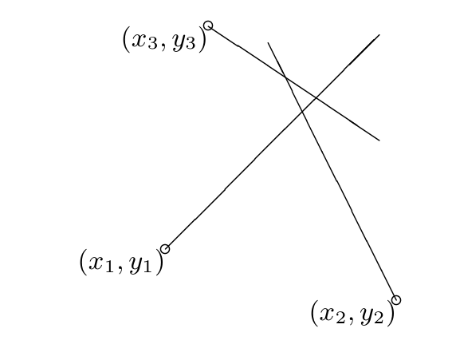

<!-- 源 PDF 物理页 319；原书印刷页 307。习题 22.12 跨 PDF 320；式 (22.31) 后的变量说明并入本页。另有习题 22.10 的无编号窗口示意图和图 22.8。 -->

▷ **习题 22.8**（难度 2）（a）为推断遥远恒星的亮度，即每分钟抵达计数器的光子速率 $\lambda$，将光子计数器朝向该星观测一分钟。假设收集到的光子数 $r$ 服从均值为 $\lambda$ 的泊松分布：

$$P(r\mid\lambda)=\exp(-\lambda)\frac{\lambda^r}{r!},\tag{22.30}$$

给定 $r=9$，$\lambda$ 的最大似然估计是多少？求 $\ln\lambda$ 的误差棒。

（b）情形相同，但现在假设计数器除恒星光子外还会探测到“背景”光子。已知背景光子速率为每分钟 $b=13$ 个。假设收集到的光子数 $r$ 服从均值为 $\lambda+b$ 的泊松分布。现在探测到 $r=9$ 个光子，$\lambda$ 的最大似然估计是多少？请评论这个答案，并讨论贝叶斯后验分布以及抽样理论中的“无偏估计量”$\hat\lambda\equiv r-b$。

**习题 22.9**（难度 2）将一枚有偏硬币抛掷 $N$ 次，得到 $N_a$ 次正面、$N_b$ 次反面。假设正面概率 $p$ 的先验服从贝塔分布，例如均匀分布。求 $p$ 的最大似然值和最大后验值，再求其 logit $a\equiv\ln[p/(1-p)]$ 的最大似然值和最大后验值。将这些值与预测分布比较，即下一次抛掷出现正面的概率。

▷ **习题 22.10**（难度 2）*两个人隔着监狱的铁窗向外看；一个看见了星星，另一个试图推断窗框在哪里。*

你从房间另一侧透过一扇窗户，看见位于 $\{(x_n,y_n)\}$ 的星星。除了星星以外一片漆黑，所以你看不见窗户的边缘。假设窗户为矩形，而且可见星星的位置是独立随机分布的。按照最大似然方法，推断出的 $(x_{\min},y_{\min},x_{\max},y_{\max})$ 是多少？固定 $x_{\min}$、$y_{\min}$ 和 $y_{\max}$ 时，画出似然作为 $x_{\max}$ 的函数的草图。

▷ **习题 22.11**（难度 3）一名水手通过测量三个浮标的方位，推断自己的位置 $(x,y)$；海图上给出了各浮标的位置 $(x_n,y_n)$。记浮标的真实方位为 $\theta_n$。假设他对每个方位的测量值 $\tilde\theta_n$ 都受到标准差较小的高斯噪声影响；按最大似然方法，他推断出的位置是什么？

水手的经验法则是把船的位置取在“三角帽”的中心。“三角帽”由三条测得的方位线相交形成（图 22.8）。你能说服他最大似然的答案更好吗？

图 22.8　在海图上按常规画出三条略有不一致的方位线，会形成一个叫作“三角帽”（cocked hat）的三角形。水手在哪里？图内 $(x_1,y_1)$、$(x_2,y_2)$、$(x_3,y_3)$ 标出三个浮标的位置。

▷ **习题 22.12**（难度 3；解答见原书印刷页 310）**指数族模型的最大似然拟合。** 假设变量 $\mathbf x$ 来自如下形式的概率分布：

$$P(\mathbf x\mid\mathbf w)=\frac{1}{Z(\mathbf w)}\exp\!\left(\sum_k w_k f_k(\mathbf x)\right),\tag{22.31}$$

其中函数 $f_k(\mathbf x)$ 已给定，而参数 $\mathbf w=\{w_k\}$ 未知。现有由 $N$ 个点组成的数据集 $\{\mathbf x^{(n)}\}$。
