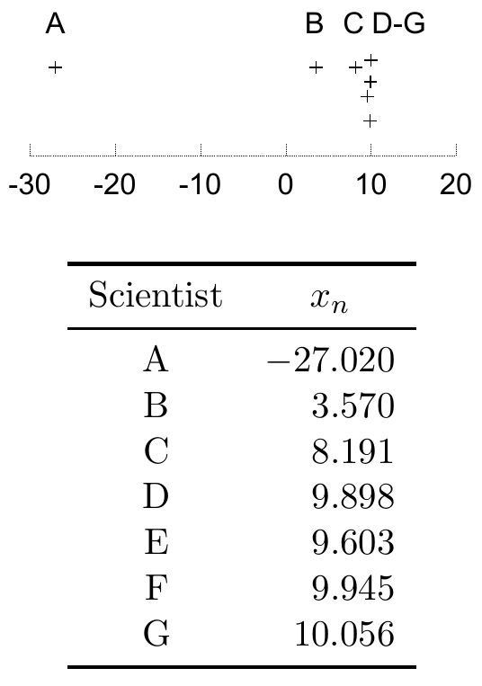

<!-- 源 PDF 物理页 321；原书印刷页 309。习题 22.16 的第一组答案跨 PDF 322，在本页译全。图 22.9 内嵌表逐格抄成可复制表格。 -->

### *最大似然与 MAP 遇到困难的习题*

▷ **习题 22.14**（难度 2）本题探究这样一个观点：最大化概率密度，并不是寻找密度代表性位置的好办法。考虑 $k$ 维空间中的高斯分布

$$P(\mathbf w)=\left(\frac{1}{\sqrt{2\pi}\sigma_W}\right)^k\exp\!\left(-\sum_{i=1}^{k}\frac{w_i^2}{2\sigma_W^2}\right).$$

证明高斯分布几乎全部的概率质量都位于半径 $r=\sqrt{k}\sigma_W$、厚度正比于 $r/\sqrt{k}$ 的薄球壳中。例如，在 $1000$ 维空间，$\sigma_W=1$ 的高斯分布有 $90\%$ 的质量位于半径 $31.6$、厚度 $2.8$ 的球壳内。然而，原点处的概率*密度*是该球壳处密度的 $e^{k/2}\simeq10^{217}$ 倍，而大部分概率质量都在球壳中。

现在考虑 $1000$ 维空间中的两个高斯密度，它们的半径尺度 $\sigma_W$ 仅相差 $1\%$，总概率质量相等。证明 $\sigma_W$ 较小的那个高斯分布，其中心的最大概率密度要大约高出 $\exp(0.01k)\simeq20\,000$ 倍。

在病态问题中，典型的后验分布往往是均值和标准差各不相同的高斯分布的加权叠加。因此，真实后验有一个偏斜的峰：概率密度的最大值位于标准差*最小*的高斯分布的均值附近，而不是权重最大的高斯分布附近。

▷ **习题 22.15**（难度 3）**七位科学家。** 从 $N$ 个分布抽取了 $N$ 个数据点 $\{x_n\}$；这些分布都是高斯分布，共有均值 $\mu$，但各有不同且未知的标准差 $\sigma_n$。给定数据，最大似然参数 $\mu,\{\sigma_n\}$ 是什么？例如，实验能力差异很大的七位科学家（A、B、C、D、E、F、G）测量 $\mu$。你预期其中一些人的测量很准确（即 $\sigma_n$ 很小），另一些人的答案则很不准确（即 $\sigma_n$ 极大）。图 22.9 给出七个结果。$\mu$ 是多少？每位科学家的结果有多可靠？

我希望你也会同意，凭直觉看，A 和 B 的测量都很糟糕，D 至 G 较好，而 $\mu$ 的真值应在 $10$ 附近。但最大化似然会告诉你什么？

图 22.9　七位科学家对参数 $\mu$ 的七次测量 $\{x_n\}$，每人有自己的噪声水平 $\sigma_n$。图内 “Scientist” 为“科学家”；下表逐格列出原图数据。

| 科学家 | $x_n$ |
| --- | ---: |
| A | $-27.020$ |
| B | $3.570$ |
| C | $8.191$ |
| D | $9.898$ |
| E | $9.603$ |
| F | $9.945$ |
| G | $10.056$ |

**习题 22.16**（难度 3）**MAP 方法的问题。** 一组器件 $i=1,\ldots,k$ 有一种称为“wodge”的属性 $w_i$。我们对每个器件分别做带噪声的实验来测量它，噪声水平已知为 $\sigma_\nu=1.0$。模型假设这些量来自高斯先验 $P(w_i\mid\alpha)=\operatorname{Normal}(0,1/\alpha)$，其中 $\alpha=1/\sigma_W^2$ 未知。这个方差的先验在 $\log\sigma_W$ 上是平坦的，$\sigma_W$ 的范围从 $0.1$ 到 $10$。

**情形 1。** 假设已测量四个器件，得到数据 $\{d_1,d_2,d_3,d_4\}=\{2.2,-2.2,2.8,-2.8\}$。我们希望推断这四个器件的 wodge 值。

（a）求使后验概率 $P(\mathbf w,\log\alpha\mid\mathbf d)$ 最大的 $\mathbf w$ 和 $\alpha$。

（b）对 $\alpha$ 求边缘概率，求给定数据时 $\mathbf w$ 的后验概率密度。[此题需用积分技巧；解答见 MacKay（1999a）。] 找出 $P(\mathbf w\mid\mathbf d)$ 的各个最大值。[答案：有两个最大值。一个位于 $\mathbf w_{\mathrm{MP}}=\{1.8,-1.8,2.2,-2.2\}$，四个参数的误差棒均为 $\pm0.9$（由后验分布的高斯近似得到）；另一个位于 $\mathbf w'_{\mathrm{MP}}=\{0.03,-0.03,0.04,-0.04\}$，误差棒为 $\pm0.1$。]
