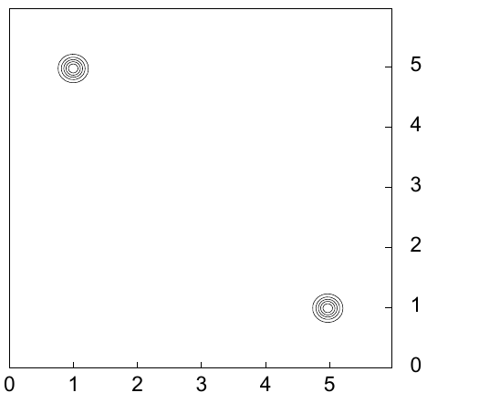

<!-- 源 PDF 物理页 322；原书印刷页 310。页首接续习题 22.16 第一情形答案已并入 PDF 321。原书式 (22.38)、(22.40) 对 n 求和的项印成 f_k(x)，未带 (n) 上标；此处照录，式 (22.37)、(22.41) 则照录其 (n)。 -->

**情形 2。** 除上述四次测量外，现又得知另外四个器件也被测量了，但所用仪器的精度低得多，噪声水平为 $\sigma'_\nu=100.0$。因此，与典型的病态问题一样，现在既有确定性较高的参数，也有确定性较低的参数。这些测量给出一组几乎不提供信息的值：$\{d_5,d_6,d_7,d_8\}=\{100,-100,100,-100\}$。

我们仍要推断这些器件的 wodge 值。凭直觉，关于测量精确的器件所作的推断，应几乎不受测量很不精确的器件提供的空泛信息影响。可是，MAP 方法会怎样？

（a）求使后验概率 $P(\mathbf w,\log\alpha\mid\mathbf d)$ 最大的 $\mathbf w$ 和 $\alpha$。

（b）求 $P(\mathbf w\mid\mathbf d)$ 的各个最大值。[答案：只有一个最大值，$\mathbf w_{\mathrm{MP}}=\{0.03,-0.03,0.03,-0.03,0.0001,-0.0001,0.0001,-0.0001\}$；全部八个参数的误差棒都是 $\pm0.11$。]

## 22.6　解答

**习题 22.5 的解答（原书印刷页 302）。** 图 22.10 给出了 $32$ 个数据点对应的似然函数等高线图。两个峰的中心大致位于 $(1,5)$ 和 $(5,1)$，等高线大致呈圆形。每个峰的宽度（标准差）为 $\sigma/\sqrt{16}=1/4$。峰的形状大致是高斯形的。

图 22.10　似然作为 $\mu_1$ 和 $\mu_2$ 的函数。

**习题 22.12 的解答（原书印刷页 307）。** 对数似然为：

$$\ln P(\{\mathbf x^{(n)}\}\mid\mathbf w)=-N\ln Z(\mathbf w)+\sum_n\sum_k w_kf_k(\mathbf x^{(n)}).\tag{22.37}$$

$$\frac{\partial}{\partial w_k}\ln P(\{\mathbf x^{(n)}\}\mid\mathbf w)=-N\frac{\partial}{\partial w_k}\ln Z(\mathbf w)+\sum_n f_k(\mathbf x).\tag{22.38}$$

现在，有意思的是对归一化常数取对数并求导会得到什么：

$$\begin{aligned}
\frac{\partial}{\partial w_k}\ln Z(\mathbf w)
&=\frac{1}{Z(\mathbf w)}\sum_{\mathbf x}\frac{\partial}{\partial w_k}\exp\!\left(\sum_{k'}w_{k'}f_{k'}(\mathbf x)\right)\\
&=\frac{1}{Z(\mathbf w)}\sum_{\mathbf x}\exp\!\left(\sum_{k'}w_{k'}f_{k'}(\mathbf x)\right)f_k(\mathbf x)
=\sum_{\mathbf x}P(\mathbf x\mid\mathbf w)f_k(\mathbf x),
\end{aligned}\tag{22.39}$$

因此

$$\frac{\partial}{\partial w_k}\ln P(\{\mathbf x^{(n)}\}\mid\mathbf w)=-N\sum_{\mathbf x}P(\mathbf x\mid\mathbf w)f_k(\mathbf x)+\sum_n f_k(\mathbf x),\tag{22.40}$$

而在似然达到最大值时，

$$\sum_{\mathbf x}P(\mathbf x\mid\mathbf w_{\mathrm{ML}})f_k(\mathbf x)=\frac{1}{N}\sum_n f_k(\mathbf x^{(n)}).\tag{22.41}$$
