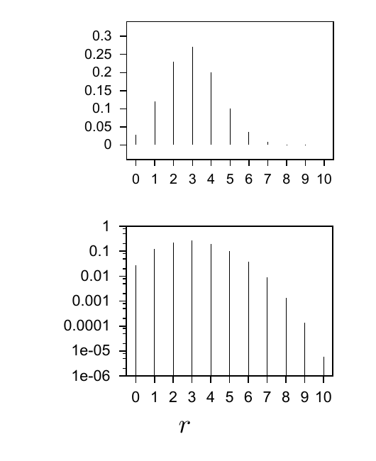
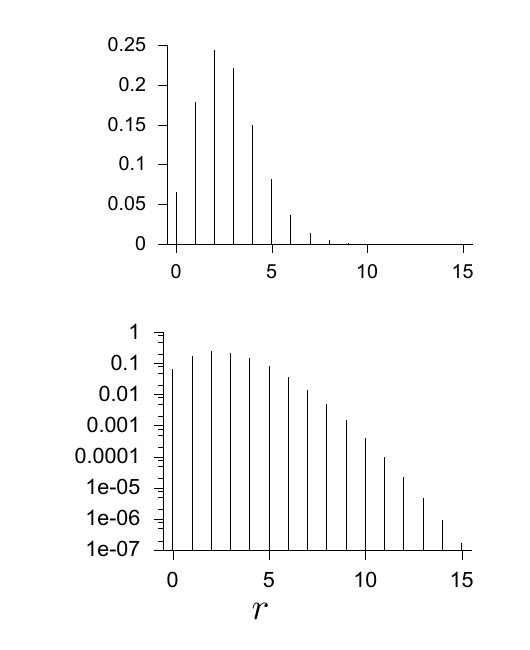

<!-- 源 PDF 物理页 323；原书印刷页 311。本页有图 23.1、图 23.2 及式 (23.1)–(23.4)。式 (23.3)/(23.4) 原页把离散取值范围排为圆括号，此处照录。 -->

# 第 23 章　常用的概率分布

> **编者导读（非原书正文）**　本章汇集贝叶斯建模中常见的离散与连续分布，说明它们的形式、参数和典型用途，并讨论分布之间的联系。

在贝叶斯数据建模中，有一小组概率分布会反复出现。本章介绍这些分布，免得以后在实际问题中遇到它们时感到畏惧。

除了高斯分布，也许不必背下其中任何一种。如果某种分布足够重要，自然会记住；否则，查一下也很容易。

## 23.1　整数上的分布

### 二项分布、泊松分布与指数分布

我们已在第 2 页见过二项分布和泊松分布。

参数为 $f$（偏置，$f\in[0,1]$）和 $N$（试验次数）的整数 $r$ 上的*二项分布*为：

$$P(r\mid f,N)=\binom Nr f^r(1-f)^{N-r},\qquad r\in\{0,1,2,\ldots,N\}.\tag{23.1}$$

例如，把一枚偏置为 $f$ 的硬币抛掷 $N$ 次，并观察正面出现的次数 $r$，就得到二项分布。

图 23.1　二项分布 $P(r\mid f=0.3,N=10)$。上图采用线性刻度，下图采用对数刻度；横轴 $r$ 为计数。

参数为 $\lambda>0$ 的*泊松分布*为：

$$P(r\mid\lambda)=e^{-\lambda}\frac{\lambda^r}{r!},\qquad r\in\{0,1,2,\ldots\}.\tag{23.2}$$

例如，在固定的时间间隔内，统计到达某个像素的光子数 $r$；若该像素上的平均光强对应的平均光子数为 $\lambda$，就会得到泊松分布。

图 23.2　泊松分布 $P(r\mid\lambda=2.7)$。上图采用线性刻度，下图采用对数刻度；横轴 $r$ 为计数。

*整数上的指数分布*为

$$P(r\mid f)=f^r(1-f),\qquad r\in(0,1,2,\ldots,\infty),\tag{23.3}$$

它出现在等待问题中。例如，如果反复掷一枚公平的六面骰，要等多久才会掷出 6？答案是：掷骰次数 $r$ 在整数上服从参数为 $f=5/6$ 的指数分布。这个分布也可以写为

$$P(r\mid f)=(1-f)e^{-\lambda r},\qquad r\in(0,1,2,\ldots,\infty),\tag{23.4}$$

其中 $\lambda=\ln(1/f)$。
