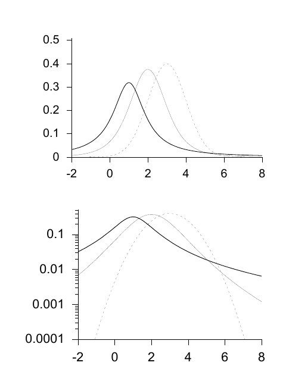

<!-- 源 PDF 物理页 324；原书印刷页 312。含式 (23.5)–(23.9)、一条无编号双高斯混合式、图 23.3 和习题 23.1。原书混合式的根号横线覆盖 σ_i；虽与常用高斯归一化形式不同，仍照原页保留。 -->

## 23.2　无界实数上的分布

### 高斯、Student、柯西、双指数与反双曲余弦分布

均值为 $\mu$、标准差为 $\sigma$ 的*高斯分布*或正态分布为

$$P(x\mid\mu,\sigma)=\frac1Z\exp\!\left(-\frac{(x-\mu)^2}{2\sigma^2}\right),\qquad x\in(-\infty,\infty),\tag{23.5}$$

其中

$$Z=\sqrt{2\pi\sigma^2}.\tag{23.6}$$

有时使用 $\tau\equiv1/\sigma^2$ 很方便；它称为高斯分布的*精度参数*（precision parameter）。

可以用下式生成一个标准一维高斯分布样本 $z$：

$$z=\cos(2\pi u_1)\sqrt{2\ln(1/u_2)},\tag{23.7}$$

其中 $u_1$ 与 $u_2$ 都在 $(0,1)$ 上均匀分布。还可以免费得到第二个与第一个样本独立的样本 $z_2=\sin(2\pi u_1)\sqrt{2\ln(1/u_2)}$。

高斯分布用途广泛，也常被说成是现实世界中很常见的一种分布，但我对此说法持怀疑态度。的确，*单峰分布*也许很常见；然而高斯分布是一种特殊、甚至相当极端的单峰分布。它的尾部很轻：对数概率密度随偏差的平方下降。$x$ 与 $\mu$ 的典型偏差是 $\sigma$，而偏差超过 $2\sigma$、$3\sigma$、$4\sigma$ 和 $5\sigma$ 的概率分别是 $0.046$、$0.003$、$6\times10^{-5}$ 和 $6\times10^{-7}$。依我的经验，偏差达到典型偏差四倍或五倍的情形或许少见，但不会少到只有 $6\times10^{-5}$ 那样。因此，我主张谨慎使用高斯分布：如果以高斯分布建模的变量实际上有更重的尾部，模型其余部分就会自行调整，压低离群值的偏差，就像橡皮筋把一张纸揉皱一样。

▷ 习题 23.1（难度 1）选一个据称具有钟形概率分布的变量，收集数据，并绘出该变量的经验分布。用对数刻度的直方图表示分布，检验其尾部是否由高斯分布很好地描述。[一个可研究的例子是音频信号的振幅。]

图 23.3　三种单峰分布：两条 Student 分布曲线，参数 $(m,s)=(1,1)$（粗线，为柯西分布）和 $(2,4)$（细线）；以及均值 $\mu=3$、标准差 $\sigma=3$ 的高斯分布（虚线）。上图采用线性纵轴，下图采用对数纵轴。注意：在上方的“钟形曲线”中，柯西分布的重尾几乎看不出来。

一种比高斯分布尾部更重的分布是*高斯混合分布*。例如，两个高斯分布的混合由两个均值、两个标准差，以及两个*混合系数* $\pi_1$ 和 $\pi_2$ 定义，满足 $\pi_1+\pi_2=1$、$\pi_i\geq0$。

$$P(x\mid\mu_1,\sigma_1,\pi_1,\mu_2,\sigma_2,\pi_2)=\frac{\pi_1}{\sqrt{2\pi\sigma_1}}\exp\!\left(-\frac{(x-\mu_1)^2}{2\sigma_1^2}\right)+\frac{\pi_2}{\sqrt{2\pi\sigma_2}}\exp\!\left(-\frac{(x-\mu_2)^2}{2\sigma_2^2}\right).$$

如果把无限多个均值都为 $\mu$ 的高斯分布按适当权重混合，就得到 *Student-t 分布*：

$$P(x\mid\mu,s,n)=\frac1Z\frac1{\left(1+(x-\mu)^2/(ns^2)\right)^{(n+1)/2}},\tag{23.8}$$

其中

$$Z=\sqrt{\pi ns^2}\,\frac{\Gamma(n/2)}{\Gamma((n+1)/2)}.\tag{23.9}$$
