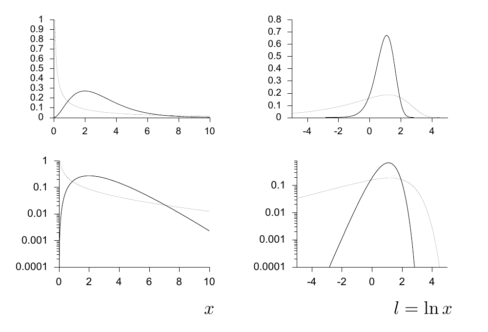

<!-- 源 PDF 物理页 326；原书印刷页 314。含图 23.4、式 (23.17)–(23.21) 与习题 23.2。原书把尺度重参数化印为 x=mx（同一符号两次），本页照录。 -->

图 23.4　两种伽马分布：参数 $(s,c)=(1,3)$（粗线）和 $(10,0.3)$（细线）。上排纵轴为线性刻度，下排为对数刻度；左列以 $x$ 为横轴，对应式 (23.15)；右列以 $l=\ln x$ 为横轴，对应式 (23.18)。

这是一个简单的单峰分布，均值为 $sc$，方差为 $s^2c$。

通常，将正实数变量 $x$ 表示为它的对数 $l=\ln x$ 很自然。$l$ 的概率密度是

$$P(l)=P(x(l))\left|\frac{\partial x}{\partial l}\right|=P(x(l))x(l),\tag{23.17}$$

$$=\frac1{Z_l}\left(\frac{x(l)}s\right)^c\exp\!\left(-\frac{x(l)}s\right),\tag{23.18}$$

其中

$$Z_l=\Gamma(c).\tag{23.19}$$

[伽马分布以它的归一化常数命名——依我看，这种惯例很奇怪！] 图 23.4 展示了两种伽马分布随 $x$ 和 $l$ 变化的曲线。注意：原来的伽马分布 (23.15) 在 $x=0$ 处可能有一个“尖峰”，而 $l$ 上的分布绝不会有这样的尖峰。这个尖峰是变量选取不当造成的假象。

当 $sc=1$ 且 $c\to0$ 时，我们得到尺度参数的无信息先验，即 $1/x$ 先验。这个*非正规先验*（improper prior）之所以称为无信息，是因为它没有对应的长度尺度，也没有特征性的 $x$ 值，所以同等对待所有 $x$ 值。它在重参数化 $x=mx$ 下保持不变。若将 $1/x$ 概率密度变换为 $l=\ln x$ 上的密度，就会发现后者是均匀的。

▷ 习题 23.2（难度 1）设想用正变量 $x$ 的立方根 $u=x^{1/3}$ 重新参数化。如果 $x$ 的概率密度是非正规的 $1/x$ 分布，那么 $u$ 的概率密度是什么？

伽马分布在 $l=\ln x$ 上的密度总是单峰的，而且如图所示，它是不对称的。如果 $x$ 服从伽马分布，而我们决定改用它的倒数 $v=1/x$，就会得到一个新分布：其在 $l$ 上的密度左右翻转。$v$ 的概率密度称为*逆伽马分布*（inverse-gamma distribution）：

$$P(v\mid s,c)=\frac1{Z_v}\left(\frac1{sv}\right)^{c+1}\exp\!\left(-\frac1{sv}\right),\qquad 0\leq v<\infty,\tag{23.20}$$

其中

$$Z_v=\Gamma(c)/s.\tag{23.21}$$
