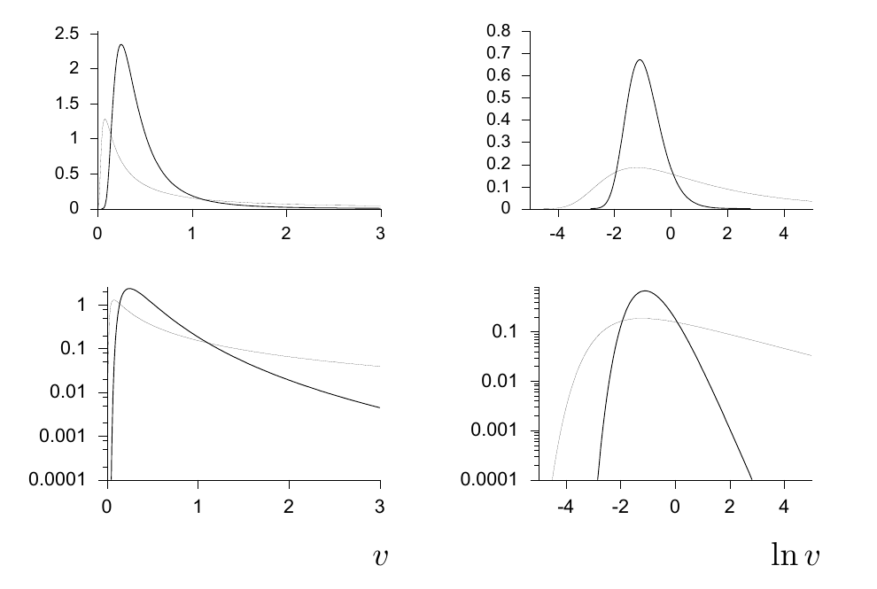
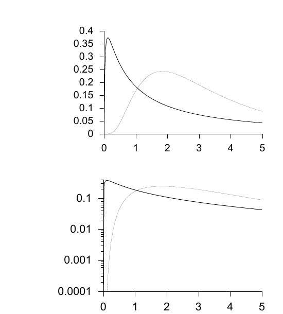

<!-- 源 PDF 物理页 327；原书印刷页 315。含图 23.5/23.6、式 (23.22)–(23.26)。图 23.5 原图注称横轴为 x 与 l=ln x，图内却标 v 与 ln v；两者均照原页保留。 -->

图 23.5　两种逆伽马分布：参数 $(s,c)=(1,3)$（粗线）和 $(10,0.3)$（细线）。上排纵轴为线性刻度，下排为对数刻度；原书图注称左列以 $x$ 为横轴、右列以 $l=\ln x$ 为横轴，图内横轴则分别标为 $v$ 与 $\ln v$。

伽马分布和逆伽马分布会出现在许多从数据推断正数的任务中。例如，根据噪声样本推断高斯噪声的方差，或者根据计数推断泊松分布的速率参数。

伽马分布也自然地出现在泊松分布事件之间的等待时间分布中。给定速率为 $\lambda$ 的泊松过程，第 $m$ 个事件的到达时间 $x$ 的概率密度为

$$\frac{\lambda(\lambda x)^{m-1}}{(m-1)!}e^{-\lambda x}.\tag{23.22}$$

### *对数正态分布*

正实数 $x$ 上的另一种分布是*对数正态分布*（log-normal distribution）：如果 $l=\ln x$ 服从正态分布，$x$ 就服从这种分布。我们定义 $m$ 为 $x$ 的中位数，$s$ 为 $\ln x$ 的标准差。

$$P(l\mid m,s)=\frac1Z\exp\!\left(-\frac{(l-\ln m)^2}{2s^2}\right),\qquad l\in(-\infty,\infty),\tag{23.23}$$

其中

$$Z=\sqrt{2\pi s^2},\tag{23.24}$$

由此可得

$$P(x\mid m,s)=\frac1x\frac1Z\exp\!\left(-\frac{(\ln x-\ln m)^2}{2s^2}\right),\qquad x\in(0,\infty).\tag{23.25}$$

图 23.6　两种对数正态分布：参数 $(m,s)=(3,1.8)$（粗线）和 $(3,0.7)$（细线）。上图采用线性纵轴，下图采用对数纵轴。[是的，它们的中位数确实都为 $m=3$。]

## 23.4　周期变量上的分布

周期变量 $\theta$ 是一个属于 $[0,2\pi]$ 的实数，且 $\theta=0$ 与 $\theta=2\pi$ 等价。

对周期变量而言，起到高斯分布对实变量所起作用的分布是 *von Mises 分布*：

$$P(\theta\mid\mu,\beta)=\frac1Z\exp\!\bigl(\beta\cos(\theta-\mu)\bigr),\qquad\theta\in(0,2\pi).\tag{23.26}$$

归一化常数为 $Z=2\pi I_0(\beta)$，其中 $I_0(x)$ 是修正贝塞尔函数（modified Bessel function）。
