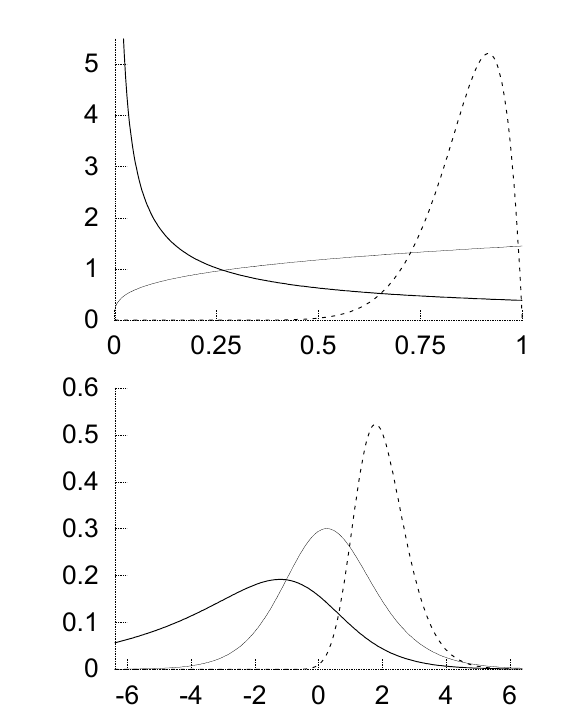

<!-- 源 PDF 物理页 328；原书印刷页 316。本页含式 (23.27)–(23.33)、图 23.7；页末跨 PDF 329 的 logit 变换句在此译全。 -->

由沿圆周的布朗扩散得到的一种分布是*缠绕高斯分布*（wrapped Gaussian distribution）：

$$P(\theta\mid\mu,\sigma)=\sum_{n=-\infty}^{\infty}\operatorname{Normal}(\theta;\mu+2\pi n,\sigma^2),\qquad\theta\in(0,2\pi).\tag{23.27}$$

## 23.5　概率值上的分布

### 贝塔分布、狄利克雷分布与熵分布

*贝塔分布*（beta distribution）是概率变量 $p$（$p\in(0,1)$）上的概率密度：

$$P(p\mid u_1,u_2)=\frac1{Z(u_1,u_2)}p^{u_1-1}(1-p)^{u_2-1}.\tag{23.28}$$

参数 $u_1,u_2$ 可以取任意正值。归一化常数是贝塔函数：

$$Z(u_1,u_2)=\frac{\Gamma(u_1)\Gamma(u_2)}{\Gamma(u_1+u_2)}.\tag{23.29}$$

特殊情形包括均匀分布，$u_1=1,u_2=1$；Jeffreys 先验，$u_1=0.5,u_2=0.5$；以及非正规的 Laplace 先验，$u_1=0,u_2=0$。如果把贝塔分布变换到相应的对数几率（logit）$l\equiv\ln[p/(1-p)]$ 上的密度，就会发现 $l$ 上的密度总是形状悦目的钟形曲线，而 $p$ 上的密度在 $p=0$ 或 $p=1$ 处可能有奇点（图 23.7）。

图 23.7　三种贝塔分布，参数 $(u_1,u_2)$ 分别为 $(0.3,1)$、$(1.3,1)$ 和 $(12,2)$。上图展示 $P(p\mid u_1,u_2)$ 随 $p$ 的变化；下图展示相应的对数几率上的密度，其中 logit 为

$$\ln\frac{p}{1-p}.$$

注意：这些密度作为 logit 的函数时，曲线的形状十分规整。

### *更多维度*

*狄利克雷分布*（Dirichlet distribution）是 $I$ 维向量 $\mathbf p$ 上的密度，$\mathbf p$ 的 $I$ 个分量均为正数，且总和为 $1$。贝塔分布是 $I=2$ 时狄利克雷分布的特例。狄利克雷分布由测度 $\mathbf u$ 参数化（该向量的所有系数均满足 $u_i>0$）；这里把它写成 $\mathbf u=\alpha\mathbf m$，其中 $\mathbf m$ 是 $I$ 个分量上的归一化测度（$\sum_i m_i=1$），而 $\alpha$ 为正数：

$$P(\mathbf p\mid\alpha\mathbf m)=\frac1{Z(\alpha\mathbf m)}\prod_{i=1}^{I}p_i^{\alpha m_i-1}\delta\!\left(\sum_i p_i-1\right)\equiv\operatorname{Dirichlet}^{(I)}(\mathbf p\mid\alpha\mathbf m).\tag{23.30}$$

函数 $\delta(x)$ 是狄拉克 delta 函数，它把分布限制在 $\mathbf p$ 已归一化的单纯形上，即 $\sum_i p_i=1$。狄利克雷分布的归一化常数为

$$Z(\alpha\mathbf m)=\frac{\prod_i\Gamma(\alpha m_i)}{\Gamma(\alpha)}.\tag{23.31}$$

向量 $\mathbf m$ 是该概率分布的均值：

$$\int\operatorname{Dirichlet}^{(I)}(\mathbf p\mid\alpha\mathbf m)\,\mathbf p\,d^I\mathbf p=\mathbf m.\tag{23.32}$$

处理概率向量 $\mathbf p$ 时，常常宜改用 “softmax 坐标系”（softmax basis）。例如，三维概率向量 $\mathbf p=(p_1,p_2,p_3)$ 可由三个数 $a_1,a_2,a_3$ 表示，要求 $a_1+a_2+a_3=0$，并满足

$$p_i=\frac1Z e^{a_i},\qquad\text{其中 }Z=\sum_i e^{a_i}.\tag{23.33}$$

这种非线性变换类似于尺度变量的 $\sigma\mapsto\ln\sigma$ 变换，以及单个概率的 logit 变换 $p\mapsto\ln\frac{p}{1-p}$。
