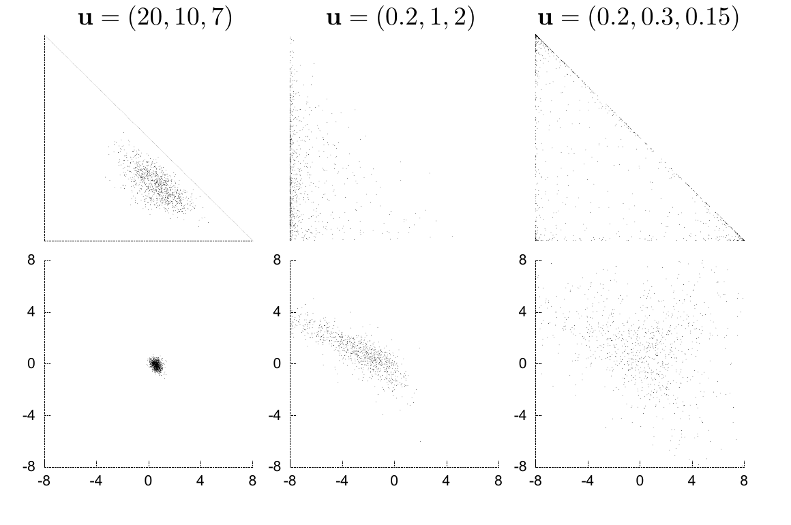
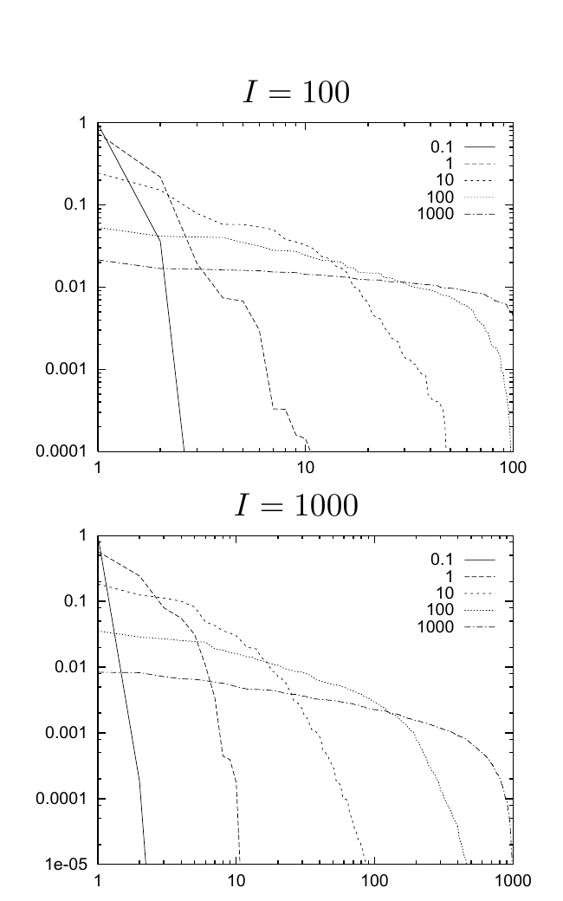

<!-- 源 PDF 物理页 329；原书印刷页 317。含图 23.8/23.9、式 (23.34) 与习题 23.3；习题在 PDF 330 续完，此处合为完整题目。页首承接 PDF 328 的 logit 句，已在 PDF 328 译全。 -->

图 23.8　三维概率向量 $(p_1,p_2,p_3)$ 上的三种狄利克雷分布。每列图内上方给出参数向量 $\mathbf u$，依次为 $(20,10,7)$、$(0.2,1,2)$ 和 $(0.2,0.3,0.15)$。上排每幅图展示从对应分布中随机抽取的 $1000$ 个样本；两轴分别表示 $p_1$ 与 $p_2$，而 $p_3=1-(p_1+p_2)$。第一幅图中的三角形是合法概率分布构成的单纯形。下排以 softmax 坐标系（式 (23.33)）展示同一批样本；两轴分别表示 $a_1$ 与 $a_2$，且 $a_3=-a_1-a_2$。

在 softmax 坐标系中，狄利克雷分布 (23.30) 的指数里那些难看的“减一”消失了，密度变为

$$P(\mathbf a\mid\alpha\mathbf m)\propto\frac1{Z(\alpha\mathbf m)}\prod_{i=1}^{I}p_i^{\alpha m_i}\delta\!\left(\sum_i a_i\right).\tag{23.34}$$

参数 $\alpha$ 的作用可以从两个方面说明。第一，$\alpha$ 衡量分布有多尖锐（图 23.8），也就是我们预期从该分布抽取的典型样本 $\mathbf p$ 会与均值 $\mathbf m$ 相差多远；这与高斯分布的精度 $\tau=1/\sigma^2$ 衡量样本会离均值多远类似。$\alpha$ 很大时，$\mathbf p$ 上的分布在 $\mathbf m$ 附近有尖锐的峰。要看清 $\alpha$ 在更高维情形下的作用，可以从 $\operatorname{Dirichlet}^{(I)}(\mathbf p\mid\alpha\mathbf m)$ 中抽取一个典型样本，把 $\mathbf m$ 设为均匀向量 $m_i=1/I$，然后绘制 Zipf 图，即按大小排列各分量 $p_i$ 的值。通常把 $p_i$（纵轴）和排名（横轴）都画在对数刻度上，这样幂律关系就呈现为直线。图 23.9 展示 $I=100$ 和 $I=1000$、$\alpha$ 从 $0.1$ 到 $1000$ 时，各取一个样本所得到的图。$\alpha$ 较大时，曲线比较平缓，许多分量的值相近。$\alpha$ 较小时，通常有一个分量 $p_i$ 占了概率的绝大部分；在其他分量分摊的少量剩余概率中，另一个分量 $p_{i'}$ 也会占很大一部分。随着 $\alpha$ 趋于零，曲线趋于越来越陡峭的幂律。

图 23.9　对 $\alpha=0.1,1,10,100,1000$ 的狄利克雷分布所抽取的随机样本绘制 Zipf 图。上图 $I=100$，下图 $I=1000$；每个 $I$ 与 $\alpha$ 的组合都只抽取一个概率向量 $\mathbf p$。图内图例的五个数字表示 $\alpha$。横轴是各分量按大小排列后的排名，纵轴是对应的概率 $p_i$；两轴均用对数刻度。

第二，观察从 $\mathbf p$ 中抽取的样本，得到各可能结果的计数 $\mathbf F=(F_1,F_2,\ldots,F_I)$ 后，我们也可以从所得的预测分布来说明 $\alpha$ 的作用。$\alpha$ 的值决定：要使数据在预测中压过先验，需要从 $\mathbf p$ 中抽取多少样本。

▷ 习题 23.3（难度 3）狄利克雷分布具有一种很好的可加性。设想一颗有偏的六面骰子有两个红色面、四个蓝色面。掷骰子 $N$ 次，两位贝叶斯主义者观察结果，以推断骰子的偏倚并作出预测。其中一位只知道每次掷出的是红色还是蓝色，因而推断一个二分量概率向量 $(p_{\mathrm R},p_{\mathrm B})$。另一位掌握每次掷出的完整结果：他能看到六个面中是哪一个朝上，因而推断六分量概率向量 $(p_1,p_2,p_3,p_4,p_5,p_6)$，其中 $p_{\mathrm R}=p_1+p_2$，$p_{\mathrm B}=p_3+p_4+p_5+p_6$。假设第二位给 $(p_1,p_2,p_3,p_4,p_5,p_6)$ 指定一个超参数为 $(u_1,u_2,u_3,u_4,u_5,u_6)$ 的狄利克雷分布。证明：要使第一位的推断与第二位一致，第一位所用的先验应是超参数为 $((u_1+u_2),(u_3+u_4+u_5+u_6))$ 的狄利克雷分布。 提示：一种费力的办法是计算积分 $P(p_{\mathrm R},p_{\mathrm B})=\int d^6\mathbf p\,P(\mathbf p\mid\mathbf u)\delta(p_{\mathrm R}-(p_1+p_2))\delta(p_{\mathrm B}-(p_3+p_4+p_5+p_6))$。更省力的办法是：给定任意数据 $(F_1,F_2,F_3,F_4,F_5,F_6)$，计算两人的预测分布，再找出使两种预测分布对所有数据都相符的条件。
