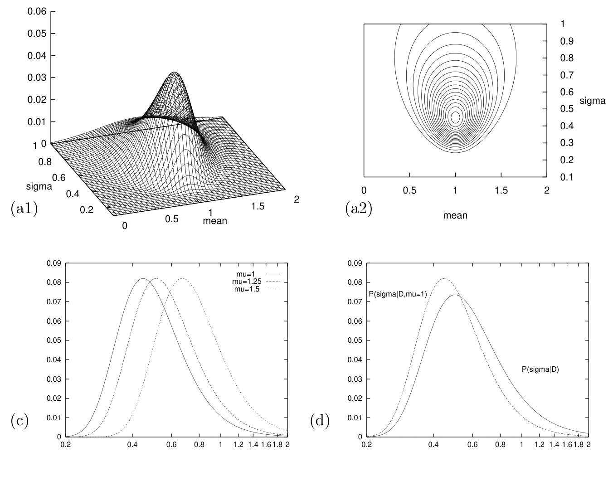

<!-- 源 PDF 物理页 333；原书印刷页 321。图 24.1 四面板由原 PDF 本页裁取；图注中的原书图号、数值和图内标签逐项保留。式 (24.5) 的根号横线经原页放大核对，仅覆盖 2\pi，与式 (24.1) 一致。 -->

图 24.1　高斯分布参数的似然函数，此处重现图 21.5。（a1、a2）以 $\mu$ 和 $\sigma$ 为变量的对数似然曲面图和等高线图。这组 $N=5$ 个数据点的均值为 $\bar{x}=1.0$，且 $S\equiv\sum(x-\bar{x})^2=1.0$。注意峰值沿 $\sigma$ 方向呈偏斜。两个标准差估计量分别为 $\sigma_N=0.45$ 和 $\sigma_{N-1}=0.50$。（c）固定 $\mu$ 于不同值时 $\sigma$ 的后验概率（表示为关于 $\ln\sigma$ 的密度）。（d）假设 $\mu$ 的先验是平坦的，将（a）中的概率质量投影到 $\sigma$ 轴，得到 $\sigma$ 的后验概率 $P(\sigma\mid D)$。$P(\sigma\mid D)$ 的峰值位于 $\sigma_{N-1}$；相比之下，$P(\sigma\mid D,\mu=\bar{x})$ 的峰值位于 $\sigma_N$。（这两个概率都表示为关于 $\ln\sigma$ 的密度。）图内 “mean”“sigma” 分别为“均值”“标准差”；“mu=1”“mu=1.25”“mu=1.5” 分别表示固定 $\mu=1,1.25,1.5$ 的三条曲线；“P(sigma|D,mu=1)” 和 “P(sigma|D)” 分别表示给定 $\mu=1$ 时以及边缘化 $\mu$ 后的 $\sigma$ 后验概率。

在抽样理论中，可以这样说明前述估计量的理由：$\bar{x}$ 是 $\mu$ 的无偏估计量；在所有可能的 $\mu$ 的无偏估计量中，它的方差最小。这里的方差，是设想从一个未知高斯分布反复抽样，在这些假想实验上取平均得到的。估计量 $(\bar{x},\sigma_N)$ 是 $(\mu,\sigma)$ 的最大似然估计量。然而，$\sigma_N$ 有*偏差*：给定 $\sigma$ 后，在许多假想实验上取平均所得的 $\sigma_N$ 的期望值并不等于 $\sigma$。

 **习题 24.1**（难度 2；解答见原书印刷第 323 页）请直观解释为什么估计量 $\sigma_N$ 有偏差。

这一偏差促使抽样理论引入 $\sigma_{N-1}$，它可以证明是无偏的。更准确地说，无偏估计 $\sigma^2$ 的是 $\sigma_{N-1}^2$。

现在来看这个问题的贝叶斯推断，假设 $\mu$ 和 $\sigma$ 都使用无信息先验。我们的重点不是先验本身，而是（a）似然函数和（b）边缘化的概念。$\mu$ 与 $\sigma$ 的联合后验概率，正比于图 24.1a 中以等高线表示的似然函数。对数似然为：

$$\ln P(\{x_n\}_{n=1}^{N}\mid\mu,\sigma)=-N\ln(\sqrt{2\pi}\sigma)-\sum_n\frac{(x_n-\mu)^2}{2\sigma^2},\tag{24.5}$$

$$=-N\ln(\sqrt{2\pi}\sigma)-\frac{N(\mu-\bar{x})^2+S}{2\sigma^2},\tag{24.6}$$

其中 $S\equiv\sum_n(x_n-\bar{x})^2$。在高斯模型下，似然可以只用数据的两个函数 $\bar{x}$ 和 $S$ 表示，因此这两个量称为*充分统计量（sufficient statistics）*。使用上述非正规先验时，$\mu$ 和 $\sigma$ 的后验概率为

$$P(\mu,\sigma\mid\{x_n\}_{n=1}^{N})=\frac{P(\{x_n\}_{n=1}^{N}\mid\mu,\sigma)P(\mu,\sigma)}{P(\{x_n\}_{n=1}^{N})}\tag{24.7}$$

$$=\frac{\displaystyle\frac{1}{(2\pi\sigma^2)^{N/2}}\exp\!\left(-\frac{N(\mu-\bar{x})^2+S}{2\sigma^2}\right)\frac{1}{\sigma_\mu}\frac{1}{\sigma}}{P(\{x_n\}_{n=1}^{N})}.\tag{24.8}$$
