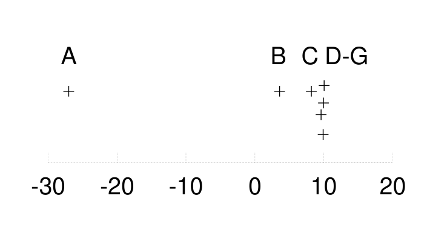

<!-- 源 PDF 物理页 335；原书印刷页 323。页首承接 PDF334 末段的经典统计学句子，已在上一页合成完整段。习题 24.3 的右侧无编号小图由原页裁取。 -->

图 24.1d 给出了 $\sigma$ 的后验概率，它正比于边缘似然。可将其与图 24.1c、d 中的另一种后验概率比较：将 $\mu$ 固定在最可能的值 $\bar{x}=1$ 时，$\sigma$ 的后验概率。

我们最后可能还想推断：“给定数据，$\mu$ 是多少？”

▷ **习题 24.2**（难度 3）对 $\sigma$ 做边缘化，求出 $\mu$ 的边缘后验分布；它是 Student-t 分布：

$$P(\mu\mid D)\propto\frac{1}{\bigl(N(\mu-\bar{x})^2+S\bigr)^{N/2}}.\tag{24.15}$$

### 延伸阅读

精确边缘化的一部经典参考书是 Bretthorst（1988）关于贝叶斯频谱分析与参数估计的著作。

## 24.2　习题

▷ **习题 24.3**（难度 3）［本题需要熟练的积分能力。］请给出习题 22.15（原书印刷第 309 页）的贝叶斯解法：七位能力各异的科学家测量了 $\mu$，每个人的噪声水平为 $\sigma_n$；我们希望推断 $\mu$。令每个 $\sigma_n$ 的先验为宽分布，例如参数 $(s,c)=(10,0.1)$ 的伽马分布。求 $\mu$ 的后验分布。将其绘出，并用不同数据集考察它的性质，例如图示数据集，以及数据集 $\{x_n\}=\{13.01,7.39\}$。

习题 24.3 的原书小图：A、B、C、D–G 标示七位科学家的观测；“+” 是各自的测量位置，横轴刻度为 $-30,-20,-10,0,10,20$。

［提示：先求给定 $\mu$ 和 $x_n$ 时 $\sigma_n$ 的后验分布 $P(\sigma_n\mid x_n,\mu)$。注意，这一推断的归一化常数是 $P(x_n\mid\mu)$。对 $\sigma_n$ 做边缘化以求出这个归一化常数，然后再次运用贝叶斯定理求 $P(\mu\mid\{x_n\})$。］

## 24.3　解答

**习题 24.1 的解答（原书印刷第 321 页）。**

1. 相对于真实均值，数据点的平均平方偏差为 $\sigma^2$。
2. 样本均值不大可能恰好等于真实均值。
3. 样本均值是使数据点相对于 $\mu$ 的平方偏差之和最小的那个 $\mu$ 值。任何其他 $\mu$ 值，尤其是真实的 $\mu$ 值，都会比 $\mu=\bar{x}$ 得到更大的平方偏差之和。

因此，相对于样本均值的平均平方偏差，其期望必然小于相对于真实均值的平均平方偏差 $\sigma^2$。
