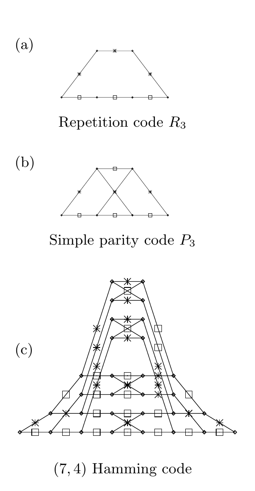

<!-- 源 PDF 物理页 338；原书印刷页 326。含图 25.1 与式 (25.7)–(25.11)。 -->

### *求解逐位译码问题*

形式上，逐位译码问题的精确解是从式 (25.1) 出发，对其他比特求*边缘化*：

$$P(t_n\mid\mathbf y)=\sum_{\{t_{n'}:n'\ne n\}}P(\mathbf t\mid\mathbf y).\tag{25.7}$$

我们也可以借助真值函数 $\mathbb 1[S]$ 来写出这一边缘概率：当命题 $S$ 为真时，该函数为 $1$，否则为 $0$。

$$P(t_n=1\mid\mathbf y)=\sum_{\mathbf t}P(\mathbf t\mid\mathbf y)\,\mathbb 1[t_n=1]\tag{25.8}$$

$$P(t_n=0\mid\mathbf y)=\sum_{\mathbf t}P(\mathbf t\mid\mathbf y)\,\mathbb 1[t_n=0].\tag{25.9}$$

若通过显式遍历所有码字 $\mathbf t$ 并求和来计算这些边缘概率，耗时将随码长指数增长。但对于某些码，使用*前向—后向算法*能更高效地解决逐位译码问题。稍后我们会介绍这种算法，它是*和积算法*的一个例子。最小和算法与和积算法都具有广泛的重要性，也曾在许多领域被反复发明。

## 25.2　码与格形图

第 1 章和第 11 章曾用生成矩阵和校验矩阵表示线性 $(N,K)$ 码。对于*系统*分组码，每组 $N$ 个发送比特中的前 $K$ 个是信源比特，其余 $M=N-K$ 个是校验比特。这意味着该码的生成矩阵可以写成

$$\mathbf G^{\mathsf T}=\begin{bmatrix}\mathbf I_K\\\mathbf P\end{bmatrix},\tag{25.10}$$

校验矩阵可以写成

$$\mathbf H=\begin{bmatrix}\mathbf P&\mathbf I_M\end{bmatrix},\tag{25.11}$$

其中 $\mathbf P$ 是一个 $M\times K$ 矩阵。

本节将研究线性码的另一种表示，称为*格形图*。这类格形图表示的码一般不是系统码，但若有需要，可以重新排列分组内的比特，将它们映射为系统码。

**图 25.1　格形图示例。** (a) 重复码 $R_3$；(b) 简单奇偶校验码 $P_3$；(c) $(7,4)$ 汉明码。每条边都以 $0$（图中用方框表示）或 $1$（图中用叉号表示）标记。图内英文“Repetition code $R_3$”“Simple parity code $P_3$”“$(7,4)$ Hamming code”分别为“重复码 $R_3$”“简单奇偶校验码 $P_3$”“$(7,4)$ 汉明码”。

### *格形图的定义*

我们给出的定义相当狭窄。如需对格形图有更全面的了解，读者可参阅 Kschischang 和 Sorokine（1995）。

**格形图**是由*节点*（也称状态或顶点）和*边*构成的图。节点按称为*时刻*的竖直切片分组；各时刻依序排列，使每条边都连接相邻两个时刻中的节点。每条边都标有一个*符号*。最左端和最右端的状态各只有一个节点。除这两个端点节点外，格形图中的每个节点都至少有一条向左连接的边和一条向右连接的边。
