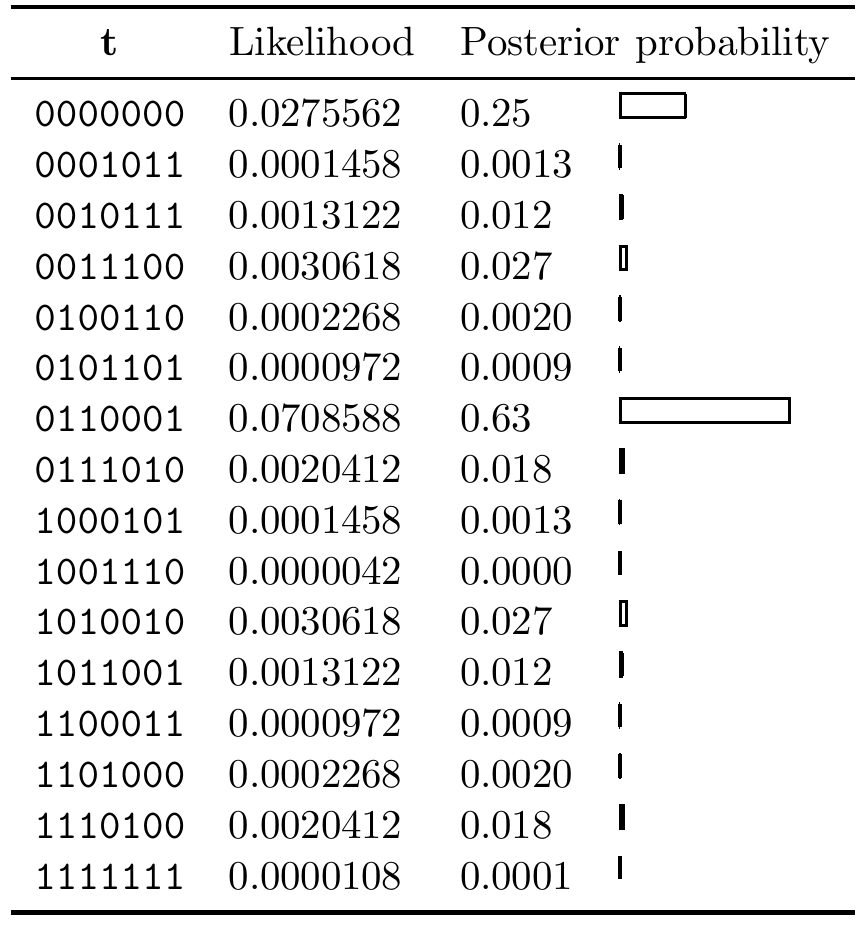

<!-- 源 PDF 物理页 340；原书印刷页 328。例 25.3 自上页接续；含图 25.2 与式 (25.12)。 -->

**图 25.2　十六个码字的后验概率。** 接收向量 $\mathbf y$ 的归一化似然为 $(0.1,0.4,0.9,0.1,0.1,0.1,0.3)$。图内英文列名“$\mathbf t$”“Likelihood”“Posterior probability”分别为“码字 $\mathbf t$”“似然”“后验概率”；每行后的横条显示相应后验概率的大小。

设归一化似然为 $(0.1,0.4,0.9,0.1,0.1,0.1,0.3)$。这就是说，似然之比分别为

$$\frac{P(y_1\mid x_1=1)}{P(y_1\mid x_1=0)}=\frac{0.1}{0.9},\qquad\frac{P(y_2\mid x_2=1)}{P(y_2\mid x_2=0)}=\frac{0.4}{0.6},\quad\text{等等。}\tag{25.12}$$

该如何对这个接收信号译码？

1. 若以 $0.5$ 为阈值，将这些似然转成二元接收向量，就得到 $\mathbf r=(0,0,1,0,0,0,0)$。使用第 1 章的二元对称信道译码器，会将它译为 $\hat{\mathbf t}=(0,0,0,0,0,0,0)$。

   这不是最优的译码过程。最优推断始终要应用贝叶斯定理。

2. 我们可以显式枚举全部 16 个码字，求出码字的后验概率。这一后验分布见图 25.2。当然，我们真正感兴趣的不是这种暴力求解方法；本章的目标是理解怎样用少于 $2^K$ 的计算时间获得同样的信息。

   查看这些后验概率可以发现，概率最高的码字实际上是 $\mathbf t=0110001$。它的概率是通过阈值处理得到的答案 $0000000$ 的两倍多。

   利用图 25.2 所示的后验概率，还可以计算每个比特的后验边缘分布。结果见图 25.3。注意，第 1、4、5、6 位都能相当有把握地推断为零；第 2、3、7 位的后验概率没有那么强。□

上例中的 MAP 码字与逐位译码的结果一致：后者是根据后验边缘分布，为每一位选择概率最大的状态。但情况并非总是如此，下一道习题将说明这一点。
