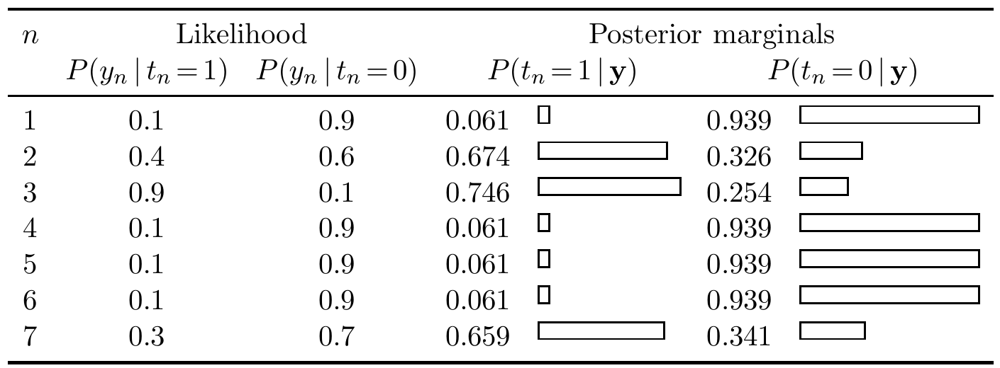

<!-- 源 PDF 物理页 341；原书印刷页 329。含图 25.3、习题 25.4 和前向消息的未编号初始化式；推导跨页接续 PDF 342。 -->

**图 25.3　七个比特的后验边缘概率。** 数值由图 25.2 的后验分布算出。图内英文“Likelihood”“Posterior marginals”分别为“似然”“后验边缘概率”；两组数值分别列出 $P(y_n\mid t_n=1)$、$P(y_n\mid t_n=0)$ 和 $P(t_n=1\mid\mathbf y)$、$P(t_n=0\mid\mathbf y)$，横条显示后验边缘概率的大小。

 **习题 25.4**（难度 2；解答见原书印刷页 333）若归一化似然为 $(0.2,0.2,0.9,0.2,0.2,0.2,0.2)$，求概率最高的码字。还要找出或估计这七个比特各自的后验边缘概率，并给出逐位译码结果。

［提示：重点考虑概率最大的少数几个码字。］

下面讨论如何通过在码的格形图上进行消息传递来解决这些译码问题。

### *最小和算法*

MAP 码字译码问题可以用第 16.3 节介绍的最小和算法求解。码的每个码字都对应一条贯穿格形图的路径。正如一段旅程的费用是各段路程费用之和，码字的对数似然也是逐位对数似然之和。按照惯例，我们将希望最大化的对数似然取反，称之为希望最小化的费用。

我们给每条边赋予费用 $-\log P(y_n\mid t_n)$，其中 $t_n$ 是与该边关联的发送比特，$y_n$ 是接收到的符号。这样，第 16.3 节的最小和算法只需与格形图边数相同数量级的计算操作，就能找出概率最高的码字。该算法也称为维特比算法（Viterbi，1967）。

### *和积算法*

为解决逐位译码问题，我们可以稍微修改最小和算法，使格形图上传递的消息表示“截至当前位置的数据概率”，而非“到达此处的最佳路径费用”。用似然本身 $P(y_n\mid t_n)$ 替换边上的费用 $-\log P(y_n\mid t_n)$；再分别用求和与求积运算替换最小和算法中的取最小值与求和运算。

令 $i$ 遍历节点／状态，$i=0$ 标记起始状态；令 $\mathcal P(i)$ 表示状态 $i$ 的父状态集合，$w_{ij}$ 表示从节点 $j$ 到节点 $i$ 的边所关联的似然。我们将前向传递的消息 $\alpha_i$ 定义为

$$\alpha_0=1$$
