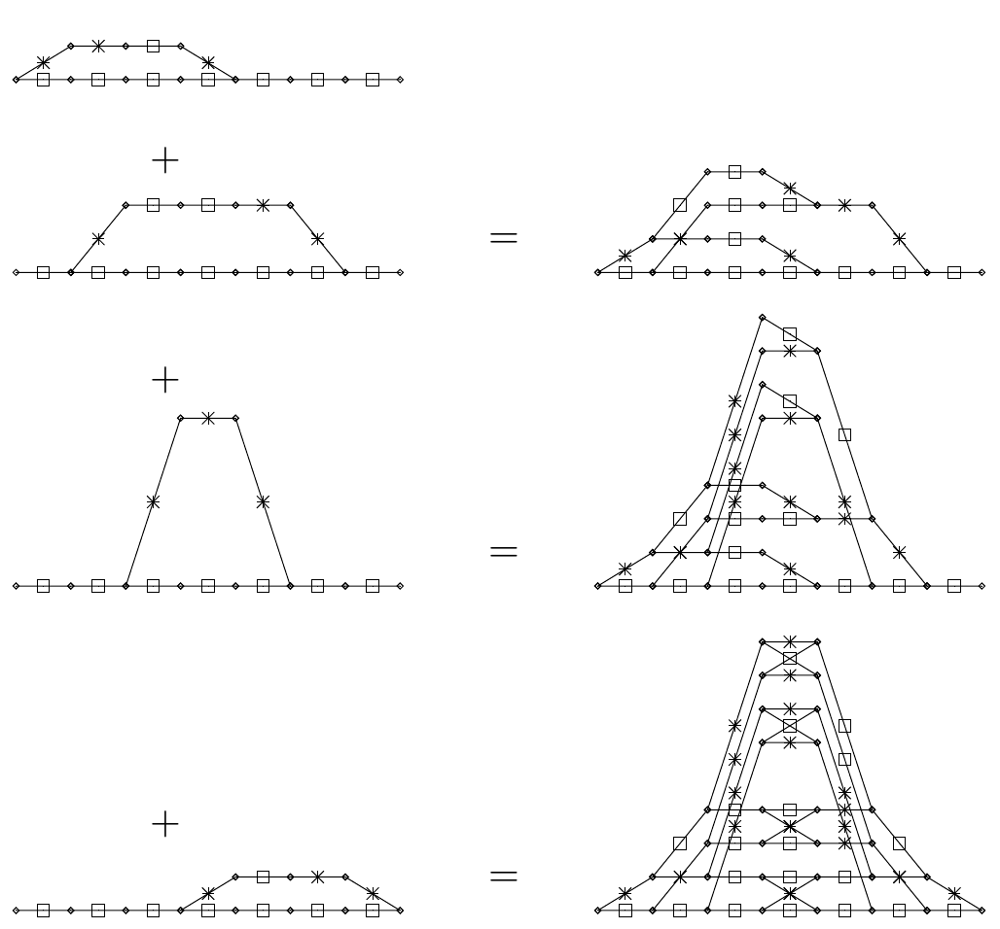
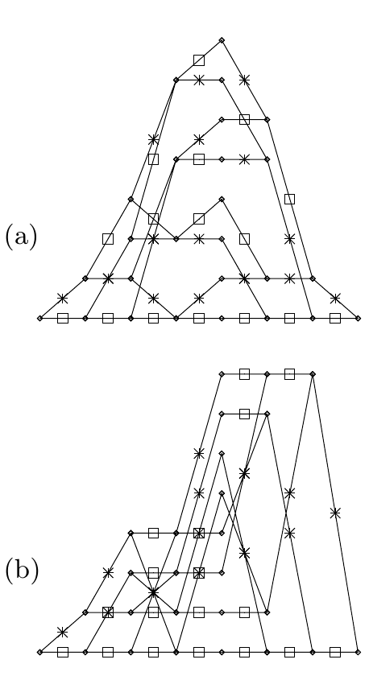

<!-- 源 PDF 物理页 344；原书印刷页 332。含图 25.6、25.7 与式 (25.20)；页末跨 PDF 345 的句子在本页补全。 -->

**图 25.6　格形图的逐步构造。** 左列是 $(7,4)$ 汉明码四个子码的格形图；右列是构造该汉明码格形图时依次得到的格形图。每条边都以 $0$（方框）或 $1$（叉号）标记；图中的“$+$”和“$=$”显示子码格形图相加构造的顺序。

由这个矩阵生成的 $(7,4)$ 汉明码，与第 1 章和上文所用的系统矩阵生成的码相比，码字比特的顺序经过了一次置换。对应于这一置换的校验矩阵为

$$\mathbf H=\begin{bmatrix}1&0&1&0&1&0&1\\0&1&1&0&0&1&1\\0&0&0&1&1&1&1\end{bmatrix}.\tag{25.20}$$

由式 (25.19) 中经过置换的矩阵 $\mathbf G$ 得到的格形图见图 25.7a。注意，这个格形图的节点数少于图 25.1c 中先前那个 $(7,4)$ 汉明码格形图的节点数。由此可见，*重新排列码字比特的顺序有时能够得到更小、更简单的格形图*。

**图 25.7　置换后的 $(7,4)$ 汉明码的格形图。** (a) 用图 25.6 的方法从生成矩阵构造；(b) 用本页所述的方法从校验矩阵构造。每条边都以 $0$（方框）或 $1$（叉号）标记。

### *从校验矩阵构造格形图*

还可以从伴随式的角度看格形图。向量 $\mathbf r$ 的伴随式定义为 $\mathbf H\mathbf r$，其中 $\mathbf H$ 是校验矩阵。只有伴随式为零的向量才可能是码字。生成一个码字时，可以用*部分伴随式*描述当前状态，也就是 $\mathbf H$ 与迄今生成的码字比特的乘积。格形图中每个状态都是某一时间坐标上的一个部分伴随式。起始状态和终止状态都被约束为零伴随式。一个状态中的每个节点表示部分伴随式的一个不同可能取值。由于 $\mathbf H$ 是 $M\times N$ 矩阵，其中 $M=N-K$，伴随式至多是一个 $M$ 位向量。因此，每个状态至多需要 $2^M$ 个节点。我们可以从两端分别推进，生成可能的伴随式序列的两棵树；两棵树的交集定义了该码的格形图。

对于这样构造得到的图，可以让竖直坐标表示伴随式。于是，每条水平边必然对应一个零比特（因为只有非零比特会改变伴随式），而每条非水平边都对应一个一比特。
