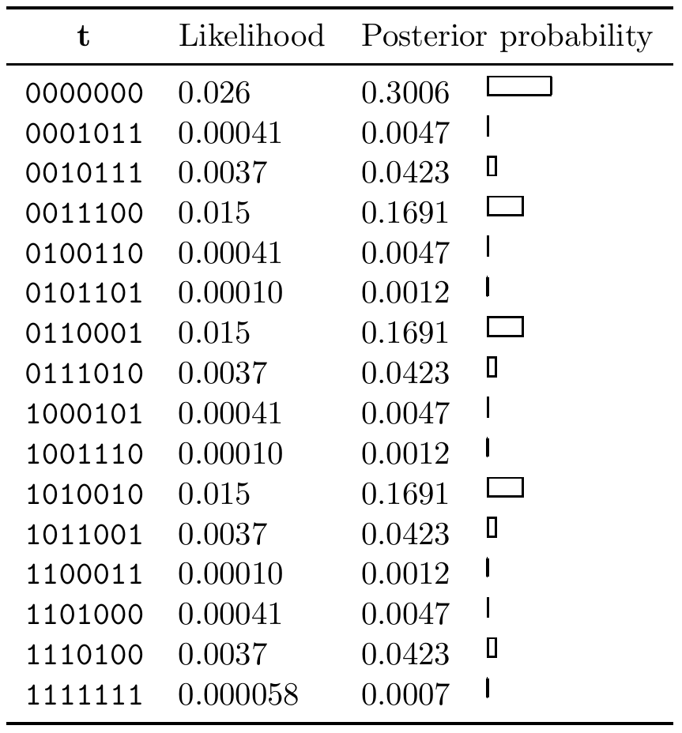

<!-- 源 PDF 物理页 345；原书印刷页 333。页首承接 PDF 344 已补全的跨页句；含表 25.8、习题 25.4/25.9 解答及一张未编号后验边缘概率表。原书习题 25.9 解答把三项逐位概率的下标都印作 t_1，照录并加源文备注。 -->

（因此，采用这种表示时，无须再为格形图的边标记符号。）图 25.7b 给出了式 (25.20) 的校验矩阵对应的格形图。

## 25.5　解答

**表 25.8　习题 25.4 的码字后验概率。** 图内英文列名“$\mathbf t$”“Likelihood”“Posterior probability”分别为“码字 $\mathbf t$”“似然”“后验概率”；横条显示后验概率的大小。数值逐行转写如下：

| 码字 $\mathbf t$ | 似然 | 后验概率 |
|:---|---:|---:|
| `0000000` | 0.026 | 0.3006 |
| `0001011` | 0.00041 | 0.0047 |
| `0010111` | 0.0037 | 0.0423 |
| `0011100` | 0.015 | 0.1691 |
| `0100110` | 0.00041 | 0.0047 |
| `0101101` | 0.00010 | 0.0012 |
| `0110001` | 0.015 | 0.1691 |
| `0111010` | 0.0037 | 0.0423 |
| `1000101` | 0.00041 | 0.0047 |
| `1001110` | 0.00010 | 0.0012 |
| `1010010` | 0.015 | 0.1691 |
| `1011001` | 0.0037 | 0.0423 |
| `1100011` | 0.00010 | 0.0012 |
| `1101000` | 0.00041 | 0.0047 |
| `1110100` | 0.0037 | 0.0423 |
| `1111111` | 0.000058 | 0.0007 |

**习题 25.4 的解答**（原书印刷页 329）。码字的后验概率见表 25.8。概率最高的码字是 `0000000`。全部七个比特的后验边缘概率为：

| $n$ | 似然 $P(y_n\mid t_n=1)$ | 似然 $P(y_n\mid t_n=0)$ | 后验边缘概率 $P(t_n=1\mid\mathbf y)$ | 后验边缘概率 $P(t_n=0\mid\mathbf y)$ |
|---:|---:|---:|---:|---:|
| 1 | 0.2 | 0.8 | 0.266 | 0.734 |
| 2 | 0.2 | 0.8 | 0.266 | 0.734 |
| 3 | 0.9 | 0.1 | 0.677 | 0.323 |
| 4 | 0.2 | 0.8 | 0.266 | 0.734 |
| 5 | 0.2 | 0.8 | 0.266 | 0.734 |
| 6 | 0.2 | 0.8 | 0.266 | 0.734 |
| 7 | 0.2 | 0.8 | 0.266 | 0.734 |

因此，逐位译码结果是 `0010000`，但它实际上不是一个码字。

**习题 25.9 的解答**（原书印刷页 330）。MAP 码字是 `101`，其似然为 $1/8$。和积算法的归一化常数是 $Z=\alpha_I=3/16$。中间的 $\alpha_i$（从左到右）依次为 $1/2,\,1/4,\,5/16,\,4/16$；中间的 $\beta_i$（从右到左）依次为 $1/2,\,1/8,\,9/32,\,3/16$。逐位译码结果按原书排印为：$P(t_1=1\mid\mathbf y)=3/4$，$P(t_1=1\mid\mathbf y)=1/4$，$P(t_1=1\mid\mathbf y)=5/6$。码字 `000`、`011`、`110`、`101` 的概率依次为 $1/12,\,2/12,\,1/12,\,8/12$。

**原书排印备注。** 上段三个逐位概率的下标在原书中都印为 $t_1$；根据四个码字的后验概率，第二、第三项应分别对应 $t_2$、$t_3$。
