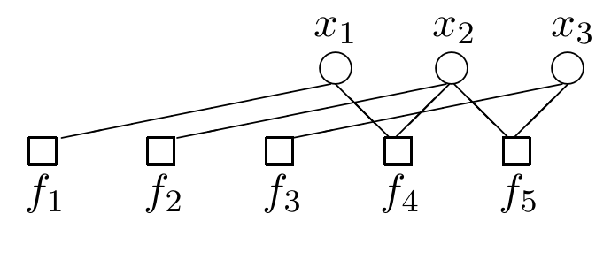

<!-- 源 PDF 物理页 347；原书印刷页 335。末段最后一句跨 PDF348 页首，译文在本页合成完整段。本页图 26.1 由原页裁取，节点、边与标签完整。 -->

顺便说一下，若接收信号为 $\mathbf r=(1,1,0)$、信道为翻转概率 $0.1$ 的二元对称信道，那么这个函数 $P(\mathbf x)$ 就是重复码中三个传输比特的后验概率分布（见第 1.2 节）。因子 $f_4$ 和 $f_5$ 分别施加约束：$x_1$ 必须等于 $x_2$，$x_2$ 必须等于 $x_3$。因子 $f_1,f_2,f_3$ 则是 $\mathbf r$ 各分量贡献的似然函数。

形如式 (26.1) 的因子分解函数可以用*因子图（factor graph）*表示：圆形节点表示变量，方形节点表示因子。只要函数 $f_m(\mathbf x_m)$ 依赖变量 $x_n$，就将变量节点 $n$ 与因子节点 $m$ 用一条边连接。式 (26.4) 的示例函数所对应的因子图见图 26.1。

图 26.1　与函数 $P^*(\mathbf x)$［式 (26.4)］对应的因子图。图中圆形节点 $x_1,x_2,x_3$ 是变量，方形节点 $f_1,\ldots,f_5$ 是因子；连线表示因子对变量的依赖。

### *归一化问题*

第一个要解决的任务是计算归一化常数 $Z$。

### *边缘化问题*

第二个任务是计算任意变量 $x_n$ 的边缘函数，定义为

$$Z_n(x_n)=\sum_{\{x_{n'}\},\,n'\ne n}P^*(\mathbf x).\tag{26.5}$$

例如，若 $f$ 是三个变量的函数，那么对 $n=1$，边缘函数定义为

$$Z_1(x_1)=\sum_{x_2,x_3}f(x_1,x_2,x_3).\tag{26.6}$$

这种对除 $x_n$ 之外的所有 $x_{n'}$ 求和的运算非常重要，因此为它设置一个专门的记号可能有用；可以称之为“不求和”（not-sum）或“汇总”（summary）。

第三个任务是计算任意变量 $x_n$ 的归一化边缘分布，定义为

$$P_n(x_n)\equiv\sum_{\{x_{n'}\},\,n'\ne n}P(\mathbf x).\tag{26.7}$$

［我们在 $P_n(x_n)$ 中保留了下标 $n$；这不同于本书其他地方通常省略该下标的做法。］

▷ **习题 26.1**（难度 1）证明归一化边缘分布与边缘函数 $Z_n(x_n)$ 满足

$$P_n(x_n)=\frac{Z_n(x_n)}{Z}.\tag{26.8}$$

我们也可能关心一部分变量的联合边缘函数，例如

$$Z_{12}(x_1,x_2)\equiv\sum_{x_3}P^*(x_1,x_2,x_3).\tag{26.9}$$

一般而言，上述任务都难以直接求解。即使每个因子只涉及三个变量，一般也认为 $Z$ 和各边缘函数的精确计算成本会随变量数 $N$ 指数增长。不过，对某些函数 $P^*$，利用其因子分解结构便能高效计算边缘函数。第 16 章的消息传递例子很好地说明了这种效率从何而来。下面要回顾的和积算法，是消息传递规则集 B（原书印刷第 242 页）的推广。与当时一样，和积算法仅在图具有树状结构时适用。
