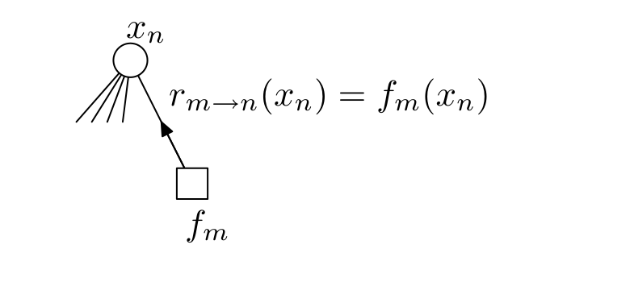
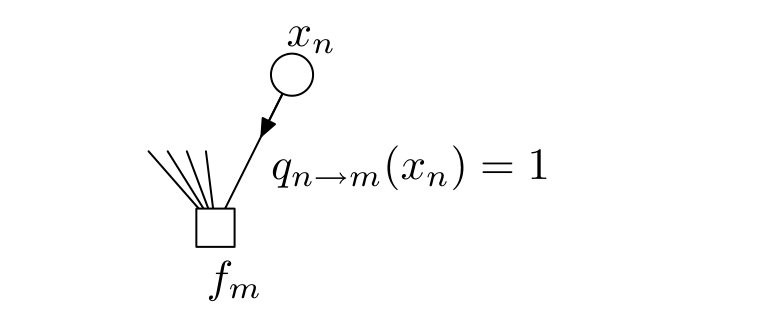

<!-- 源 PDF 物理页 348；原书印刷页 336。式 (26.11)/(26.12) 与两个加粗说明在原书同一个有边框的规则框内；本页 Markdown 逐项保留，整章构建时需组合为有框结构。页末一句跨 PDF349 页首，译文在本页合为完整句。图 26.2/26.3 均由原页裁取并保留箭头及式子。 -->

## 26.2　和积算法

### *记号*

用 $\mathcal N(m)$ 表示第 $m$ 个因子所依赖的变量集合 $\mathbf{x}_m$ 中各变量的下标。对示例函数式 (26.4)，$\mathcal N(1)=\{1\}$（因为 $f_1$ 只依赖 $x_1$），$\mathcal N(2)=\{2\}$，$\mathcal N(3)=\{3\}$，$\mathcal N(4)=\{1,2\}$，$\mathcal N(5)=\{2,3\}$。类似地，用 $\mathcal M(n)$ 表示变量 $n$ 所参与的因子集合。用 $\mathcal N(m)\backslash n$ 表示从 $\mathcal N(m)$ 中去掉变量 $n$。再用简记 $\mathbf{x}_m\backslash n$ 或 $\mathbf{x}_{m\backslash n}$，表示 $\mathbf{x}_m$ 中去掉 $x_n$ 后的变量集合，即

$$\mathbf{x}_m\backslash n\equiv\{x_{n'}:n'\in\mathcal N(m)\backslash n\}.\tag{26.10}$$

和积算法要在因子图的边上发送两种消息：$q_{n\to m}$ 从变量节点传向因子节点，$r_{m\to n}$ 从因子节点传向变量节点。沿着连接因子 $f_m$ 与变量 $x_n$ 的边发送的消息，无论属于 $q$ 还是 $r$，始终都是变量 $x_n$ 的函数。两类消息分别按以下规则更新。

**从变量到因子：**

$$q_{n\to m}(x_n)=\prod_{m'\in\mathcal M(n)\backslash m}r_{m'\to n}(x_n).\tag{26.11}$$

**从因子到变量：**

$$r_{m\to n}(x_n)=\sum_{\mathbf{x}_m\backslash n}\left(f_m(\mathbf{x}_m)\prod_{n'\in\mathcal N(m)\backslash n}q_{n'\to m}(x_{n'})\right).\tag{26.12}$$

### *这些规则怎样用于因子图中的叶节点*

如果一个节点只有一条边连向另一节点，就称它为*叶节点*。

图中有些因子节点可能只连着一个变量节点。此时，在因子消息更新式 (26.12) 中，集合 $\mathcal N(m)\backslash n$ 是空集，而空乘积的值为 $1$。这样的因子节点会一直向唯一的邻居 $x_n$ 发送消息 $r_{m\to n}(x_n)=f_m(x_n)$。

图 26.2　作为叶节点的因子节点，始终向它唯一的邻居 $x_n$ 发送消息 $r_{m\to n}(x_n)=f_m(x_n)$。图内圆形节点为 $x_n$，方形节点为 $f_m$；箭头表示消息方向。

类似地，有些变量节点可能只连着一个因子节点。在式 (26.11) 中，此时 $\mathcal M(n)\backslash m$ 是空集。这些节点会一直发送消息 $q_{n\to m}(x_n)=1$。

图 26.3　作为叶节点的变量节点，始终发送消息 $q_{n\to m}(x_n)=1$。图内圆形节点为 $x_n$，方形节点为 $f_m$；箭头表示消息方向。

### *启动与结束：方法 1*

算法有两种初始化方法。如果图具有树状结构，其中必然有叶节点。这些叶节点可以从一开始就向各自的邻居发送消息。
