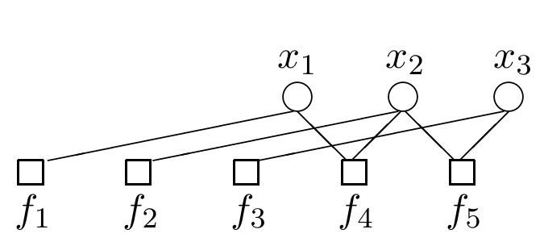

<!-- 源 PDF 物理页 349；原书印刷页 337。页首接续 PDF348 末句，已在前页合为完整句。图 26.4 为原页独立裁图，保留 x1–x3、f1–f5 和全部连线。 -->

对于所有叶变量节点 $n$：

$$q_{n\to m}(x_n)=1.\tag{26.13}$$

对于所有叶因子节点 $m$：

$$r_{m\to n}(x_n)=f_m(x_n).\tag{26.14}$$

接下来可以采用第 16 章的消息传递规则集 B（第 242 页）的流程：只有当一条消息所依赖的全部消息都已到达时，才根据规则 (26.11)、(26.12) 创建它。例如，在图 26.4 中，$x_1$ 发给 $f_1$ 的消息，必须等 $f_4$ 发给 $x_1$ 的消息到达后才能发出；$x_2$ 发给 $f_2$ 的消息 $q_{2\to2}$，必须等 $r_{4\to2}$ 和 $r_{5\to2}$ 都到达后才能发出。

图 26.4　函数 $P^*(\mathbf x)$（式 (26.4)）的模型因子图。图内圆形节点从左到右为 $x_1,x_2,x_3$，方形节点从左到右为 $f_1,f_2,f_3,f_4,f_5$；连线表示因子对变量的依赖。

这样，消息便会沿着树的每条边在两个方向上传递。经过与图的直径相等的步数，全部消息都将创建完成。

这时就能读出所需的结果。把到达节点 $x_n$ 的所有消息相乘，便得到 $x_n$ 的边缘函数：

$$Z_n(x_n)=\prod_{m\in\mathcal M(n)}r_{m\to n}(x_n).\tag{26.15}$$

对任意一个边缘函数求和，就能得到归一化常数 $Z=\sum_{x_n}Z_n(x_n)$。由此得到归一化后的边缘分布：

$$P_n(x_n)=\frac{Z_n(x_n)}{Z}.\tag{26.16}$$

▷ 习题 26.2（难度 2）对式 (26.4) 和图 26.1 定义的函数应用和积算法。检查得到的归一化边缘分布，是否与你对重复码 $R_3$ 的认识一致。

习题 26.3（难度 3）证明：如果图具有树状结构，和积算法就能正确计算边缘函数 $Z_n(x_n)$。

习题 26.4（难度 3）说明如何利用和积算法计算出的消息，在树状图中得到更复杂的边缘函数。例如，若变量 $x_1$ 和 $x_2$ 都连接到同一个因子节点，如何求 $Z_{1,2}(x_1,x_2)$？

### *启动与结束：方法 2*

也可以把从变量节点发出的*所有*初始消息都设为 $1$，以此初始化算法：

$$q_{n\to m}(x_n)=1,\qquad\text{对所有 }n,m.\tag{26.17}$$

然后按因子消息更新规则 (26.12) 计算，并与变量消息更新规则 (26.11) 交替进行。与方法 1 相比，这种宽松的初始化方式会造成许多白费的计算；随着方法 1 会算出的正确结果逐步传开，这些无用结果会被冲掉。

迭代次数达到因子图的直径后，算法将收敛到一组满足和积关系 (26.11)、(26.12) 的消息。

习题 26.5（难度 2）对式 (26.4) 和图 26.1 定义的函数，应用这个第二版本的和积算法。
