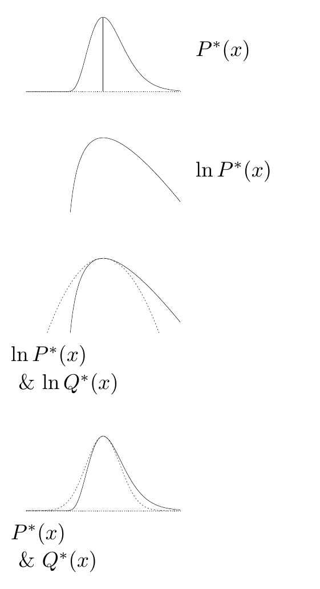

<!-- 源 PDF 物理页 353；原书印刷页 341。含式 (27.1)–(27.8) 和一幅无编号、无图注的拉普拉斯近似示意图。 -->

# 第 27 章　拉普拉斯方法

> **编者导读（非原书正文）**　本章用密度峰值附近的二次展开构造高斯近似，估算归一化常数，并通过习题考察这一方法对坐标变换和后验推断的影响。

拉普拉斯近似背后的想法很简单。设我们关心一个未归一化概率密度 $P^*(x)$，其归一化常数为

$$Z_P\equiv\int P^*(x)\,\mathrm dx,\tag{27.1}$$

并假设它在 $x_0$ 处有一个峰值。围绕这个峰值，对 $P^*(x)$ 的对数作泰勒展开：

$$\ln P^*(x)\simeq\ln P^*(x_0)-\frac{c}{2}(x-x_0)^2+\cdots,\tag{27.2}$$

其中

$$c=-\left.\frac{\partial^2}{\partial x^2}\ln P^*(x)\right|_{x=x_0}.\tag{27.3}$$

接着，用一个未归一化的高斯函数近似 $P^*(x)$：

$$Q^*(x)\equiv P^*(x_0)\exp\!\left[-\frac{c}{2}(x-x_0)^2\right],\tag{27.4}$$

并用这个高斯函数的归一化常数近似 $Z_P$：

$$Z_Q=P^*(x_0)\sqrt{\frac{2\pi}{c}}.\tag{27.5}$$

**图内文字译注（原书无图号及图注）。** 从上到下，四组标签分别是“$P^*(x)$”“$\ln P^*(x)$”“$\ln P^*(x)$ 与 $\ln Q^*(x)$”“$P^*(x)$ 与 $Q^*(x)$”。示意图依次展示原密度、其对数以及与高斯近似的对照。

我们可以把这个积分推广到 $K$ 维空间 $\mathbf x$ 中的密度 $P^*(\mathbf x)$，以近似计算 $Z_P$。设在最大值点 $\mathbf x_0$，$-\ln P^*(\mathbf x)$ 的二阶导数矩阵为 $\mathbf A$，其定义是

$$A_{ij}=-\left.\frac{\partial^2}{\partial x_i\partial x_j}\ln P^*(\mathbf x)\right|_{\mathbf x=\mathbf x_0},\tag{27.6}$$

则式 (27.2) 推广为

$$\ln P^*(\mathbf x)\simeq\ln P^*(\mathbf x_0)-\frac{1}{2}(\mathbf x-\mathbf x_0)^{\mathsf T}\mathbf A(\mathbf x-\mathbf x_0)+\cdots,\tag{27.7}$$

于是，归一化常数可近似为

$$Z_P\simeq Z_Q=P^*(\mathbf x_0)\frac{1}{\sqrt{\det\!\left(\frac{1}{2\pi}\mathbf A\right)}}=P^*(\mathbf x_0)\sqrt{\frac{(2\pi)^K}{\det\mathbf A}}.\tag{27.8}$$

可以用近似分布 $Q$ 进行预测。物理学家也把这一广泛使用的近似称为*鞍点近似*。
