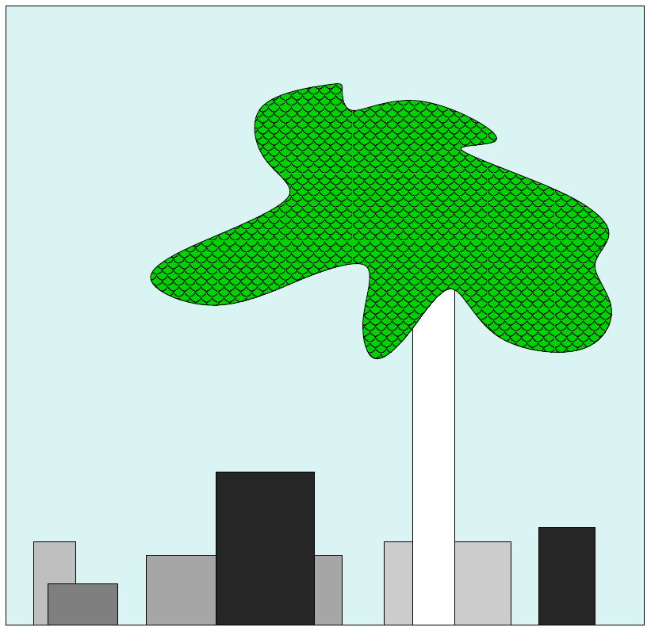
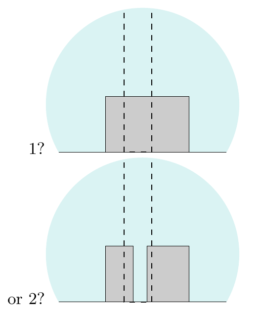

<!-- 源 PDF 物理页 355；原书印刷页 343。含图 28.1、28.2；页末跨 PDF 356 的动机段落在本页合为完整句。 -->

# 第 28 章　模型比较与奥卡姆剃刀

> **编者导读（非原书正文）**　本章从树后盒子的例子出发，讨论贝叶斯模型比较怎样在解释数据的同时体现对简单模型的偏好。

**图 28.1　等待解释的一幅图。** 图中有一棵树和一些盒子。

## 28.1　奥卡姆剃刀

这幅图（图 28.1）里有多少个盒子？特别是，树的附近有多少个盒子？如果戴上能透视的眼镜，我们会在树干后面看到一个盒子，还是两个（图 28.2）？或者更多？*奥卡姆剃刀*是一条偏好简单理论的原则：“接受能解释数据的最简单解释。”因此，按照奥卡姆剃刀，我们应推断树后只有一个盒子。这只是临时想出的经验法则吗？还是说，有令人信服的理由相信最可能只有一个盒子？或许你直觉上赞同这样的论证：“两个盒子恰好有同样的高度和颜色，那可真是惊人的*巧合*。”如果希望制造能正确解释数据的人工智能，我们就必须将这种直觉转化为具体理论。

**图 28.2　树后有多少个盒子？** 图内英文“1?”和“or 2?”分别为“1 个？”和“还是 2 个？”。

### *奥卡姆剃刀的动机*

如果若干种解释都与一组观察相容，奥卡姆剃刀建议我们选择最简单的解释。人们通常出于两个理由主张这一原则：第一个是审美理由（“具有数学美感的理论，比符合某些实验数据的丑陋理论更可能正确”——Paul Dirac）；第二个是奥卡姆剃刀以往在经验上的成功。
