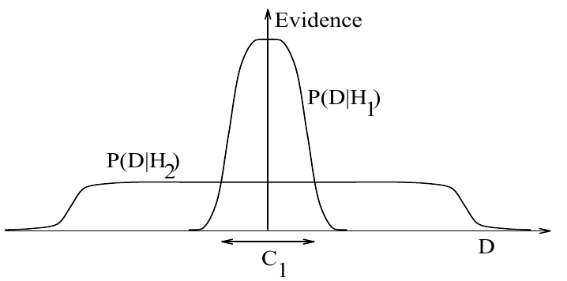

<!-- 源 PDF 物理页 356；原书印刷页 344。页首接续 PDF 355 的动机段已并入上页；含图 28.3、式 (28.1) 和一处未编号数列展示式。页末跨 PDF 357 的多项式完整收在本页。 -->

**图 28.3　为什么贝叶斯推断体现奥卡姆剃刀。** 这幅图给出复杂模型有时反而不那么可能的基本直觉。横轴表示可能的数据集 $D$ 的空间。贝叶斯定理按模型对实际出现的数据所作预测的程度奖励模型。这些预测由 $D$ 上的归一化概率分布量化。给定模型 $\mathcal H_i$ 时数据出现的概率 $P(D\mid\mathcal H_i)$，称为 $\mathcal H_i$ 的*证据*。简单模型 $\mathcal H_1$ 只预测有限范围的数据，如 $P(D\mid\mathcal H_1)$ 所示；能力更强的模型 $\mathcal H_2$，例如拥有更多自由参数，能够预测更多种数据集。但这也意味着，在区域 $C_1$ 内，$\mathcal H_2$ 对数据集的预测不如 $\mathcal H_1$ 强。假设两个模型具有相同的先验概率，那么若数据集落在 $C_1$，能力*较弱*的 $\mathcal H_1$ 将是*更可能*的模型。图内英文“Evidence”为“证据”；$P(D\mid\mathcal H_1)$、$P(D\mid\mathcal H_2)$、$C_1$ 和 $D$ 为图中的概率曲线、区域与数据空间标记。

不过，奥卡姆剃刀还有另一依据：

> 自洽推断（贝叶斯概率是它的一种体现）会自动、定量地体现奥卡姆剃刀。

树后确实*更可能*只有一个盒子，而且我们可以计算一个盒子比两个盒子可能多少。

### *模型比较与奥卡姆剃刀*

给定数据 $D$，我们可以这样评估两个备选理论 $\mathcal H_1$ 和 $\mathcal H_2$ 的可信程度：利用贝叶斯定理，将观察到数据后模型 $\mathcal H_1$ 的可信程度 $P(\mathcal H_1\mid D)$，与模型对数据的预测 $P(D\mid\mathcal H_1)$ 及模型的先验可信程度 $P(\mathcal H_1)$ 联系起来。这样就得到两个理论的概率比：

$$\frac{P(\mathcal H_1\mid D)}{P(\mathcal H_2\mid D)}=\frac{P(\mathcal H_1)}{P(\mathcal H_2)}\frac{P(D\mid\mathcal H_1)}{P(D\mid\mathcal H_2)}.\tag{28.1}$$

等号右边第一个比值 $P(\mathcal H_1)/P(\mathcal H_2)$ 衡量我们的初始信念相对于 $\mathcal H_2$ 有多偏向 $\mathcal H_1$。第二个比值表示，与 $\mathcal H_2$ 相比，$\mathcal H_1$ 对观察数据的预测有多好。

若 $\mathcal H_1$ 比 $\mathcal H_2$ 简单，这和奥卡姆剃刀有什么关系？如果愿意，我们可以借助第一个比值 $P(\mathcal H_1)/P(\mathcal H_2)$，出于审美或经验理由，加入偏向 $\mathcal H_1$ 的先验偏好。这对应前述支持奥卡姆剃刀的两种动机。但这种先验偏好并非必要：第二个比值，即依赖数据的因子，会*自动*体现奥卡姆剃刀。简单模型往往作出精确的预测。复杂模型从性质上说能够作出更多种预测（图 28.3）。因此，若 $\mathcal H_2$ 更复杂，它就必须把预测概率 $P(D\mid\mathcal H_2)$ 比 $\mathcal H_1$ 更分散地分配到数据空间。于是，当数据与两个理论都相容时，较简单的 $\mathcal H_1$ 会比 $\mathcal H_2$ 更可能，而我们无须表达任何对复杂模型的主观反感。我们的主观先验只需为简单与复杂这两种可能性赋予相同的先验概率；随后，概率论便让观测数据表达自己的意见。

来看一个简单例子。数列如下：

$$-1,\ 3,\ 7,\ 11.$$

任务是预测接下来的两个数，并推断产生这一数列的过程。一个常见答案是“15、19”，理由是“在前一个数上加 4”。

另一种答案“$-19.9$、$1043.8$”又如何？它所依据的规则是：从前一个数 $x$ 出发，计算 $-x^3/11+9x^2/11+23/11$，得到下一个数。
