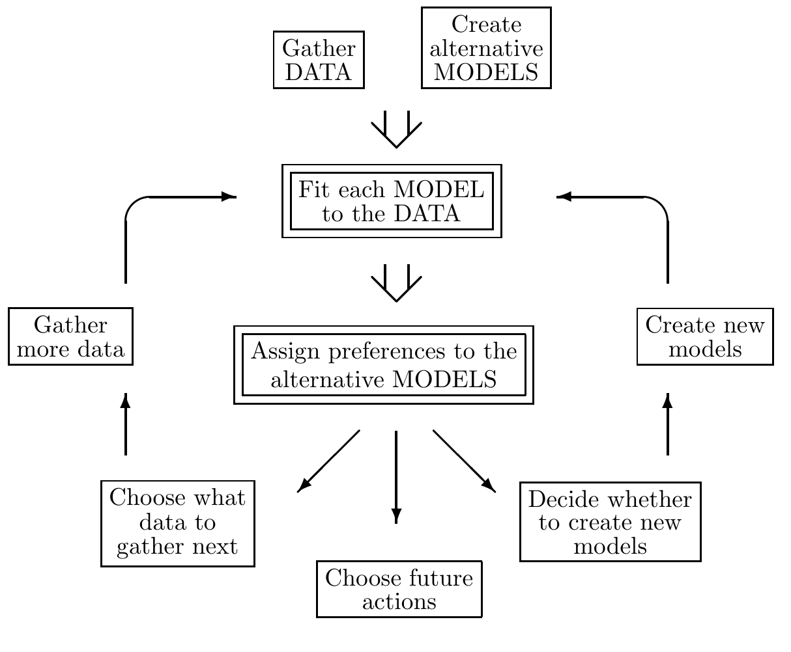

<!-- 源 PDF 物理页 358；原书印刷页 346。页首接续 PDF 357 的句子已并入上页；含图 28.4。页末跨 PDF 359 的缩进说明在本页合为完整段落。 -->

**图 28.4　贝叶斯推断在数据建模过程中的位置。** 这幅图抽象地表示科学研究中收集数据和建立模型的过程，包括模式分类、学习、插值等。两个双线框表示涉及*推断*的步骤；只有在这两个步骤中才可以使用贝叶斯定理。例如，贝叶斯方法并不告诉你怎样发明模型。第一个框“将每个模型拟合数据”是在已知模型和数据的条件下推断模型参数可能取什么值。贝叶斯方法可用于寻找概率最高的参数值及这些参数的误差棒；对此问题，所得结果通常与传统统计学的答案差别不大。第二项推断任务是根据数据比较模型；贝叶斯方法在这里独具优势。这项任务需要一把定量的奥卡姆剃刀来惩罚过于复杂的模型。贝叶斯方法能为备选模型赋予客观的偏好，并自动体现奥卡姆剃刀。图内英文各框依次为：“Gather DATA”＝“收集数据”，“Create alternative MODELS”＝“建立备选模型”，“Fit each MODEL to the DATA”＝“将每个模型拟合数据”，“Assign preferences to the alternative MODELS”＝“为备选模型赋予偏好”，“Gather more data”＝“收集更多数据”，“Create new models”＝“建立新模型”，“Choose what data to gather next”＝“选择下一步收集的数据”，“Decide whether to create new models”＝“决定是否建立新模型”，“Choose future actions”＝“选择今后的行动”。

### *贝叶斯方法与数据分析*

现在把上面的讨论联系到数据分析中的实际问题。

在科学、统计学和技术中，有无数问题需要在数据有限时，对复杂程度不同的备选模型赋予偏好。例如，解释行星运动的两个备选假说是：宗教裁判官先生（Mr. Inquisition）基于“本轮”（epicycles）的地心模型，和哥白尼先生以太阳为中心的较简单太阳系模型。本轮模型对行星运动数据的拟合至少与哥白尼模型一样好，但它使用了更多参数。巧的是，对宗教裁判官先生来说，每颗行星额外需要的两个本轮参数，恰好与太阳“绕地球运动”的周期和半径相同。直觉上，我们认为哥白尼的理论更可能。

### *贝叶斯剃刀的机制：证据与奥卡姆因子*

在数据建模过程中，通常可以区分两个层次的推断。第一层假定某个特定模型为真，将它拟合到数据；也就是说，给定数据后，推断其自由参数可能取什么值。这一层的结果通常概括为概率最高的参数值，以及这些参数的误差棒。每个模型都重复这样的分析。第二层推断是模型比较：根据数据比较各模型，并对备选模型赋予某种偏好或排序。

> 注意，这两个层次的*推断*都不同于*决策理论*。推断的目标是在假设空间和数据集已确定时，为各假设赋予概率。决策理论通常依据这些概率，在备选*行动*之间作选择，以使“损失函数”的期望最小。本章只讨论推断，不涉及损失函数。这里所说的模型比较，也不应理解为暗示要*选择*一个模型。理想的贝叶斯预测并不在模型之间作选择；它按各模型的概率加权，对所有备选模型求和来作预测。
