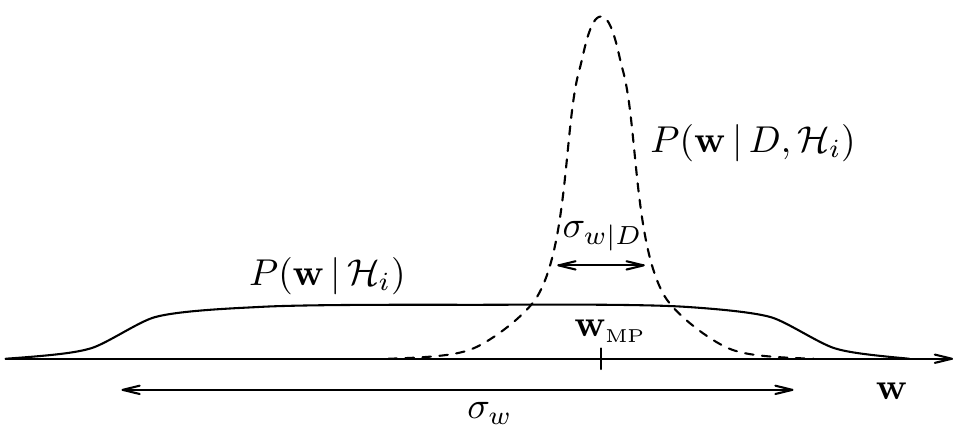

<!-- 源 PDF 物理页 360；原书印刷页 348。页首接续 PDF 359 的方括号说明已并入上页；含图 28.5、式 (28.6)、(28.7)，第二项编号列表承接上页第一项。 -->

**图 28.5　奥卡姆因子。** 图示具有单个参数 $\mathbf w$ 的假设 $\mathcal H_i$ 之奥卡姆因子由哪些量决定。参数的先验分布（实线）宽度为 $\sigma_w$；后验分布（虚线）在 $\mathbf w_{\mathrm{MP}}$ 处有单个峰，其特征宽度为 $\sigma_{w\mid D}$。奥卡姆因子是 $\sigma_{w\mid D}P(\mathbf w_{\mathrm{MP}}\mid\mathcal H_i)=\sigma_{w\mid D}/\sigma_w$。图内 $P(\mathbf w\mid\mathcal H_i)$ 与 $P(\mathbf w\mid D,\mathcal H_i)$ 分别表示先验与后验；$\mathbf w_{\mathrm{MP}}$、$\sigma_w$、$\sigma_{w\mid D}$ 标记峰值与两种宽度。

2. **模型比较。** 在第二层推断中，给定数据后，我们要推断哪个模型最可信。各模型的后验概率为

$$P(\mathcal H_i\mid D)\propto P(D\mid\mathcal H_i)P(\mathcal H_i).\tag{28.6}$$

注意，依赖数据的 $P(D\mid\mathcal H_i)$ 是 $\mathcal H_i$ 的证据，也就是式 (28.4) 中出现的归一化常数。第二项 $P(\mathcal H_i)$ 是假设空间上的主观先验，表示看到数据之前，我们认为各备选模型有多可信。假设我们选择为备选模型赋予相同的先验 $P(\mathcal H_i)$，那么*评估证据就能给模型 $\mathcal H_i$ 排序*。式 (28.6) 略去了归一化常数 $P(D)=\sum_i P(D\mid\mathcal H_i)P(\mathcal H_i)$，因为在数据建模过程中，我们可能在看到数据后发现最初模型的不足，继而开发新模型。推断是开放的：我们不断寻找更可能解释所收集数据的模型。

再重述要点：贝叶斯方法通过评估证据 $P(D\mid\mathcal H_i)$，为备选模型 $\mathcal H_i$ 排序。这个概念非常普遍：参数模型和“非参数”模型都可以计算证据；无论数据建模任务是回归、分类还是密度估计，证据都可以作为比较备选模型的通用量。在所有这些情形中，证据都自然体现奥卡姆剃刀。

### *计算证据*

现在更仔细地研究证据，以理解贝叶斯奥卡姆剃刀如何发挥作用。证据是式 (28.4) 的归一化常数：

$$P(D\mid\mathcal H_i)=\int P(D\mid\mathbf w,\mathcal H_i)P(\mathbf w\mid\mathcal H_i)\,\mathrm d\mathbf w.\tag{28.7}$$

对许多问题，后验分布 $P(\mathbf w\mid D,\mathcal H_i)\propto P(D\mid\mathbf w,\mathcal H_i)P(\mathbf w\mid\mathcal H_i)$ 在最可能的参数 $\mathbf w_{\mathrm{MP}}$ 处有一个明显的峰（图 28.5）。为简单起见，考虑一维情形，应用拉普拉斯方法，可用被积函数 $P(D\mid\mathbf w,\mathcal H_i)P(\mathbf w\mid\mathcal H_i)$ 的峰高乘以其宽度 $\sigma_{w\mid D}$，来近似证据：
