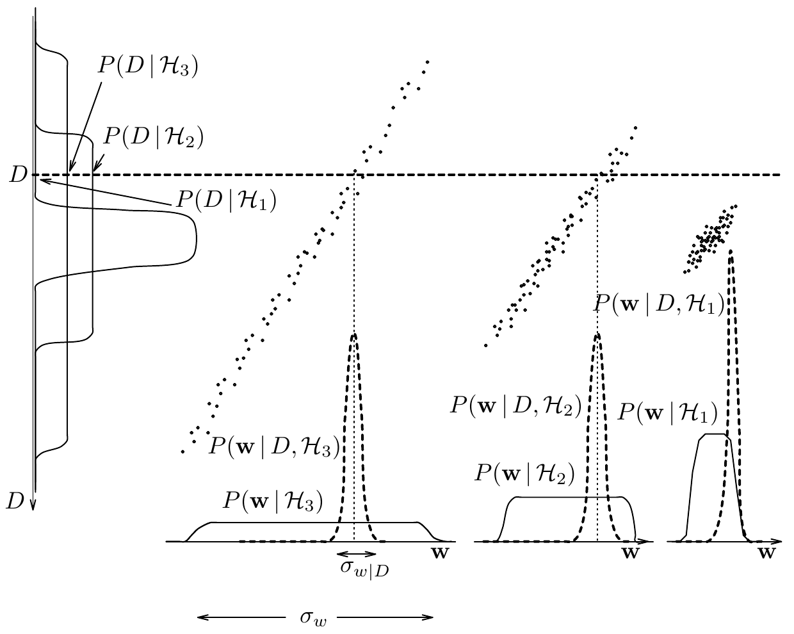

<!-- 源 PDF 物理页 362；原书印刷页 350。页首方括号说明已并入 PDF 361；含图 28.6 与式 (28.10)。原书正文确实引用“图 28.3”说明边缘化结果，照录。 -->

**图 28.6　由三个互斥模型构成的假设空间。** 每个模型都有一个参数 $\mathbf w$ 和一维数据集 $D$。这里的“数据集”是一个测量值，它与参数 $\mathbf w$ 相差少量加性噪声。图中点表示从联合分布 $P(D,\mathbf w,\mathcal H)$ 取得的典型样本；注意，它们*不是数据点*。水平虚线标出观测“数据集”所对应的 $D$ 的一个特定值。下方虚线曲线表示在给定这个数据集时，各模型的 $\mathbf w$ 后验概率（参见图 28.3）。不同模型的证据由左侧沿 $D$ 轴求边缘化得到（参见图 28.5）。图内 $P(D\mid\mathcal H_1)$、$P(D\mid\mathcal H_2)$、$P(D\mid\mathcal H_3)$ 分别为三个模型的数据分布；$P(\mathbf w\mid\mathcal H_i)$ 与 $P(\mathbf w\mid D,\mathcal H_i)$ 分别标示参数先验与后验，$\sigma_w$ 和 $\sigma_{w\mid D}$ 标示其宽度。

将联合分布 $P(D,\mathbf w\mid\mathcal H_i)$ 在左侧沿 $D$ 轴求边缘化，就得到图 28.3。对水平虚线所示的数据集 $D$，更灵活的模型 $\mathcal H_3$ 的证据 $P(D\mid\mathcal H_3)$ 小于 $\mathcal H_2$ 的证据。这是因为 $\mathcal H_3$ 在这条线上分配的预测概率更少（点更少）。从 $\mathbf w$ 的分布看，$\mathcal H_3$ 的证据较小，是因为它的奥卡姆因子 $\sigma_{w\mid D}/\sigma_w$ 小于 $\mathcal H_2$ 的相应因子。最简单的模型 $\mathcal H_1$ 证据反而最小，因为它对数据 $D$ 所能达到的最佳拟合非常差。给定这个数据集，概率最高的模型是 $\mathcal H_2$。

### *多个参数时的奥卡姆因子*

如果后验分布能很好地用高斯分布近似，就可以从相应协方差矩阵的行列式求出奥卡姆因子（参见式 (28.8) 和第 27 章）：

$$P(D\mid\mathcal H_i)\simeq\underbrace{P(D\mid\mathbf w_{\mathrm{MP}},\mathcal H_i)}_{\text{最佳拟合似然}}\times\underbrace{P(\mathbf w_{\mathrm{MP}}\mid\mathcal H_i)\det^{-1/2}\!\left(\frac{\mathbf A}{2\pi}\right)}_{\text{奥卡姆因子}}.\tag{28.10}$$

即证据 $\simeq$ 最佳拟合似然 $\times$ 奥卡姆因子。其中 $\mathbf A=-\nabla\nabla\ln P(\mathbf w\mid D,\mathcal H_i)$ 是我们计算 $\mathbf w_{\mathrm{MP}}$ 误差棒时所求的 Hessian 矩阵（式 (28.5) 和第 27 章）。随着收集的数据增多，这种高斯近似预计会越来越准确。

总之，贝叶斯模型比较是最大似然模型选择的一种直接扩展：*证据等于最佳拟合似然乘以奥卡姆因子*。

若高斯近似足够好，计算奥卡姆因子只需要 Hessian 矩阵 $\mathbf A$。因此，通过计算证据进行贝叶斯模型比较，所需计算量并不比为每个模型寻找最佳拟合参数及其误差棒更多。
