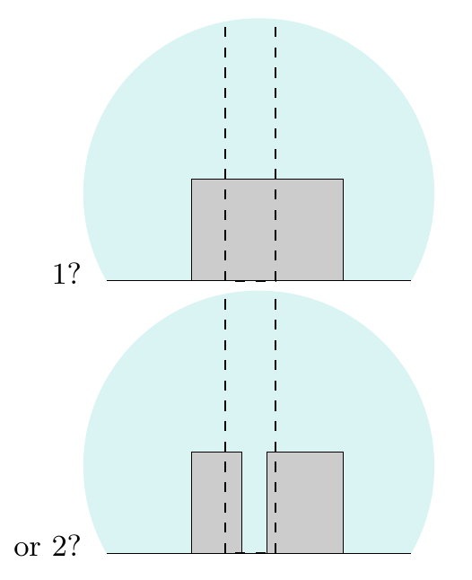

<!-- 源 PDF 物理页 363；原书印刷页 351。含图 28.7 和式 (28.11)–(28.14)。 -->

## 28.2　例子

回到本章开头的例子。图 28.1 中树后有一个盒子，还是两个？为什么巧合会使我们起疑？

**图 28.7　树后有多少个盒子？** 图内英文“1?”和“or 2?”分别为“1 个？”和“还是 2 个？”。

假设树干和盒子周围的图像宽度是 $50$ 像素，树干宽 $10$ 像素，并能区分 $16$ 种盒子颜色。理论 $\mathcal H_1$ 认为树干旁有一个盒子，它有四个自由参数：三个坐标确定盒子上方的三条边，一个参数给出盒子的颜色。（如果盒子能悬浮，就会有五个自由参数。）

理论 $\mathcal H_2$ 认为树干旁有两个盒子，它有八个自由参数（两倍于四），另有第九个二元变量，表示两个盒子中哪一个离观察者更近。

各模型的证据是多少？先看 $\mathcal H_1$。计算证据需要参数的先验。为方便起见，以像素为单位，并为盒子的水平位置、宽度、高度和颜色指定可分解的先验。高度可有例如 $20$ 个可区分的取值；宽度和位置也各有 $20$ 个取值。颜色可有 $16$ 个取值。给这些变量指定均匀先验。图像中其他物体的参数与 $\mathcal H_1$ 和 $\mathcal H_2$ 的比较无关，因此忽略。证据为

$$P(D\mid\mathcal H_1)=\frac1{20}\frac1{20}\frac1{20}\frac1{16},\tag{28.11}$$

因为只有一组参数取值与数据相符，而且它完美地预测了数据。

对模型 $\mathcal H_2$，九个参数中有六个由数据充分确定，另有三个受到部分约束。例如，若左侧盒子离得最远，它的宽度至少为 $8$ 像素、至多为 $30$ 像素；若它是两个盒子中较近的那个，宽度则在 $8$ 到 $18$ 像素之间。（这里假设左侧盒子的可见部分约宽 $8$ 像素。）求证据需要对所有可行假设的先验概率求和。精确计算还须更明确地指定数据和先验；这里只估计量级：假设两个未完全约束的实变量各有一半取值仍可用，二元变量完全不受约束。（读者可以自己建立一个明确的模型并算出精确答案。）

$$P(D\mid\mathcal H_2)\simeq\frac1{20}\frac1{20}\frac{10}{20}\frac1{16}\frac1{20}\frac1{20}\frac{10}{20}\frac1{16}\frac2{2}.\tag{28.12}$$

因此，假定两个模型的先验概率相同，后验概率比为

$$\frac{P(D\mid\mathcal H_1)P(\mathcal H_1)}{P(D\mid\mathcal H_2)P(\mathcal H_2)}=\frac{1}{\frac1{20}\frac{10}{20}\frac{10}{20}\frac1{16}}\tag{28.13}$$

$$=20\times2\times2\times16\simeq1000/1.\tag{28.14}$$

因此，数据大约以 $1000$ 比 $1$ 支持较简单的假设。式 (28.13) 中的四个因子可以按奥卡姆因子来解释。较复杂的模型为大小和颜色多用了四个参数——三个描述大小，一个描述颜色。由于两个盒子的高度恰好相同、颜色也恰好相同这两件极可疑的巧合，它须付出两个很大的奥卡姆因子（$1/20$ 和 $1/16$）；而由于两个盒子各有一条边恰巧被树或另一个盒子挡住，它还须为这两件较小的巧合付出两个较小的奥卡姆因子。
