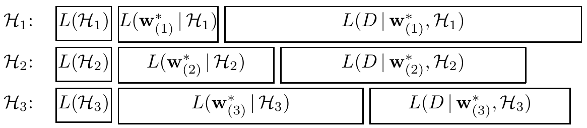

<!-- 源 PDF 物理页 364；原书印刷页 352。含图 28.8 与式 (28.15)–(28.17)。 -->

**图 28.8　用最小描述长度比较模型的一种常见看法。** 每个模型 $\mathcal H_i$ 依次发送模型身份、模型的最佳拟合参数 $\mathbf w^*$，以及相对于这些参数的数据，从而传达数据 $D$。随着模型越来越复杂，参数消息变长；另一方面，复杂模型对数据拟合得更好，残差更小，数据消息因而变短。在这个例子中，中等复杂度的模型 $\mathcal H_2$ 在这两种趋势之间达到最优权衡。图内每行从左到右的三段分别标为 $L(\mathcal H_i)$、$L(\mathbf w^*_{(i)}\mid\mathcal H_i)$ 和 $L(D\mid\mathbf w^*_{(i)},\mathcal H_i)$，表示模型、最佳拟合参数和数据的描述长度。

## 28.3　最小描述长度（MDL）

如果把事件的概率替换为将该事件无损传达给接收者所需消息的比特长度，就得到贝叶斯模型比较的一种互补视角。消息长度 $L(x)$ 与事件 $x$ 的概率模型有如下关系：

$$P(x)=2^{-L(x)},\qquad L(x)=-\log_2 P(x).\tag{28.15}$$

MDL 原则（Wallace 和 Boulton，1968）主张选择那些能以最少比特传达数据的模型。考虑一条分成两部分的消息：先说明要用哪个模型 $\mathcal H$，再在这个模型内按事先约定的精度 $\delta D$ 传达数据 $D$。消息总长度为 $L(D,\mathcal H)=L(\mathcal H)+L(D\mid\mathcal H)$。不同模型的 $L(\mathcal H)$ 隐含地定义了备选模型上的先验 $P(\mathcal H)$；类似地，$L(D\mid\mathcal H)$ 对应密度 $P(D\mid\mathcal H)$。因此，分配消息长度的过程可以映射为后验概率：

$$L(D,\mathcal H)=-\log P(\mathcal H)-\log\!\left(P(D\mid\mathcal H)\delta D\right)\tag{28.16}$$

$${}=-\log P(\mathcal H\mid D)+\mathrm{const}.\tag{28.17}$$

所以，原则上 MDL 总能解释为贝叶斯模型比较，*反过来也一样*。不过，这个简单讨论尚未说明如何实际计算关键的、依赖数据的项 $L(D\mid\mathcal H)$，它对应 $\mathcal H$ 的证据。通常设想把这条消息分成参数块和数据块（图 28.8）。参数少的模型，参数块较短，但对数据拟合不佳，因此数据消息——一串较大的残差——很长。参数数目增加时，参数块变长，数据消息变短。存在一种最优模型复杂度（图中的 $\mathcal H_2$），使总长度最小。

这一图景略过了一些微妙问题。我们尚未指定参数 $\mathbf w$ 的发送精度。这个精度有重要影响；与此不同，实值数据 $D$ 的发送精度 $\delta D$ 若相对于噪声水平足够小，只会引入一个加性常数。降低 $\mathbf w$ 的发送精度时，参数消息缩短，但截断后的参数通常不能很好拟合数据，数据消息就会变长。因此存在一个并非显而易见的最优精度。对简单的高斯情形，可以求出这一最优精度（Wallace 和 Freeman，1987）；它与参数后验的误差棒 $\mathbf A^{-1}$ 密切相关，其中 $\mathbf A=-\nabla\nabla\ln P(\mathbf w\mid D,\mathcal H)$。结果发现，最优参数消息长度与式 (28.10) 中奥卡姆因子的对数几乎相同。（截断参数时涉及随机性，所以这种编码略非最优。）

因此，只要处理得当，就可以用 MDL 术语复现贝叶斯方法的结果。尽管最早一些复杂模型比较研究采用了 MDL 框架（Patrick 和 Wallace，1982），但与直接的概率方法相比，MDL 看不出有什么优势。
