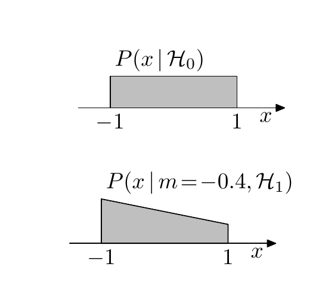
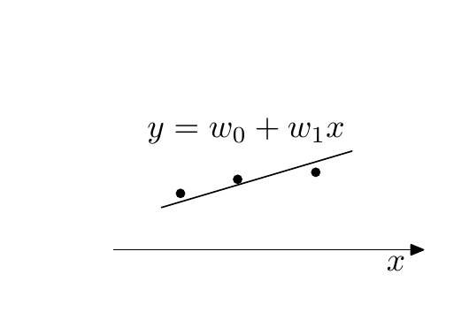

<!-- 源 PDF 物理页 366；原书印刷页 354。页首承接 PDF 365 的正规先验段落，已并入前页；含式 (28.20)–(28.22)、习题 28.1–28.4、两幅无图号习题插图及一张无编号列联表。习题 28.4 跨 PDF 367。 -->

## 28.4　习题

**习题 28.1**（难度 3）随机变量 $x$ 独立地来自概率分布 $P(x)$。模型 $\mathcal H_0$ 认为，$P(x)$ 是均匀分布：

$$P(x\mid\mathcal H_0)=\frac12\qquad x\in(-1,1).\tag{28.20}$$

模型 $\mathcal H_1$ 认为，$P(x)$ 是一个非均匀分布，具有未知参数 $m\in(-1,1)$：

$$P(x\mid m,\mathcal H_1)=\frac12(1+mx)\qquad x\in(-1,1).\tag{28.21}$$

**图内文字译注（原书无图号）。** 上图 $P(x\mid\mathcal H_0)$ 为模型 $\mathcal H_0$ 的均匀分布；下图 $P(x\mid m=-0.4,\mathcal H_1)$ 是模型 $\mathcal H_1$ 取 $m=-0.4$ 的一个例子。横轴为 $x$，标出 $-1$ 与 $1$。

给定数据 $D=\{0.3,0.5,0.7,0.8,0.9\}$，$\mathcal H_0$ 和 $\mathcal H_1$ 各自的证据是多少？

**习题 28.2**（难度 3）认为数据点 $(x,t)$ 来自一条直线。实验者选择 $x$，而 $t$ 在下式给出的值附近服从高斯分布：

$$y=w_0+w_1x\tag{28.22}$$

其方差为 $\sigma_\nu^2$。模型 $\mathcal H_1$ 认为直线是水平的，即 $w_1=0$。模型 $\mathcal H_2$ 则把 $w_1$ 视为参数，先验分布为 $\operatorname{Normal}(0,1)$。两个模型都为 $w_0$ 指定 $\operatorname{Normal}(0,1)$ 先验。给定数据集 $D=\{(-8,8),(-2,10),(6,11)\}$，并假设噪声水平 $\sigma_\nu=1$，各模型的证据是多少？

**图内文字译注（原书无图号）。** 直线标为 $y=w_0+w_1x$，横轴标为 $x$，图中有三个数据点。

**习题 28.3**（难度 3）一枚六面骰子掷了 $30$ 次，各面出现次数为 $\mathbf F=\{3,3,2,2,9,11\}$。若备选假设 $\mathcal H_1$ 认为骰子服从有偏分布 $\mathbf p$，且 $\mathbf p$ 的先验密度在单纯形 $p_i\geq0$、$\sum_i p_i=1$ 上均匀，那么骰子完全公平（假设 $\mathcal H_0$）的概率是多少？

用两种方法求解：一是借助狄利克雷分布的公式 (23.30)、(23.31) 精确计算；二是用拉普拉斯方法近似计算。注意，为拉普拉斯近似选取什么基十分重要。关于这道习题的讨论，参见 MacKay（1998a）。

**习题 28.4**（难度 3）在美国，种族对谋杀罪死刑判决的影响已经得到大量研究。下面的三维列联表将 $326$ 起被告被判谋杀罪的案件分类。三个变量分别是被告的族裔、被害人的族裔，以及被告是否被判死刑。［数据来自 M. Radelet，“Racial characteristics and imposition of the death penalty”，*American Sociological Review*，**46**（1981），918–927 页。］

| 被告族裔 | 被害人族裔 | 判死刑：是 | 判死刑：否 |
| --- | --- | ---: | ---: |
| 白人 | 白人 | 19 | 132 |
| 白人 | 黑人 | 0 | 9 |
| 黑人 | 白人 | 11 | 52 |
| 黑人 | 黑人 | 6 | 97 |
