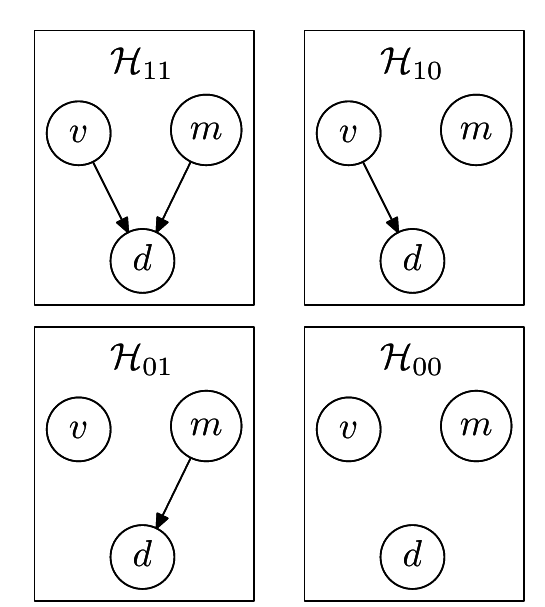

<!-- 源 PDF 物理页 367；原书印刷页 355。续完习题 28.4；含图 28.9。原书第 28 章至此结束。 -->

死刑似乎远比被害人为黑人时更常用于被害人为白人的案件：被害人为白人时，$14\%$ 的被告被判死刑；被害人为黑人时，这一比例为 $6\%$。［顺带一提，这组数据展示了一种称为*辛普森悖论*的现象：总体上，白人被告被判死刑的比例较高；但若只看被害人为黑人的案件，黑人被告被判死刑的比例较高；只看被害人为白人的案件，黑人被告被判死刑的比例也较高。］

**图 28.9　关于死刑判决 $d$ 是否依赖被害人族裔 $v$ 和被定罪行凶者族裔 $m$ 的四种假设。** 例如，$\mathcal H_{01}$ 认为被判死刑的概率取决于行凶者的族裔，而不取决于被害人的族裔。图中四幅模型分别标为 $\mathcal H_{11}$、$\mathcal H_{10}$、$\mathcal H_{01}$、$\mathcal H_{00}$；圆圈中的 $v$、$m$、$d$ 分别代表被害人族裔、行凶者族裔、是否判死刑，箭头表示依赖关系。

请量化图 28.9 中四种备选假设的证据。我应当说明，我不认为其中任何一个模型都充分：谋杀案件中还有几个重要变量，例如被害人与行凶者是否相识、谋杀是否出于预谋，以及被告是否有前科，而这些变量均未列入表中。所以，这是一道模型比较的学术练习，并非对佛罗里达州种族偏见的严肃研究。

这些假设以图模型表示；箭头表明变量 $v$（被害人族裔）、$m$（行凶者族裔）和 $d$（是否判死刑）之间的依赖关系。模型 $\mathcal H_{00}$ 只有一个自由参数，即被判死刑的概率；模型 $\mathcal H_{11}$ 有四个这样的参数，对应 $v$ 与 $m$ 的四种取值组合。对这些参数赋予均匀先验。结论对先验的选择有多敏感？
