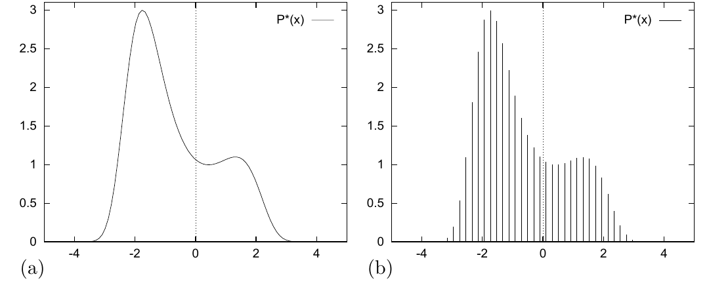

<!-- 原书 PDF 物理页 370；印刷页 358。含图 29.1、式 (29.8)–(29.10) 与原书方框强调段。 -->

**图 29.1。**（a）函数 $P^*(x)=\exp[0.4(x-0.4)^2-0.08x^4]$。怎样从这个密度中抽取样本？（b）在一组均匀间隔的离散点 $\{x_i\}$ 上计算得到的 $P^*(x)$。怎样从这一离散分布中抽取样本？图内纵向数值表示 $P^*(x)$，横向数值表示 $x$；“P*(x)”即未归一化的密度 $P^*(x)$，（a）和（b）分别标识连续曲线与离散取值。

这是蒙特卡罗方法的一个重要性质。

> 蒙特卡罗估计 (29.6) 的精度只取决于 $\phi$ 的方差，而不取决于采样空间的维数。准确地说，$\hat\Phi$ 的方差按 $\sigma^2/R$ 变化。因此，无论 $\mathbf x$ 的维数是多少，可能只需十几个独立样本 $\{\mathbf x^{(r)}\}$，就足以把 $\Phi$ 估计到令人满意的精度。

不过，我们稍后会发现，高维性可能给蒙特卡罗方法带来其他困难。从给定分布 $P(\mathbf x)$ 中取得独立样本往往并不容易。

### *为什么从 $P(\mathbf x)$ 中采样很难？*

我们假定，至少在相差一个乘法常数的意义下，能够计算想要采样的密度 $P(\mathbf x)$；也就是说，我们能够计算某个函数 $P^*(\mathbf x)$，使得

$$P(\mathbf x)=P^*(\mathbf x)/Z.\tag{29.8}$$

如果能够计算 $P^*(\mathbf x)$，为什么还不能轻易解决问题 1？从 $P(\mathbf x)$ 中取得样本为什么通常很难？困难有两个。首先，我们通常不知道归一化常数

$$Z=\int\!\mathrm d^N\mathbf x\,P^*(\mathbf x).\tag{29.9}$$

其次，即使知道 $Z$，从 $P(\mathbf x)$ 中抽样仍然是一个有挑战性的问题，尤其在高维空间中。因为，除非枚举大部分甚至全部可能状态，否则没有显然的办法按 $P$ 采样。按照定义，来自 $P$ 的正确样本往往落在 $\mathbf x$ 空间中 $P(\mathbf x)$ 较大的地方；但如果不在各处都计算 $P(\mathbf x)$，我们怎样找出这些地方？只有少数几种高维密度容易采样，高斯分布就是一例。

先看一个简单的一维例子。设想我们希望从密度 $P(x)=P^*(x)/Z$ 中抽样，其中

$$P^*(x)=\exp\!\left[0.4(x-0.4)^2-0.08x^4\right],\quad x\in(-\infty,\infty).\tag{29.10}$$

我们可以画出这个函数（图 29.1a），但这并不意味着能从中抽样。首先，我们不知道归一化常数 $Z$。
