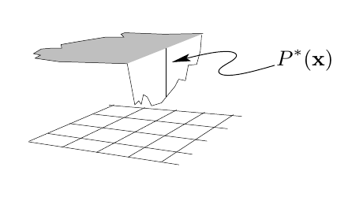

<!-- 原书 PDF 物理页 371；印刷页 359。含式 (29.11)–(29.15)、图 29.2 和星号脚注。 -->

为了把问题简化，我们可以把变量 $x$ 离散化，要求从一组均匀间隔的有限点 $\{x_i\}$ 上的离散概率分布中抽样（图 29.1b）。怎样解决这个问题？如果在每个点 $x_i$ 计算 $p_i^*=P^*(x_i)$，就能求出

$$Z=\sum_i p_i^*\tag{29.11}$$

以及

$$p_i=p_i^*/Z,\tag{29.12}$$

然后就可以利用随机比特源，采用各种方法从概率分布 $\{p_i\}$ 中抽样（见第 6.3 节）。但这样做需要多少代价？代价如何随空间维数 $N$ 增长？先看计算 $Z$（29.11）的初始代价。要计算 $Z$，必须访问空间中的每个点。图 29.1b 在一维中有 50 个均匀间隔的点。如果系统有 $N$ 维，例如 $N=1000$，相应的点数就是 $50^{1000}$；要计算 $P^*$ 的次数多得难以想象。即使每个分量 $x_n$ 只取两个离散值，仍需计算 $P^*$ 共 $2^{1000}$ 次，这个数依然大得惊人。如果宇宙中的每个电子（约有 $2^{266}$ 个）都是一台 1000 吉赫兹计算机，每秒能对一万亿（$2^{40}$）个状态计算 $P^*$，并且让这 $2^{266}$ 台计算机运行宇宙年龄那么久（$2^{58}$ 秒），也只能访问 $2^{364}$ 个状态。要访问完全部 $2^{1000}$ 个状态，还须等待超过 $2^{636}\simeq10^{190}$ 个宇宙年龄。

具有 $2^{1000}$ 个状态的系统多得很。[^29-1] 一个例子是一组 1000 个自旋，例如伊辛模型的一块 $30\times30$ 的区域；其概率分布正比于

$$P^*(\mathbf x)=\exp[-\beta E(\mathbf x)]\tag{29.13}$$

其中 $x_n\in\{\pm1\}$，且

$$E(\mathbf x)=-\left[\frac12\sum_{m,n}J_{mn}x_mx_n+\sum_n H_nx_n\right].\tag{29.14}$$

对于任意 $\mathbf x$，能容易地计算能量函数 $E(\mathbf x)$。但如果想对所有状态 $\mathbf x$ 都计算它，计算机就必须求值 $2^{1000}$ 次。

伊辛模型是一个由来已久的简单模型，但从分布 $P(\mathbf x)=P^*(\mathbf x)/Z$ 中生成样本，至今仍是活跃的研究课题。Propp 和 Wilson（1996）的开创性工作首次从这一分布生成了“精确”样本；我们将在第 32 章介绍。

### *一个有用的类比*

设想从一座湖中随机取水样，并求浮游生物的平均浓度（图 29.2）。湖在 $\mathbf x=(x,y)$ 处的深度是 $P^*(\mathbf x)$；为了使类比成立，我们假定浮游生物浓度是 $\mathbf x$ 的函数 $\phi(\mathbf x)$。所需的平均浓度是类似 (29.3) 的积分，即

**图 29.2。**一座湖在 $\mathbf x=(x,y)$ 处的深度为 $P^*(\mathbf x)$。图内箭头所指的“$P^*(x)$”表示该处湖深，下方网格表示位置平面。

$$\Phi=\langle\phi(\mathbf x)\rangle\equiv\frac1Z\int\!\mathrm d^N\mathbf x\,P^*(\mathbf x)\phi(\mathbf x),\tag{29.15}$$

[^29-1]: 原书星号脚注：给美国读者的译法是“这样的系统比比皆是”（*such systems are a dime a dozen*）；顺便说一句，这个等价关系（10 美分 = 6 便士）说明两国货币的正确汇率是 £1.00 = $1.67。
