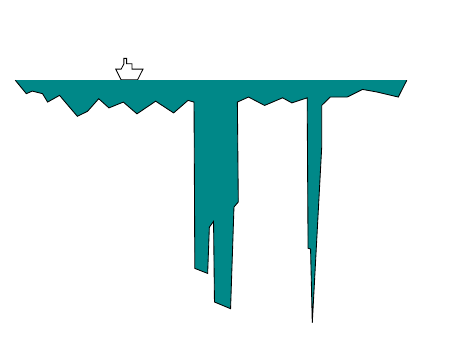

<!-- 原书 PDF 物理页 372；印刷页 360。接续式 (29.15)；含图 29.3、式 (29.16)–(29.17)。 -->

其中 $Z=\int\!\mathrm dx\,\mathrm dy\,P^*(\mathbf x)$ 是湖的体积。你有一条船、一套卫星导航系统和一个铅垂线。借助导航仪，可以把船驶到地图上任意指定的位置 $\mathbf x$；借助铅垂线，可以测量该处的 $P^*(\mathbf x)$。你也可以测量那里的浮游生物浓度。

问题 1 是从湖中随机抽取 $1\,\mathrm{cm}^3$ 的水样，并使每份水样来自湖中任意一点的概率都相同。问题 2 是求浮游生物的平均浓度。

这些问题很难解决，因为起初我们对湖的深度 $P^*(\mathbf x)$ 一无所知。湖的大部分水量或许藏在狭窄而深的水下峡谷里（图 29.3）。若是如此，为了正确地从湖中采样并正确估计 $\Phi$，我们的方法必须以某种方式发现这些峡谷，并求出它们相对于湖中其他部分的体积。这些问题确实很难；不过，我们将看到巧妙的蒙特卡罗方法能够解决它们。

**图 29.3。**一座含有若干峡谷的湖泊剖面。图中青色区域表示湖水，向下伸出的狭窄部分表示深的水下峡谷；上方小船标示水面位置。

### *均匀采样*

既然不能穷尽状态空间中的每个位置 $\mathbf x$，我们不妨考虑：从状态空间*均匀地*抽取随机样本 $\{\mathbf x^{(r)}\}_{r=1}^{R}$，并在这些点计算 $P^*(\mathbf x)$，借此解决第二个问题，即估计函数 $\phi(\mathbf x)$ 的期望。然后可以引入归一化常数 $Z_R$，定义为

$$Z_R=\sum_{r=1}^{R}P^*(\mathbf x^{(r)}),\tag{29.16}$$

并按下式估计 $\Phi=\int\!\mathrm d^N\mathbf x\,\phi(\mathbf x)P(\mathbf x)$：

$$\hat\Phi=\sum_{r=1}^{R}\phi(\mathbf x^{(r)})\frac{P^*(\mathbf x^{(r)})}{Z_R}.\tag{29.17}$$

这一策略有什么问题吗？这取决于函数 $\phi(\mathbf x)$ 和 $P^*(\mathbf x)$。我们假定 $\phi(\mathbf x)$ 是一个平缓、光滑变化的函数，把注意力放在 $P^*(\mathbf x)$ 的性质上。如第 4 章所述，高维分布的概率往往集中在状态空间中的一小块区域，即典型集 $T$；它的体积约为 $|T|\simeq2^{H(X)}$，其中 $H(X)$ 是概率分布 $P(\mathbf x)$ 的熵。如果几乎所有概率质量都位于典型集内，且 $\phi(\mathbf x)$ 是平缓函数，那么 $\Phi=\int\!\mathrm d^N\mathbf x\,\phi(\mathbf x)P(\mathbf x)$ 的值，主要由 $\phi(\mathbf x)$ 在典型集内的取值决定。因此，只有把样本数 $R$ 增加到足以让样本至少命中典型集一两次，均匀采样才有望给出 $\Phi$ 的良好估计。那么需要多少样本？再次以伊辛模型为例。（严格说来，伊辛模型也许并不是好例子，因为它不一定有第 4 章所定义的典型集；按那个定义，典型集中的所有状态，其对数概率都应接近熵。对于伊辛模型，这意味着能量非常接近平均能量；但在相变附近，能量的方差，即热容，可能发散，因此随机状态的能量未必会非常接近平均能量。）状态空间总共有 $2^N$ 个状态，典型集大小为 $2^H$。所以，每个样本落入典型集的概率是 $2^H/2^N$。
