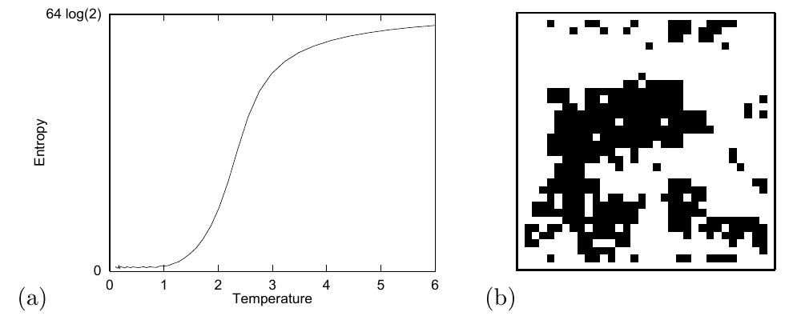

<!-- 原书 PDF 物理页 373；印刷页 361。含图 29.4、式 (29.18)–(29.20)，29.1 节结尾及 29.2 节开头。 -->

**图 29.4。**（a）64 个自旋的伊辛模型的熵随温度的变化。（b）1024 个自旋的伊辛模型的一个状态。图内英文“Entropy”和“Temperature”分别为“熵”和“温度”；“64 log(2)”表示纵轴上端标值 $64\log 2$，（a）、（b）是分图标记。

因此，要让样本命中典型集一次，所需的样本数约为

$$R_{\min}\simeq2^{N-H}.\tag{29.18}$$

那么 $H$ 是多少？在高温下，伊辛模型的概率分布趋于均匀分布，熵趋于 $H_{\max}=N$ 比特，这意味着 $R_{\min}$ 约为 1。在这种条件下，均匀采样估计 $\Phi$ 或许令人满意。不过，高温并不特别有趣。更有趣的是中间温度，例如伊辛模型从有序相熔化为无序相时的临界温度。无限大伊辛模型的熔化临界温度为 $\theta_c=2.27$。在这个温度下，伊辛模型的熵约为 $N/2$ 比特（图 29.4）。对于这一概率分布，仅仅让样本命中典型集一次，所需的样本数就约为

$$R_{\min}\simeq2^{N-N/2}=2^{N/2},\tag{29.19}$$

当 $N=1000$ 时约为 $10^{150}$。这大约是宇宙中粒子数的平方。因此，对于规模不大的伊辛模型，均匀采样也完全没有用处。在多数高维问题中，只要分布 $P(\mathbf x)$ 并非真正均匀，均匀采样就不太可能有用。

### *概览*

我们已经确认：即使 $P^*(\mathbf x)$ 容易计算，要从高维分布 $P(\mathbf x)=P^*(\mathbf x)/Z$ 中抽样仍很困难。现在我们将依次研究更精细的蒙特卡罗方法：*重要性采样*、*拒绝采样*、*Metropolis 方法*、*Gibbs 采样*和*切片采样*。

## 29.2　重要性采样

重要性采样不是从 $P(\mathbf x)$ 中生成样本的方法（问题 1）；它只是估计函数 $\phi(\mathbf x)$ 的期望的方法（问题 2）。可以把它看作均匀采样方法的推广。

为了说明问题，设目标分布是一维密度 $P(x)$。我们假定，至少在相差一个乘法常数的意义下，能够在任意选定点 $x$ 计算这一密度；也就是说，能够计算函数 $P^*(x)$，使得

$$P(x)=P^*(x)/Z.\tag{29.20}$$
