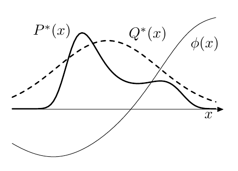
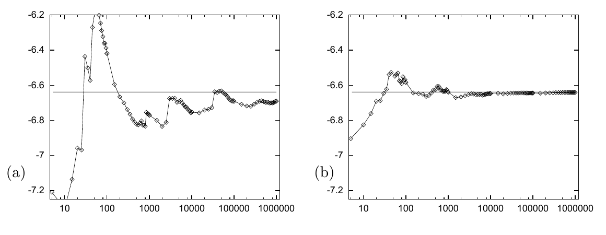

<!-- 原书 PDF 物理页 374；印刷页 362。含图 29.5、29.6、式 (29.21)–(29.22)、习题 29.1。页末段落跨 PDF 375，完整并入本页。 -->

但 $P(x)$ 太复杂，无法直接从中抽样。现在假定存在一个比较简单的密度 $Q(x)$：我们既能从中生成样本，也能在相差一个乘法常数的意义下计算它（即能够计算 $Q^*(x)$，其中 $Q(x)=Q^*(x)/Z_Q$）。图 29.5 给出了函数 $P^*$、$Q^*$ 和 $\phi$ 的一个例子。我们称 $Q$ 为*采样密度*。

**图 29.5。**重要性采样涉及的函数。我们希望估计 $\phi(x)$ 在 $P(x)\propto P^*(x)$ 下的期望。我们可以从较简单的分布 $Q(x)\propto Q^*(x)$ 中生成样本，并能在任意点计算 $Q^*$ 和 $P^*$。图内曲线标记 $P^*(x)$、$Q^*(x)$、$\phi(x)$ 分别表示目标的未归一化密度、采样的未归一化密度和待求期望的函数；横轴 $x$ 表示变量。

在重要性采样中，我们从 $Q(x)$ 生成 $R$ 个样本 $\{x^{(r)}\}_{r=1}^{R}$。如果这些点是从 $P(x)$ 中抽取的，就可以用式 (29.6) 估计 $\Phi$。但从 $Q$ 中抽样时，在 $Q(x)$ 大于 $P(x)$ 的地方，$x$ 的取值会在这个估计量中*过度出现*；在 $Q(x)$ 小于 $P(x)$ 的地方，则会*出现不足*。为顾及我们实际上从错误的分布中抽样这一事实，引入权重

$$w_r\equiv\frac{P^*(x^{(r)})}{Q^*(x^{(r)})},\tag{29.21}$$

用它来调整每个点在估计量中的“重要性”：

$$\hat\Phi\equiv\frac{\sum_r w_r\phi(x^{(r)})}{\sum_r w_r}.\tag{29.22}$$

▷ 习题 29.1。（难度 2；解答见原书印刷页 384）证明：如果在所有 $P(x)$ 非零的位置 $Q(x)$ 也非零，那么当 $R$ 增加时，估计量 $\hat\Phi$ 收敛于 $\Phi$，即 $\phi(x)$ 的均值。这个估计量在渐近意义下的方差是多少？提示：分别考察分子和分母的统计量。当 $R$ 较小时，估计量 $\hat\Phi$ 是无偏估计量吗？

重要性采样的一个实际困难是，很难估计 $\hat\Phi$ 有多可靠。估计量的方差事先未知，因为它取决于一个关于 $x$ 的积分，被积函数涉及 $P^*(x)$。$\hat\Phi$ 的方差也很难估计，因为 $w_r$ 和 $w_r\phi(x^{(r)})$ 的经验方差未必能很好反映式 (29.22) 中分子和分母的真实方差。如果在某个 $|\phi(x)P^*(x)|$ 很大的区域，提议密度 $Q(x)$ 却很小，那么即使已经生成了许多点 $x^{(r)}$，也很可能没有任何一点落入该区域。这时，对 $\Phi$ 的估计会严重错误，而经验方差并不会显示估计量 $\hat\Phi$ 的真实方差其实很大。

**图 29.6。**重要性采样的实际表现：（a）使用高斯采样密度；（b）使用柯西采样密度。纵轴表示估计值 $\hat\Phi$。水平直线标出 $\Phi$ 的真实值。横轴以对数刻度表示样本数；（a）、（b）为分图标记。

### *重要性采样的警示性示例*

在一个与氨基酸概率分布建模有关的一维变量 $x$ 玩具问题中，我用重要性采样估计一个感兴趣的量。图 29.6 显示了分别使用高斯和柯西采样密度得到的结果。横轴以对数刻度表示样本数。使用高斯采样密度时，估算约 500 个样本后，人们可能想就此停下；但显然有少数样本会对 $\hat\Phi$ 作出巨大贡献，因此 500 个样本时的估计值是错误的。即使采集了一百万个样本，估计值仍未稳定地靠近真实值。相比之下，柯西采样密度没有这样的突变；按图中尺度看，约 5000 个样本后便收敛了。
