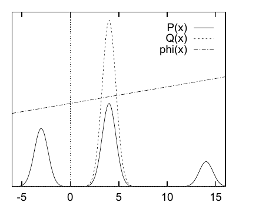

<!-- 原书 PDF 物理页 375；印刷页 363。页首跨页段已并入 PDF 374；含图 29.7、习题 29.2、式 (29.23)–(29.27)。 -->

这个例子说明，重要性采样所用的采样分布应具有**重尾**。

**图 29.7。**多峰分布 $P^*(x)$ 与单峰采样分布 $Q(x)$。图内图例原文“P(x)”“Q(x)”“phi(x)”分别标示目标分布、采样分布和函数 $\phi(x)$；横轴数值表示 $x$。

 **习题 29.2**（难度 2；解答见原书印刷页 385）考虑 $P^*(x)$ 是多峰分布，由几个相距很远的峰组成的情况。（这样的概率分布经常出现在统计数据建模中。）若把单峰采样分布 $Q(x)$ 拟合到其中一个峰，再用它做重要性采样，是明智的策略吗？假定我们要估计其均值 $\Phi$ 的函数 $\phi(x)$ 是随 $x$ 平滑变化的函数，例如 $mx+c$。描述估计量 $\hat\Phi$ 随样本数 $R$ 增加通常会怎样变化。

### *高维空间中的重要性采样*

我们已经看到，一维重要性采样也需要谨慎。那么，在更高维的空间，比如 $N=1000$ 时，重要性采样有用吗？

来看一个简单实例：目标密度 $P(\mathbf x)$ 是球内的均匀分布，

$$P^*(\mathbf x)=\begin{cases}1,&0\leq\rho(\mathbf x)\leq R_P,\\0,&\rho(\mathbf x)>R_P,\end{cases}\tag{29.23}$$

其中 $\rho(\mathbf x)\equiv(\sum_i x_i^2)^{1/2}$，提议密度是以原点为中心的高斯分布，

$$Q(\mathbf x)=\prod_i\operatorname{Normal}(x_i;0,\sigma^2).\tag{29.24}$$

如果估计量 $\hat\Phi$ 被少数很大的权重 $w_r$ 支配，重要性采样便会遇到麻烦。$w_r$ 的典型取值范围是什么？根据第一部分对典型序列的讨论——例如习题 6.14（印刷页 124）——如果 $\rho$ 是从 $Q$ 抽取的样本到原点的距离，那么 $\rho^2$ 近似服从高斯分布，其均值与标准差为

$$\rho^2\sim N\sigma^2\pm\sqrt{2N}\,\sigma^2.\tag{29.25}$$

因此，几乎所有从 $Q$ 抽取的样本都位于一个典型集中，它们到原点的距离非常接近 $\sqrt N\sigma$。假定选择 $\sigma$，使 $Q$ 的典型集位于半径 $R_P$ 的球内。［若非如此，大数定律意味着，从 $Q$ 生成的几乎所有样本都落在 $R_P$ 之外，权重为零。］于是，我们知道从 $Q$ 抽取的大多数样本，其 $Q$ 值位于以下范围：

$$\frac{1}{(2\pi\sigma^2)^{N/2}}\exp\!\left(-\frac N2\pm\frac{\sqrt{2N}}2\right).\tag{29.26}$$

因而权重 $w_r=P^*/Q$ 的典型取值范围为

$$ (2\pi\sigma^2)^{N/2}\exp\!\left(\frac N2\pm\frac{\sqrt{2N}}2\right).\tag{29.27}$$
