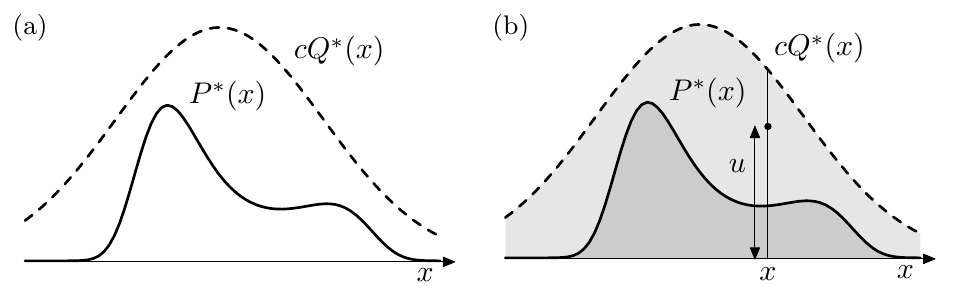

<!-- 原书 PDF 物理页 376；印刷页 364。含图 29.8、式 (29.28)–(29.29) 和 29.3 节开头；页末论证跨 PDF 377，首句续文并入本页。 -->

**图 29.8。**拒绝采样。（a）拒绝采样涉及的函数。我们希望从 $P(x)\propto P^*(x)$ 抽样；能够从 $Q(x)\propto Q^*(x)$ 抽样，并知道常数 $c$，使所有 $x$ 都满足 $cQ^*(x)>P^*(x)$。（b）在曲线 $cQ^*(x)$ 下方的浅灰色区域中随机生成点 $(x,u)$；如果此点还位于 $P^*(x)$ 下方，就接受它。图内 $P^*(x)$ 为目标曲线，$cQ^*(x)$ 为包络曲线，$x$ 为横坐标，$u$ 为垂直坐标；（a）、（b）为分图标记。

如果抽取一百个样本，权重的典型范围会怎样？把式 (29.27) 中的标准差加倍，就可以粗略估计最大权重与中位权重的比值。两者通常相差约

$$\frac{w_r^{\max}}{w_r^{\mathrm{med}}}=\exp(\sqrt{2N}).\tag{29.28}$$

因此，在 $N=1000$ 维时，一百个样本中的最大权重，很可能约为权重中位数的 $10^{19}$ 倍。于是，高维问题中的重要性采样估计值，很可能被少数权重极大的样本完全支配。

总之，高维重要性采样常有两个困难。第一，必须得到落在 $P$ 的典型集中的样本；如果 $Q$ 不能很好地近似 $P$，这可能需要很长时间。第二，即使取得了典型集中的样本，其对应权重也很可能相差很多倍；因为典型集中的点虽然概率彼此接近，仍会相差约 $\exp(\sqrt N)$ 的倍数。除非 $Q$ 是 $P$ 近乎完美的近似，权重也会相差这样的倍数。

## 29.3　拒绝采样

再次假定一维密度 $P(x)=P^*(x)/Z$ 太复杂，无法直接从中抽样。假定存在一个较简单的*提议密度* $Q(x)$，我们既能计算它（如前所述，允许相差乘法因子 $Z_Q$），也能从中生成样本。进一步假定，我们知道常数 $c$，使得

$$cQ^*(x)>P^*(x),\quad\text{对所有 }x.\tag{29.29}$$

图 29.8a 给出了两个函数的示意图。

我们生成两个随机数。第一个随机数 $x$ 从提议密度 $Q(x)$ 中生成。然后计算 $cQ^*(x)$，并从区间 $[0,cQ^*(x)]$ 均匀抽取随机变量 $u$。这两个随机数可以看成在二维平面中选出一个点，如图 29.8b 所示。

现在计算 $P^*(x)$，比较 $u$ 与 $P^*(x)$，以决定接受还是拒绝样本 $x$。如果 $u>P^*(x)$，就拒绝 $x$；否则接受，把 $x$ 加入样本集合 $\{x^{(r)}\}$。变量 $u$ 的值随后丢弃。

为什么这个过程会生成来自 $P(x)$ 的样本？如图 29.8b 所示，提议点 $(x,u)$ 以均匀概率来自曲线 $cQ^*(x)$ 下方的浅灰色区域。拒绝规则会拒绝所有位于 $P^*(x)$ 曲线上方的点。因此，被接受的点 $(x,u)$ 在 $P^*(x)$ 下方的深灰色区域中均匀分布。这意味着，被接受点的 $x$ 坐标的概率密度必定正比于 $P^*(x)$，所以这些样本必定是来自 $P(x)$ 的独立样本。
