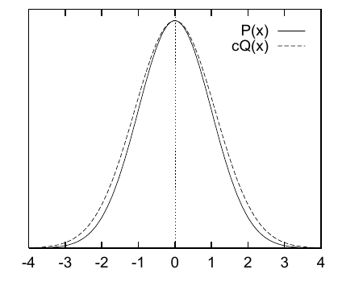
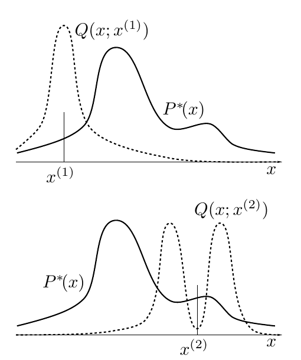

<!-- 原书 PDF 物理页 377；印刷页 365。页首证明续文已并入 PDF 376；含图 29.9、29.10、式 (29.30)，29.4 节开头。 -->

如果 $Q$ 能很好地近似 $P$，拒绝采样的效果最好。如果 $Q$ 与 $P$ 相差很大，那么要使 $cQ$ 在各处都超过 $P$，$c$ 必然要很大，拒绝的频率也会很高。

### *高维空间中的拒绝采样*

在高维问题中，要让 $cQ^*$ 成为 $P^*$ 的上界，往往必须把 $c$ 设得极大，因而被接受的样本会非常罕见。这样的 $c$ 也可能难以找到，因为在许多问题中，我们既不知道 $P^*$ 的峰位于何处，也不知道峰有多高。

**图 29.9。**高斯分布 $P(x)$ 和一个略宽的高斯分布 $Q(x)$；后者乘以因子 $c$，使得 $cQ(x)\geq P(x)$。图内图例“P(x)”与“cQ(x)”分别标示实线目标密度与虚线包络密度，横轴数字表示 $x$。

作为实例，考虑一对均值为零的 $N$ 维高斯分布（图 29.9）。设从标准差为 $\sigma_Q$ 的分布生成样本，再用拒绝采样取得标准差为 $\sigma_P$ 的另一分布的样本。假定两个标准差很接近，例如 $\sigma_Q$ 比 $\sigma_P$ 大 1%。［$\sigma_Q$ 必须大于 $\sigma_P$，否则不存在任何 $c$，能使所有 $x$ 处的 $cQ$ 都超过 $P$。］当维数 $N=1000$ 时，所需的 $c$ 是多少？$Q(\mathbf x)$ 在原点处的密度为 $1/(2\pi\sigma_Q^2)^{N/2}$；为了让 $cQ$ 超过 $P$，必须设

$$c=\frac{(2\pi\sigma_Q^2)^{N/2}}{(2\pi\sigma_P^2)^{N/2}}=\exp\!\left(N\ln\frac{\sigma_Q}{\sigma_P}\right).\tag{29.30}$$

当 $N=1000$ 且 $\sigma_Q/\sigma_P=1.01$ 时，得到 $c=\exp(10)\simeq20{,}000$。在这个 $c$ 下，接受率是多少？答案立即可得：接受率是曲线 $P(x)$ 下方面积与 $cQ(x)$ 下方面积之比。这里 $P$ 和 $Q$ 都已归一化，所以接受率为 $1/c$，例如 $1/20{,}000$。一般而言，$c$ 随维数 $N$ 指数增长，因此接受率预期会随 $N$ 指数下降。

所以，拒绝采样虽然对一维问题有用，但不大可能成为从高维分布 $P(\mathbf x)$ 生成样本的实用技术。

## 29.4　Metropolis–Hastings 方法

只有当提议密度 $Q(x)$ 与 $P(x)$ 相似时，重要性采样与拒绝采样才能很好地发挥作用。在规模大而复杂的问题中，很难构造一个始终满足这一条件的密度 $Q(x)$。

**图 29.10。**一维 Metropolis–Hastings 方法。图中的提议分布 $Q(x';x)$ 随 $x$ 改变形状；不过，实际使用的提议密度通常并非如此。图内实线 $P^*(x)$ 为目标的未归一化密度，虚线 $Q(x;x^{(1)})$、$Q(x;x^{(2)})$ 分别是在当前状态 $x^{(1)}$、$x^{(2)}$ 时的提议密度；横轴 $x$ 为候选状态。

Metropolis–Hastings 算法改用一个*依赖当前状态 $x^{(t)}$* 的提议密度 $Q$。密度 $Q(x';x^{(t)})$ 可以是一个简单分布，例如以当前 $x^{(t)}$ 为中心的高斯分布。提议密度 $Q(x';x)$ 可以是任何能够从中抽样的固定密度。与重要性采样和拒绝采样不同，$Q(x';x^{(t)})$ 不必看起来与 $P(x)$ 有丝毫相似，算法也可能有实用价值。图 29.10 给出一个提议密度的例子，分别画出了两个状态 $x^{(1)}$ 和 $x^{(2)}$ 下的密度 $Q(x';x^{(t)})$。

如前所述，假定能够在任意 $x$ 处计算 $P^*(x)$。从提议密度 $Q(x';x^{(t)})$ 中生成一个暂定的新状态 $x'$。为了决定是否接受这个新状态，我们计算以下量：
