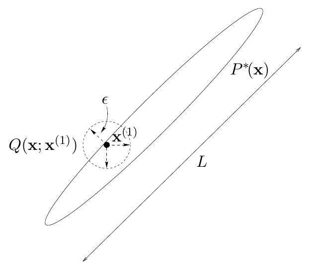

<!-- 原书 PDF 物理页 379；印刷页 367。页首跨页首段已并入 PDF 378；含图 29.11、推荐习题 29.3、原书方框及式 (29.32)。 -->

**图 29.11。**二维 Metropolis 方法，展示传统的提议密度；它的步长 $\epsilon$ 足够小，使接受频率约为 0.5。图内 $P^*(\mathbf x)$ 标示目标密度的高概率区域，$Q(\mathbf x;\mathbf x^{(1)})$ 标示以当前点 $\mathbf x^{(1)}$ 为中心的提议密度；$\epsilon$ 为提议步长尺度，$L$ 为高概率区域的较长尺度。

另一方面，小步长的缺点是，Metropolis 方法将通过*随机游走*探索概率分布；随机游走要走到远处需要很长时间，特别是每一步都很小时。

 **习题 29.3**（难度 1）考虑一维随机游走：每一步，状态都以相同概率随机向左或向右移动。证明，经过 $T$ 个长度为 $\epsilon$ 的步骤，状态通常只移动了约 $\sqrt T\epsilon$ 的距离。（计算走过距离的均方根。）

回想蒙特卡罗采样的第一个目标：从给定分布生成若干独立样本，比如十几个。如果状态空间的最长尺度为 $L$，那么必须让随机游走式 Metropolis 方法运行约 $T\simeq(L/\epsilon)^2$ 的时间，才有望得到一个与初始条件大致独立的样本——而且这还假定每一步都被接受。如果平均只有比例 $f$ 的步骤被接受，这个时间还要增大 $1/f$ 倍。

> **经验法则：Metropolis 方法迭代次数的下界。**如果高概率状态空间的最长尺度为 $L$，而 Metropolis 方法的提议分布产生步长为 $\epsilon$ 的随机游走，那么至少必须运行

$$T\simeq(L/\epsilon)^2\tag{29.32}$$

> 次迭代，才能得到一个独立样本。

这条经验法则只给出下界。实际情况可能糟糕得多，例如当概率分布由几个高概率“岛屿”组成，而这些岛屿之间隔着低概率区域时。
