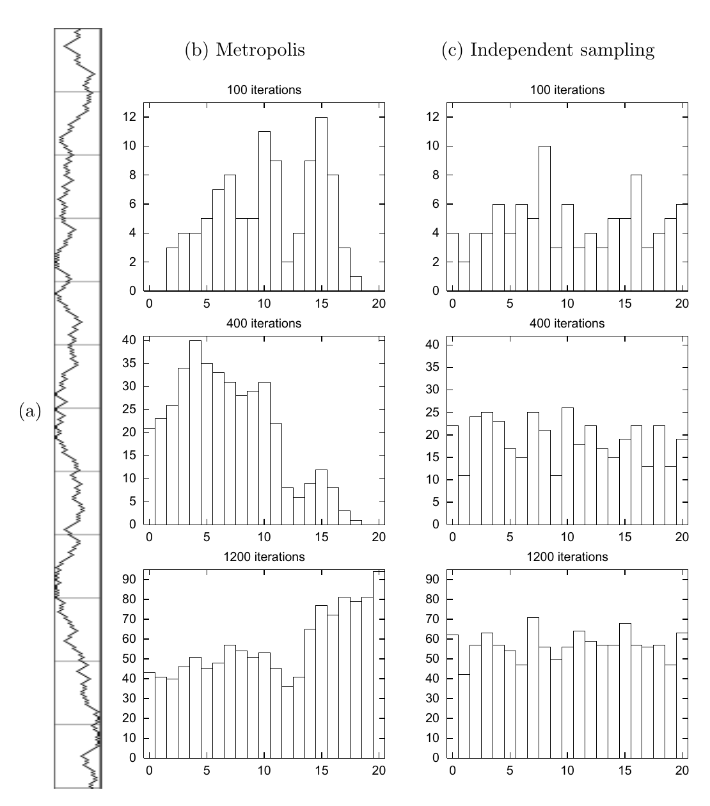

<!-- 原书 PDF 物理页 380；印刷页 368。整页为图 29.12；保留 (a)–(c) 三部分及所有图内英文译注。 -->

**图 29.12。**一个玩具问题中的 Metropolis 方法。（a）$t=1,\ldots,600$ 的状态序列：水平方向为 0 到 20 的状态，垂直方向为 1 到 600 的时间；横杠标出长度为 50 的时间区间。（b）经过 100、400、1200 次迭代后，各状态被访问次数的直方图。（c）作为对照，从目标分布独立抽取连续样本所得到的直方图。图内英文“Metropolis”为“Metropolis 方法”，“Independent sampling”为“独立采样”，“100 iterations”“400 iterations”“1200 iterations”分别表示 100、400、1200 次迭代；(a)、(b)、(c) 为各部分标记。所有直方图的横轴显示状态 0–20，纵轴显示访问次数。
