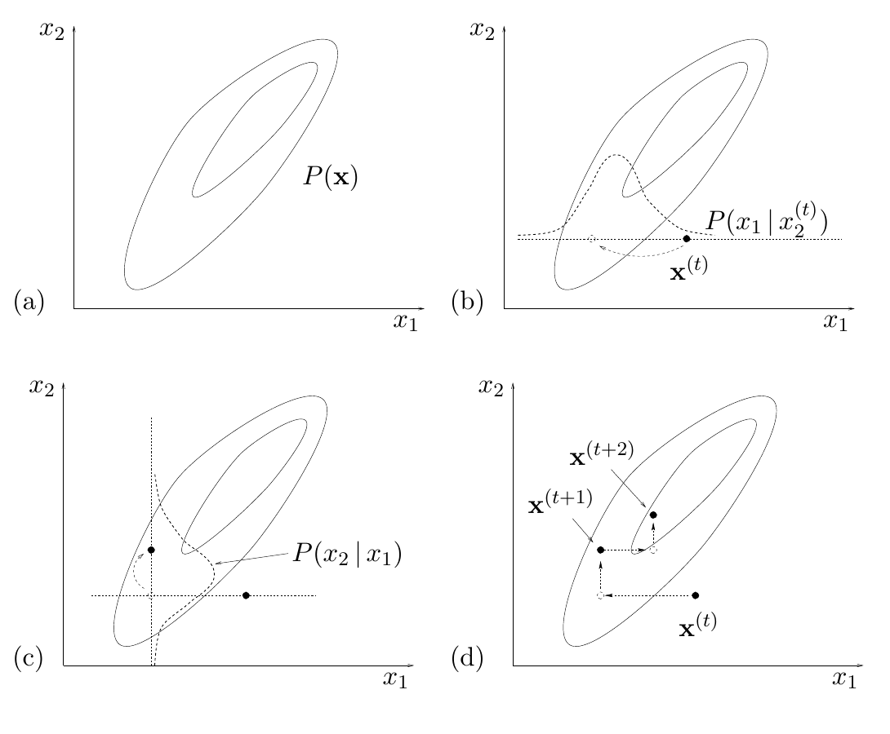

<!-- 原书 PDF 物理页 382；印刷页 370。含图 29.13 和 29.5 节开头；页末段落跨 PDF 383，首句续文并入本页。 -->

**图 29.13。**Gibbs 采样。（a）需要从中抽样的联合密度 $P(\mathbf x)$。（b）从状态 $\mathbf x^{(t)}$ 出发，按条件密度 $P(x_1\mid x_2^{(t)})$ 抽取 $x_1$。（c）接着按条件密度 $P(x_2\mid x_1)$ 抽取 $x_2$。（d）Gibbs 采样的若干次迭代。图内坐标 $x_1$、$x_2$ 是两个变量；椭圆表示 $P(\mathbf x)$ 的等密度线，虚线曲线表示相应的条件密度，点与箭头标示 $\mathbf x^{(t)}$、$\mathbf x^{(t+1)}$、$\mathbf x^{(t+2)}$ 的位置及移动；（a）–（d）为分图标记。

这既是好消息，也是坏消息。好消息是：与拒绝采样和重要性采样不同，这里并不灾难性地依赖于维数 $N$；我们的计算机能在短于宇宙年龄的时间内给出有用答案。坏消息是：对尺度之比的这种平方依赖，仍可能迫使我们运行很长的模拟。

幸运的是，有一些方法可以抑制蒙特卡罗模拟中的随机游走，我们将在下一章讨论。

## 29.5　Gibbs 采样

我们用一维例子介绍了重要性采样、拒绝采样和 Metropolis 方法。Gibbs 采样也称为*热浴方法*或“Glauber 动力学”，是一种从至少二维的分布中抽样的方法。可以把 Gibbs 采样看作一种 Metropolis 方法：其中一系列提议分布 $Q$ 根据联合分布 $P(\mathbf x)$ 的条件分布定义。它假定，虽然 $P(\mathbf x)$ 太复杂，无法直接从中抽样，但条件分布 $P(x_i\mid\{x_j\}_{j\ne i})$ 易于处理。对许多图模型（并非全部），从这些一维条件分布中抽样很直接。例如，若一些变量 $\mathbf d$ 服从均值 $\mathbf m$ 未知的高斯分布，而 $\mathbf m$ 的先验也是高斯分布，那么给定 $\mathbf d$ 时 $\mathbf m$ 的条件分布同样是高斯分布。即使条件分布不是标准形式，只要满足一定的凸性条件，仍可用自适应拒绝采样从中抽样（Gilks 和 Wild，1992）。

图 29.13 以双变量 $\mathbf x=(x_1,x_2)$ 为例说明 Gibbs 采样。每次迭代从当前状态 $\mathbf x^{(t)}$ 出发，固定 $x_2$ 为 $x_2^{(t)}$，从条件密度 $P(x_1\mid x_2)$ 中抽取 $x_1$；然后利用 $x_1$ 的新值，从条件密度 $P(x_2\mid x_1)$ 中抽取 $x_2$。这就把我们带到新状态 $\mathbf x^{(t+1)}$，完成一次迭代。
