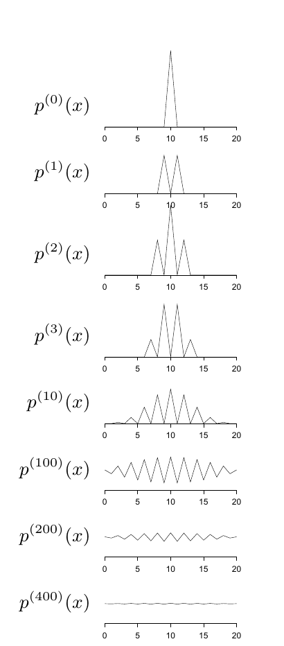

<!-- 原书 PDF 物理页 384；印刷页 372。含 29.6 节、式 (29.39)–(29.41)、原书 21×21 转移矩阵与图 29.14；“所需性质”列表续于 PDF 385。 -->

## 29.6　马尔可夫链蒙特卡罗方法的术语

现在用一点篇幅勾勒 Metropolis 方法和 Gibbs 采样所依据的理论。用 $p^{(t)}(\mathbf x)$ 表示马尔可夫链模拟器在第 $t$ 次迭代时的状态概率分布。（要想象这个分布，可以设想同时运行无限多个完全相同的模拟器。）我们的目标是找到一条马尔可夫链，使 $t\to\infty$ 时，$p^{(t)}(\mathbf x)$ 趋于所需分布 $P(\mathbf x)$。

一条*马尔可夫链*可由*初始*概率分布 $p^{(0)}(\mathbf x)$ 和*转移概率* $T(\mathbf x';\mathbf x)$ 指定。

第 $(t+1)$ 次迭代时状态的概率分布 $p^{(t+1)}(\mathbf x)$ 为

$$p^{(t+1)}(\mathbf x')=\int\!\mathrm d^N\mathbf x\,T(\mathbf x';\mathbf x)p^{(t)}(\mathbf x).\tag{29.39}$$

**例 29.6。**第 29.4 节的 Metropolis 演示（图 29.12）给出一条马尔可夫链的例子，其转移概率矩阵为

$$\mathbf T=\begin{bmatrix}
\tfrac12&\tfrac12&\cdot&\cdot&\cdot&\cdot&\cdot&\cdot&\cdot&\cdot&\cdot&\cdot&\cdot&\cdot&\cdot&\cdot&\cdot&\cdot&\cdot&\cdot&\cdot\\
\tfrac12&\cdot&\tfrac12&\cdot&\cdot&\cdot&\cdot&\cdot&\cdot&\cdot&\cdot&\cdot&\cdot&\cdot&\cdot&\cdot&\cdot&\cdot&\cdot&\cdot&\cdot\\
\cdot&\tfrac12&\cdot&\tfrac12&\cdot&\cdot&\cdot&\cdot&\cdot&\cdot&\cdot&\cdot&\cdot&\cdot&\cdot&\cdot&\cdot&\cdot&\cdot&\cdot&\cdot\\
\cdot&\cdot&\tfrac12&\cdot&\tfrac12&\cdot&\cdot&\cdot&\cdot&\cdot&\cdot&\cdot&\cdot&\cdot&\cdot&\cdot&\cdot&\cdot&\cdot&\cdot&\cdot\\
\cdot&\cdot&\cdot&\tfrac12&\cdot&\tfrac12&\cdot&\cdot&\cdot&\cdot&\cdot&\cdot&\cdot&\cdot&\cdot&\cdot&\cdot&\cdot&\cdot&\cdot&\cdot\\
\cdot&\cdot&\cdot&\cdot&\tfrac12&\cdot&\tfrac12&\cdot&\cdot&\cdot&\cdot&\cdot&\cdot&\cdot&\cdot&\cdot&\cdot&\cdot&\cdot&\cdot&\cdot\\
\cdot&\cdot&\cdot&\cdot&\cdot&\tfrac12&\cdot&\tfrac12&\cdot&\cdot&\cdot&\cdot&\cdot&\cdot&\cdot&\cdot&\cdot&\cdot&\cdot&\cdot&\cdot\\
\cdot&\cdot&\cdot&\cdot&\cdot&\cdot&\tfrac12&\cdot&\tfrac12&\cdot&\cdot&\cdot&\cdot&\cdot&\cdot&\cdot&\cdot&\cdot&\cdot&\cdot&\cdot\\
\cdot&\cdot&\cdot&\cdot&\cdot&\cdot&\cdot&\tfrac12&\cdot&\tfrac12&\cdot&\cdot&\cdot&\cdot&\cdot&\cdot&\cdot&\cdot&\cdot&\cdot&\cdot\\
\cdot&\cdot&\cdot&\cdot&\cdot&\cdot&\cdot&\cdot&\tfrac12&\cdot&\tfrac12&\cdot&\cdot&\cdot&\cdot&\cdot&\cdot&\cdot&\cdot&\cdot&\cdot\\
\cdot&\cdot&\cdot&\cdot&\cdot&\cdot&\cdot&\cdot&\cdot&\tfrac12&\cdot&\tfrac12&\cdot&\cdot&\cdot&\cdot&\cdot&\cdot&\cdot&\cdot&\cdot\\
\cdot&\cdot&\cdot&\cdot&\cdot&\cdot&\cdot&\cdot&\cdot&\cdot&\tfrac12&\cdot&\tfrac12&\cdot&\cdot&\cdot&\cdot&\cdot&\cdot&\cdot&\cdot\\
\cdot&\cdot&\cdot&\cdot&\cdot&\cdot&\cdot&\cdot&\cdot&\cdot&\cdot&\tfrac12&\cdot&\tfrac12&\cdot&\cdot&\cdot&\cdot&\cdot&\cdot&\cdot\\
\cdot&\cdot&\cdot&\cdot&\cdot&\cdot&\cdot&\cdot&\cdot&\cdot&\cdot&\cdot&\tfrac12&\cdot&\tfrac12&\cdot&\cdot&\cdot&\cdot&\cdot&\cdot\\
\cdot&\cdot&\cdot&\cdot&\cdot&\cdot&\cdot&\cdot&\cdot&\cdot&\cdot&\cdot&\cdot&\tfrac12&\cdot&\tfrac12&\cdot&\cdot&\cdot&\cdot&\cdot\\
\cdot&\cdot&\cdot&\cdot&\cdot&\cdot&\cdot&\cdot&\cdot&\cdot&\cdot&\cdot&\cdot&\cdot&\tfrac12&\cdot&\tfrac12&\cdot&\cdot&\cdot&\cdot\\
\cdot&\cdot&\cdot&\cdot&\cdot&\cdot&\cdot&\cdot&\cdot&\cdot&\cdot&\cdot&\cdot&\cdot&\cdot&\tfrac12&\cdot&\tfrac12&\cdot&\cdot&\cdot\\
\cdot&\cdot&\cdot&\cdot&\cdot&\cdot&\cdot&\cdot&\cdot&\cdot&\cdot&\cdot&\cdot&\cdot&\cdot&\cdot&\tfrac12&\cdot&\tfrac12&\cdot&\cdot\\
\cdot&\cdot&\cdot&\cdot&\cdot&\cdot&\cdot&\cdot&\cdot&\cdot&\cdot&\cdot&\cdot&\cdot&\cdot&\cdot&\cdot&\tfrac12&\cdot&\tfrac12&\cdot\\
\cdot&\cdot&\cdot&\cdot&\cdot&\cdot&\cdot&\cdot&\cdot&\cdot&\cdot&\cdot&\cdot&\cdot&\cdot&\cdot&\cdot&\cdot&\tfrac12&\cdot&\tfrac12\\
\cdot&\cdot&\cdot&\cdot&\cdot&\cdot&\cdot&\cdot&\cdot&\cdot&\cdot&\cdot&\cdot&\cdot&\cdot&\cdot&\cdot&\cdot&\cdot&\tfrac12&\tfrac12
\end{bmatrix}.$$

初始分布为

$$p^{(0)}(x)=\bigl[\cdot\ \cdot\ \cdots\ \cdot\ 1\ \cdot\ \cdots\ \cdot\ \cdot\bigr].\tag{29.40}$$

这个初始分布在 $x_0=10$ 处取 1，其他状态取 0。

**图 29.14。**例 29.6 中马尔可夫链状态的概率分布。图内从上到下依次标为 $p^{(0)}(x)$、$p^{(1)}(x)$、$p^{(2)}(x)$、$p^{(3)}(x)$、$p^{(10)}(x)$、$p^{(100)}(x)$、$p^{(200)}(x)$、$p^{(400)}(x)$；各图横轴为状态 $x=0$ 到 $20$，折线显示分布随迭代逐渐变平。

图 29.14 显示了第 $t$ 次迭代时的状态概率分布 $p^{(t)}(x)$，其中 $t=0,1,2,3,5,10,100,200,400$。对初始状态 $x_0=17$ 的链，图 29.15 给出了对应的一组分布。随着 $t\to\infty$，两条链都收敛到目标密度，即均匀密度。

### *所需性质*

设计一种 MCMC 方法时，我们构造具有以下性质的链：

1. 所需分布 $P(\mathbf x)$ 是链的一个*不变分布*。

如果分布 $\pi(\mathbf x)$ 满足

$$\pi(\mathbf x')=\int\!\mathrm d^N\mathbf x\,T(\mathbf x';\mathbf x)\pi(\mathbf x),\tag{29.41}$$

那么它就是转移概率 $T(\mathbf x';\mathbf x)$ 的不变分布。

不变分布是转移概率矩阵特征值为 1 的特征向量。
