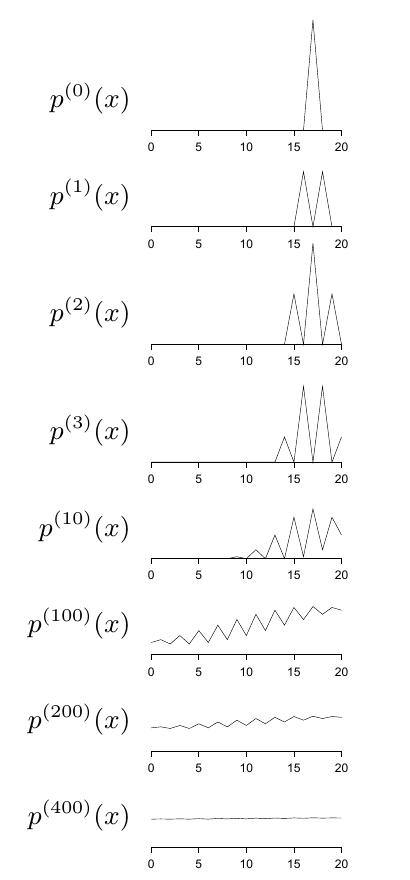

<!-- 原书 PDF 物理页 385；印刷页 373。接 PDF 384“所需性质”第 2 项，含图 29.15、式 (29.42)–(29.45)。 -->

2. 链还必须具有*遍历性*，即

$$p^{(t)}(\mathbf x)\to\pi(\mathbf x)\quad\text{当 }t\to\infty，\text{对任意 }p^{(0)}(\mathbf x).\tag{29.42}$$

**图 29.15。**初始条件为 $x_0=17$ 时，马尔可夫链状态的概率分布（例 29.6，印刷页 372）。图内从上到下依次标为 $p^{(0)}(x)$、$p^{(1)}(x)$、$p^{(2)}(x)$、$p^{(3)}(x)$、$p^{(10)}(x)$、$p^{(100)}(x)$、$p^{(200)}(x)$、$p^{(400)}(x)$；各横轴为状态 $x=0$ 到 $20$。

链可能不具有遍历性的原因有以下两种：

**（a）**它的矩阵可能是*可约*的，意思是状态空间包含两个或更多状态子集，且从其中一个子集永远无法到达另一个子集。这样的链有许多不变分布；$t\to\infty$ 时 $p^{(t)}(\mathbf x)$ 趋向哪一个，取决于初始条件 $p^{(0)}(\mathbf x)$。

这种链的转移概率矩阵有不止一个特征值等于 1。

**（b）**链可能具有一个*周期集*，意思是对某些初始条件，$p^{(t)}(\mathbf x)$ 并不趋于不变分布，而是趋于一个周期性极限环。

具有这种性质的一条简单马尔可夫链，是在 $N$ 维超立方体上的随机游走。链 $T$ 把状态从一个角点移到随机选取的相邻角点。这条链唯一的不变分布，是全部 $2^N$ 个状态上的均匀分布；但链并不遍历，它的周期为 2：如果把状态分成奇宇称与偶宇称两类，就会发现每个奇状态都被偶状态包围，反之亦然。所以，如果 $t=0$ 时初始状态具有偶宇称，那么 $t=1$ 以及所有奇数时刻，状态必具有奇宇称；在所有偶数时刻，状态必具有偶宇称。

这种链的转移概率矩阵有不止一个模长等于 1 的特征值。例如，超立方体上的随机游走有特征值 $+1$ 和 $-1$。

### *构造马尔可夫链的方法*

构造 $T$ 时，常常可以*混合*或*串接*简单的*基本转移* $B$；所有这些基本转移都满足

$$P(\mathbf x')=\int\!\mathrm d^N\mathbf x\,B(\mathbf x';\mathbf x)P(\mathbf x),\tag{29.43}$$

这里 $P(\mathbf x)$ 是所需密度；也就是说，每个基本转移都以所需密度为不变分布。各基本转移自身并不一定要具有遍历性。

如果随机选取一个基本转移，让它决定实际转移，那么 $T$ 就是多个基本转移 $B_b(\mathbf x',\mathbf x)$ 的*混合*，即

$$T(\mathbf x',\mathbf x)=\sum_b p_b B_b(\mathbf x',\mathbf x),\tag{29.44}$$

其中 $\{p_b\}$ 是定义在各基本转移上的概率分布。

如果先使用 $B_1$ 转移到中间状态 $\mathbf x''$，再使用 $B_2$ 从 $\mathbf x''$ 转移到 $\mathbf x'$，那么 $T$ 就是两个基本转移 $B_1(\mathbf x',\mathbf x)$ 和 $B_2(\mathbf x',\mathbf x)$ 的*串接*：

$$T(\mathbf x',\mathbf x)=\int\!\mathrm d^N\mathbf x''\,B_2(\mathbf x',\mathbf x'')B_1(\mathbf x'',\mathbf x).\tag{29.45}$$
