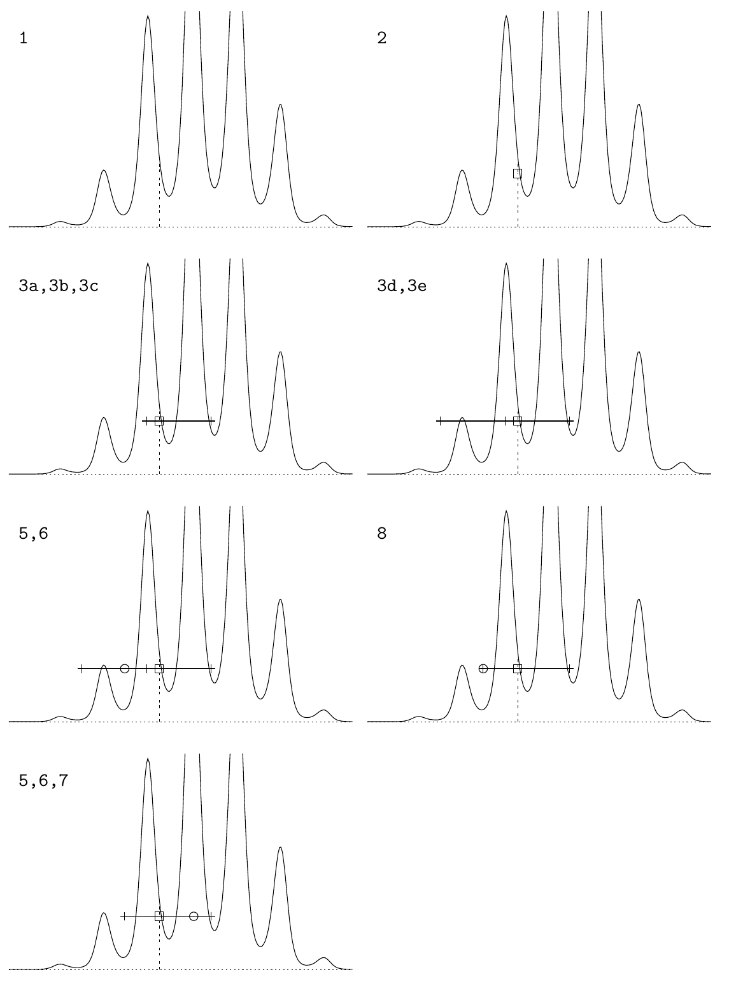

<!-- 原书 PDF 物理页 388；印刷页 376。整页为图 29.16 及图注。 -->

**图 29.16。**切片采样。每个分图的标记指明其中执行的算法步骤。第 1 步在当前点 $x$ 计算 $P^*(x)$。第 2 步选择一个纵坐标，得到图中方框所示的点 $(x,u')$。第 3a–3c 步随机建立一个宽度为 $w$、包含 $(x,u')$ 的区间。第 3d 步在区间左端计算 $P^*$，发现它大于 $u'$，于是向左移动一步，距离为 $w$。第 3e 步在区间右端计算 $P^*$，发现它小于 $u'$，因此无需再向右延伸。重复第 3d 步时，发现 $P^*$ 小于 $u'$，于是停止向外延伸。第 5 步从区间中抽取一点，图中以空心圆表示。第 6 步确认这个点位于 $P^*$ 曲线上方；第 8 步把区间收缩到这个被拒绝的点，同时让原来的点 $x$ 仍在区间内。再次执行第 5 步时，新的坐标 $x'$（位于区间右侧）给出的 $P^*$ 大于 $u'$，因此第 7 步以该点 $x'$ 为结果。
