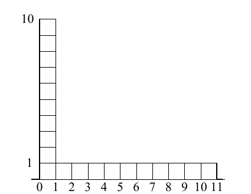

<!-- 原书 PDF 物理页 389；印刷页 377。页首续 PDF 387“性质”首段，完整段落编在起始页；含图 29.17、习题 29.10。 -->

如果选定的 $w$ 大了 $F$ 倍，算法把区间收缩到合适大小所花的时间与 $\log F$ 成正比，因为每拒绝一个点，区间通常会缩小到原来的约 $0.6$。相比之下，Metropolis 算法面对过大的步长时，会拒绝几乎所有提议，因此推进速度随 $F$ 指数级恶化。切片采样不会拒绝一次完整的转移；它停留在完全同一位置的概率很小。

**图 29.17。**$P^*(x)$。图内横轴从 $0$ 到 $11$；$0<x<1$ 区域高度为 $10$，$1<x<11$ 区域高度为 $1$。

▷ 习题 29.10。（难度 2）研究对图 29.17 所示密度应用切片采样的性质。$x$ 是介于 $0.0$ 与 $11.0$ 之间的实变量。切片采样从峰值区 $x\in(0,1)$ 的某个 $x$ 到达尾部区 $x\in(1,11)$ 的某个 $x$，通常需要多久？反向转移又需要多久？确认这些转移的概率确实能产生正确的渐近概率密度。

### *切片采样在实际问题中的用法*

对于 $N$ 维密度 $P(\mathbf x)\propto P^*(\mathbf x)$，可以选择一系列方向 $\mathbf y^{(1)},\mathbf y^{(2)},\ldots$，并令 $\mathbf x=\mathbf x^{(t)}+x\mathbf y^{(t)}$，借助上述一维切片采样方法进行抽样。前文的函数 $P^*(x)$ 此时换为 $P^*(x)=P^*(\mathbf x^{(t)}+x\mathbf y^{(t)})$。方向可以有多种选取方法；例如，像 Gibbs 采样那样选择各坐标轴；也可以用满足整体详细平衡的任何随机方法选取 $\mathbf y^{(t)}$。

### *适合计算机实现的切片采样*

概率模型中的实变量在计算机中总是用有限位数表示。在下面由 Skilling 提出的切片采样实现中，前述以浮点运算描述的向外延伸、随机化与收缩操作，改由二进制和整数运算实现。

设被切片采样的变量 $x$ 用一个 $b$ 位整数 $X$ 表示。$X$ 可取 $B=2^b$ 个值，即 $0,1,2,\ldots,B-1$；其中许多或全部值对应有效的 $x$。采用整数网格，可以消除因浮点数可变精度舍入而可能产生的详细平衡误差。从 $X$ 到 $x$ 的映射不必是线性的；若映射非线性，我们假定把函数 $P^*(x)$ 换成适当变换后的函数，例如 $P^{**}(X)\propto P^*(x)|\mathrm dx/\mathrm dX|$。

设下列作用于 $b$ 位整数的运算可用：

| 运算 | 含义 |
| --- | --- |
| $X+N$ | $X$ 与 $N$ 的算术和，模 $B$。 |
| $X-N$ | $X$ 与 $N$ 的差，模 $B$。 |
| $X\oplus N$ | $X$ 与 $N$ 的逐位异或。 |
| `N := randbits(l)` | 把 $N$ 设为一个随机的 $l$ 位整数。 |

整数的切片采样过程如下：
