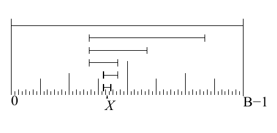

<!-- 原书 PDF 物理页 390；印刷页 378。含两段独立描边算法框、图 29.18、习题 29.11。 -->

```text
给定：当前点 X 与高度 Y = P*(X) × Uniform(0, 1) ≤ P*(X)

1: U := randbits(b)                   为二进制坐标系定义一次随机平移 U。
2: 将 l 设为一个满足 l ≤ b 的值       设置初始的 l 位采样范围。
3: 执行 {
4:     N := randbits(l)               在当前宽度为 2^l 的区间中定义随机移动。
5:     X′ := ((X - U) ⊕ N) + U        随机化 X（在平移后的坐标系中）的最低 l 位。
6:     l := l - 1                    若 X′ 不可接受，则减小 l，以较小的扰动重试。
7: } 直到 (X′ = X) 或 (P*(X′) ≥ Y)  保证在 l = 0 时或之前终止。
```

引入平移 $U$ 是为了避免永久固定的尖锐边界。例如，相邻的二进制整数 `0111111111` 和 `1000000000` 若无平移，就会永久处在不同的区块中，使 $X$ 难以从一个数移动到另一个数。

抽取新候选点所用区间的序列如图 29.18 所示。首先从整个区间抽取一点，图中由最上方的水平线表示。之后每次抽取时，都把区间减半，并让先前的点 $X$ 留在区间内。



**图 29.18。**抽取新候选点时使用的区间序列。图内标出范围端点 $0$ 与 $B-1$，以及先前的点 $X$。

如果需要先从初始范围向外延伸，可把上面第 2 步换为下面这个类似的过程：

```text
2a: 将 l 设为一个满足 l < b 的值     l 决定初始宽度。
2b: 执行 {
2c:     N := randbits(l)
2d:     X′ := ((X - U) ⊕ N) + U
2e:     l := l + 1
2f: } 直到 (l = b) 或 (P*(X′) < Y)
```

上述收缩与向外延伸方法每计算一次，区间便按因子 2 缩小或扩大。一种变体是每次缩小或扩大不止一位，令 $l:=l\pm\Delta l$，其中 $\Delta l>1$。每一步都从某个预先指定的分布中抽取 $\Delta l$（该分布也可以包含 $\Delta l=0$），可增加灵活性。

习题 29.11。（难度 4）在收缩阶段产生一个不可接受的 $X'$ 后，可以根据切片高度 $Y$ 与 $P^*(X')$ 的差来选择 $\Delta l$，而不破坏算法的有效性。（证明这一点。）当 $Y-P^*(X')$ 很大时，选用更大的 $\Delta l$ 也许是个好主意。请从理论上或经验上研究这一想法。

采用整数表示还有一个特点：只要把位数充分增加，单个整数 $X$ 就能表示两个或更多实参数。例如，可以通过 Peano 曲线一类空间填充曲线，把 $X$ 映射到 $(x_1,x_2,x_3)$。因此，可用与一维情况相同的软件来执行多维切片采样。
