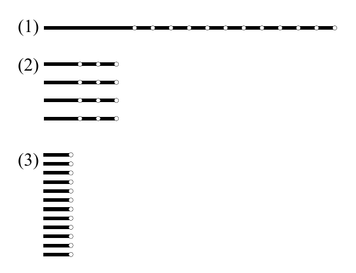

<!-- 原书 PDF 物理页 393；印刷页 381。接 PDF 392“资源分配”，含图 29.19、29.10 节开头和式 (29.49)；总结列表续 PDF 394。 -->

**图 29.19。**在固定的计算时间内取得十二个样本的三种马尔可夫链蒙特卡罗策略。水平线表示时间，白色圆圈表示样本。（1）一次长运行：先经历一段长“预热期”，再进入采样期。（2）四次中等长度的运行：初始条件不同，各有一段中等长度的预热期。（3）十二次短运行。图内的（1）、（2）、（3）对应这三种策略。

一次典型的马尔可夫链蒙特卡罗实验，起初有一段调整模拟控制参数（如步长）的时期。接下来是“预热”期，在此期间我们希望模拟“收敛”到所需分布。最后，随着模拟继续，我们偶尔记录状态向量，得到一列状态 $\{\mathbf x^{(r)}\}_{r=1}^R$，希望它们是来自 $P(\mathbf x)$ 的近似独立样本。

可以采用几种策略（图 29.19）：

1. 运行一次很长的模拟，从中取得全部 $R$ 个样本。
2. 从不同初始条件出发，运行几次中等长度的模拟，每次取得一些样本。
3. 运行 $R$ 次短模拟，每次从不同的随机初始条件出发，每次只记录模拟结束时的状态。

第一种策略最有可能达到“收敛”。最后一种策略的优点可能是记录下来的样本之间相关性更小。中间的策略深受马尔可夫链蒙特卡罗专家欢迎（Gilks 等，1996）：它避免了多次运行中丢弃预热迭代的低效，同时也有机会发现单次运行无法暴露的未收敛问题。

最后，我要强调，估计中使用的各点不必近乎独立。对相关的点求平均完全可以；它不会给估计引入偏差。例如，采用策略 1 或 2 时，如果愿意，你可以把每次运行中第一个与最后一个样本之间的所有点都纳入估计。当然，如果各点相关，就更难估计该估计值的准确度。

## 29.10　总结

- 蒙特卡罗方法是强有力的工具，可以从任何可写为 $P(\mathbf x)=P^*(\mathbf x)/Z$ 的概率分布中抽样。

- 蒙特卡罗方法能够回答几乎所有与 $P(\mathbf x)$ 有关的问题：只要把所问的问题写成如下形式，便可计算：

$$\int\phi(\mathbf x)P(\mathbf x)\simeq\frac1R\sum_r\phi(\mathbf x^{(r)}).\tag{29.49}$$
