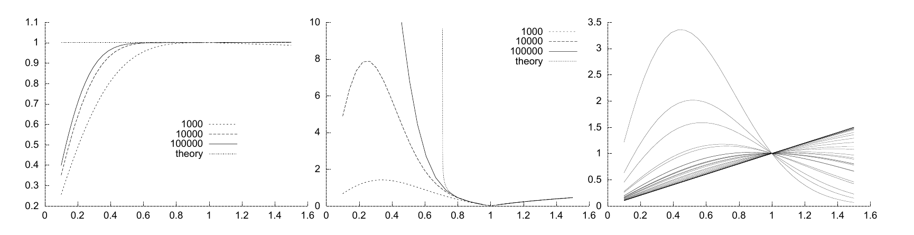

<!-- 原书 PDF 物理页 398；印刷页 386。页首续习题 29.12 解答首段，完整段落编在 PDF 397；含图 29.20、习题 29.13 解答及式 (29.57)–(29.62)。 -->

**图 29.20。**一维重要性采样。取 $R=1000,10^4,10^5$，用标准差为 $\sigma_q$ 的采样密度进行重要性采样，估计一个高斯分布的归一化常数（实际已知为 1）。横轴为 $\sigma_q$。所有运行使用同一个随机数种子。三幅图依次显示：（a）估计出的归一化常数；（b）$R$ 个权重的*经验*标准差；（c）30 个权重。图内图例 `1000`、`10000`、`100000` 对应样本数，`theory` 表示理论曲线。

**习题 29.13 的解答**（印刷页 382）。权重为 $w=P(x)/Q(x)$，而 $x$ 从 $Q$ 中抽取。权重的均值为

$$\int\!\mathrm dx\,Q(x)\bigl[P(x)/Q(x)\bigr]=\int\!\mathrm dx\,P(x)=1,\tag{29.57}$$

这里假设积分收敛。其方差为

$$\operatorname{var}(w)=\int\!\mathrm dx\,Q(x)\left[\frac{P(x)}{Q(x)}-1\right]^2\tag{29.58}$$

$$=\int\!\mathrm dx\,\left[\frac{P(x)^2}{Q(x)}-2P(x)+Q(x)\right]\tag{29.59}$$

$$=\left[\int\!\mathrm dx\,\frac{Z_Q}{Z_P^2}\exp\!\left(-\frac{x^2}{2}\left(\frac{2}{\sigma_p^2}-\frac{1}{\sigma_q^2}\right)\right)\right]-1,\tag{29.60}$$

其中 $Z_Q/Z_P^2=\sigma_q/(\sqrt{2\pi}\,\sigma_p^2)$。仅当式 (29.60) 指数中的 $x^2$ 的系数为正时，积分才有限，也就是说，必须满足

$$\sigma_q^2>\frac12\sigma_p^2.\tag{29.61}$$

如果满足这一条件，则方差为

$$\operatorname{var}(w)=\frac{\sigma_q}{\sqrt{2\pi}\,\sigma_p^2}\sqrt{2\pi}\left(\frac{2}{\sigma_p^2}-\frac{1}{\sigma_q^2}\right)^{-1/2}-1=\frac{\sigma_q^2}{\sigma_p(2\sigma_q^2-\sigma_p^2)^{1/2}}-1.\tag{29.62}$$

当 $\sigma_q$ 接近临界值——约 $0.7\sigma_p$——时，方差趋于无穷。图 29.20 用 $\sigma_p=1$、$\sigma_q$ 在 $0.1$ 到 $1.5$ 之间变化的情形说明了这些现象。*所有运行使用相同的随机数种子*，所以权重和估计值随参数变化形成平滑曲线。注意：即使真实标准差是无穷大，$R$ 个权重的*经验*标准差仍可能看起来很小、很正常（例如 $\sigma_q\simeq0.3$ 时）。
