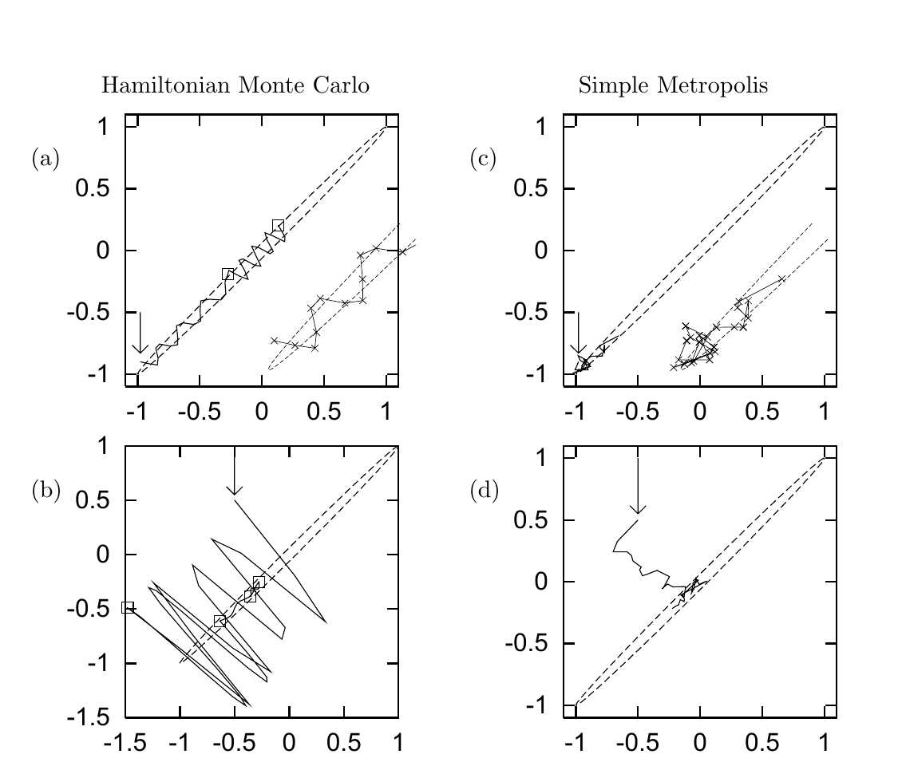

<!-- 原书 PDF 物理页 400；印刷页 388。含算法 30.1 的完整 Octave 代码及图 30.2。 -->

**算法 30.1　哈密顿蒙特卡罗方法的 Octave 源代码。**

```octave
g = gradE ( x ) ;                  # 用初始 x 设置梯度
E = findE ( x ) ;                  # 同时计算目标函数

for l = 1:L                        # 循环 L 次
    p = randn ( size(x) ) ;        # 初始动量服从 Normal(0,1)
    H = p' * p / 2 + E ;           # 计算 H(x,p)

    xnew = x ; gnew = g ;
    for tau = 1:Tau                # 执行 Tau 个“蛙跳”步骤

        p = p - epsilon * gnew / 2 ; # 对 p 走半步
        xnew = xnew + epsilon * p ;  # 对 x 走一步
        gnew = gradE ( xnew ) ;      # 求新的梯度
        p = p - epsilon * gnew / 2 ; # 对 p 再走半步

    endfor

    Enew = findE ( xnew ) ;        # 求 H 的新值
    Hnew = p' * p / 2 + Enew ;
    dH = Hnew - H ;                # 决定是否接受

    if ( dH < 0 )                   accept = 1 ;
    elseif ( rand() < exp(-dH) )   accept = 1 ;
    else                           accept = 0 ;
    endif

    if ( accept )
        g = gnew ;   x = xnew ;   E = Enew ;
    endif
endfor
```



**图 30.2。**（a、b）用哈密顿蒙特卡罗从相关系数 $\rho=0.998$ 的二维高斯分布生成样本。（c、d）在相同计算时间下，以简单的随机游走 Metropolis 方法作为比较。图内两列英文标题“Hamiltonian Monte Carlo”和“Simple Metropolis”分别为“哈密顿蒙特卡罗”和“简单 Metropolis 方法”；（a）–（d）为四幅子图标记，各轴刻度按原图保留。
