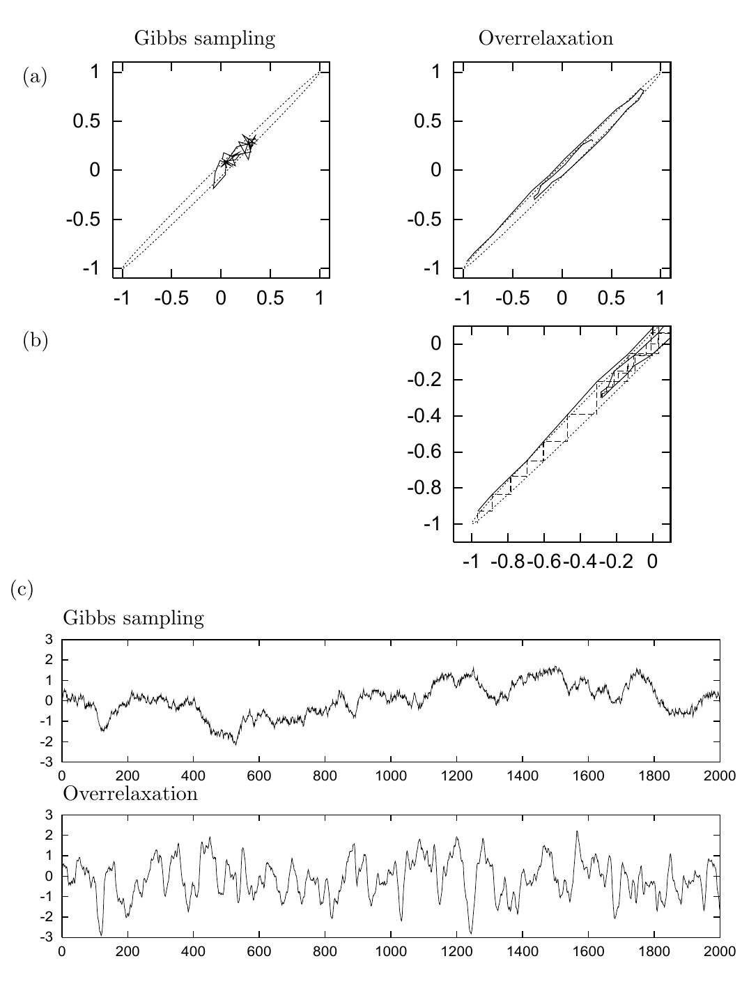

<!-- 原书 PDF 物理页 402；印刷页 390。含图 30.3、图 30.2 的后续说明、30.2 开头。页首“trajectory ...”已并入 PDF 401 末段。 -->

**图 30.3。**将过松弛方法与 Gibbs 采样作比较，目标是相关系数 $\rho=0.998$ 的二维高斯分布。（a）40 次迭代的状态序列，每次迭代都更新两个变量一次。过松弛方法取 $\alpha=-0.98$。［这里选用过大的 $|\alpha|$，是为了更容易看出过松弛方法怎样减少随机游走行为。］点线表示等高线 $\mathbf x^{\mathsf T}\boldsymbol\Sigma^{-1}\mathbf x=1$。（b）（a）的局部放大，显示每次迭代包含的两个步骤。（c）两种方法各运行 2000 次迭代期间，变量 $x_1$ 的时间轨迹。过松弛方法取 $\alpha=-0.89$。（据 Neal，1995。）图内英文“Gibbs sampling”和“Overrelaxation”分别为“Gibbs 采样”和“过松弛方法”；（a）–（c）为子图标记，坐标刻度和迭代次数按原图保留。

图 30.2c 和图 30.2d 展示用高斯提议密度的随机游走 Metropolis 方法，从同一个高斯分布中采样；它们分别从图 30.2a 和图 30.2b 的初始条件开始。在图 30.2c 中，步长调整到使接受率为 $58\%$。提议次数为 38，因此所用的总计算时间与图 30.2a 相近。由于随机游走行为，移动距离很小。在图 30.2d 中，随机游走 Metropolis 方法从图 30.2b 的同一初始条件开始，获得了类似的计算时间。

## 30.2　过松弛方法

*过松弛方法*（overrelaxation）用于减轻 Gibbs 采样中的随机游走行为。它最初是为所有条件分布都是高斯分布的系统提出的。

一个联合分布*不是*高斯分布、但其条件分布*全都是*高斯分布的例子是 $P(x,y)=\exp(-x^2y^2-x^2-y^2)/Z$。
