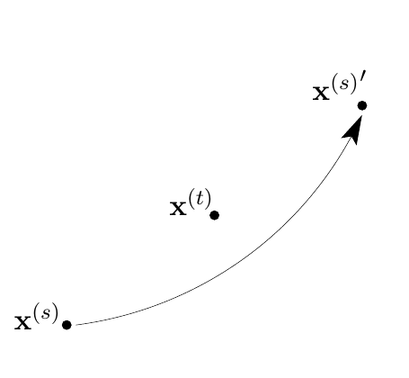

<!-- 原书 PDF 物理页 405；印刷页 393。页首续句已并入 PDF 404。含式 (30.13)、原书无编号蛙跳示意图、习题 30.3。 -->

Skilling 的蛙跳方法通过让当前状态 $\mathbf x^{(s)}$ 跳过另一个状态向量 $\mathbf x^{(t)}$，为新状态 $\mathbf x^{(s)\prime}$ 提出一个提议，再按照 Metropolis 方法接受或拒绝：

$$\mathbf x^{(s)\prime}=\mathbf x^{(t)}+\bigl(\mathbf x^{(t)}-\mathbf x^{(s)}\bigr)=2\mathbf x^{(t)}-\mathbf x^{(s)}.\tag{30.13}$$

**图内标记译注（原书无图号）。** 图中 $\mathbf x^{(s)}$ 是当前状态，$\mathbf x^{(t)}$ 是作为蛙跳支点的另一状态，弯曲箭头指向提议的新状态 $\mathbf x^{(s)\prime}$。

其余所有状态向量保持原位，因此接受概率只取决于 $\mathbf x^{(s)}$ 的能量变化。

充当蛙跳支点的向量 $t$ 可以用多种方法选择。最简单的方法是从其余向量中随机选择一个。也许更好的方法是按某种距离函数，选取 $\mathbf x^{(s)}$ 的一个最近邻作为 $t$；但这时必须使用一种接受规则，检查 $t$ 是否仍是新点 $\mathbf x^{(s)\prime}$ 的最近邻之一，以确保详细平衡。

### *为什么蛙跳是个好主意*

设想目标密度 $P(\mathbf x)$ 有很强的相关性。例如，它可能是一个针状高斯分布，宽度为 $\epsilon$，长度为 $L\epsilon$，其中 $L\gg1$。如前面强调过的，标准方法在这种密度周围移动时只能缓慢随机游走。

现在设想，我们的 $S$ 个点最初聚集在密度较高的位置，但落在一个半径仅为 $\epsilon$、小得不合适的球中。在 Skilling 的蛙跳方法下，第一次典型的移动会把某个点带到当前球体稍外面，也许使它到球心的距离翻倍。所有点都有机会移动后，球体会变大；如果所有移动都被接受，球体在各个维度上大约都会扩大一倍。若有些移动被拒绝，包围这些点的球体很可能会沿针状分布的长轴延长，比如延长一倍。各点再完成一轮移动后，球体在长轴方向又扩大一倍。所以，沿长轴移动的典型距离随迭代次数呈*指数级*增长。

不过，每次迭代增长一倍也许过于乐观；即便球体每次迭代只增大到原来的 1.1 倍，这种增长仍是指数级的。探索长轴所需的迭代次数只与 $\log L/\log(1.1)$ 成正比。

▷ 习题 30.3。（难度 2；解答见印刷页 398）以一个相关的 $N$ 维高斯分布为例，讨论 Skilling 方法的效果怎样随维数变化。求出拒绝概率的表达式，假定马尔可夫链已达到平衡。还要讨论它怎样随高斯变量之间的相关强度变化。［提示：Skilling 方法在仿射变换下保持不变，因此可考察*可分离*高斯分布，求出平衡时的拒绝概率。］

这种方法与 Gilks 等人（1994）的“自适应方向采样”（adaptive direction sampling）方法有一些相似之处；但蛙跳方法更简单，也适用于更广泛的分布。
